---
## Front matter
lang: ru-RU
title: Структура научной презентации
subtitle: Простейший шаблон
author:
  - Кулябов Д. С.
institute:
  - Российский университет дружбы народов, Москва, Россия
  - Объединённый институт ядерных исследований, Дубна, Россия
date: 01 января 1970

## i18n babel
babel-lang: russian
babel-otherlangs: english

## Formatting pdf
toc: false
toc-title: Содержание
slide_level: 2
aspectratio: 169
section-titles: true
theme: metropolis
header-includes:
 - \metroset{progressbar=frametitle,sectionpage=progressbar,numbering=fraction}
---

# Информация

## Докладчик

:::::::::::::: {.columns align=center}
::: {.column width="70%"}

  * Кулябов Дмитрий Сергеевич
  * д.ф.-м.н., профессор
  * профессор кафедры прикладной информатики и теории вероятностей
  * Российский университет дружбы народов
  * [kulyabov-ds@rudn.ru](mailto:kulyabov-ds@rudn.ru)
  * <https://yamadharma.github.io/ru/>

:::
::: {.column width="30%"}

:::
::::::::::::::

# Выполнение лабораторной работы

1.В своём рабочем каталоге создайте директорию mip, к которой будут выполнять-
ся лабораторные работы. Внутри mip создайте директорию lab-ns, а в ней файл
shablon.tcl:

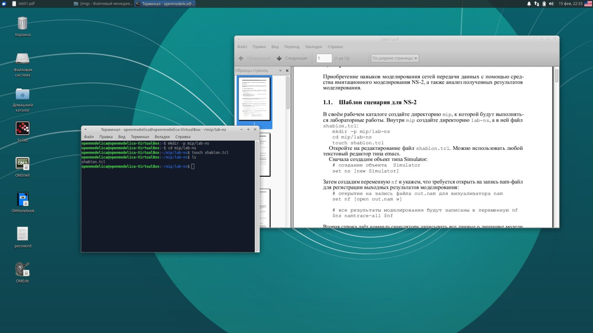{#fig:001 width=70%}

2.Откройте на редактирование файл shablon.tcl

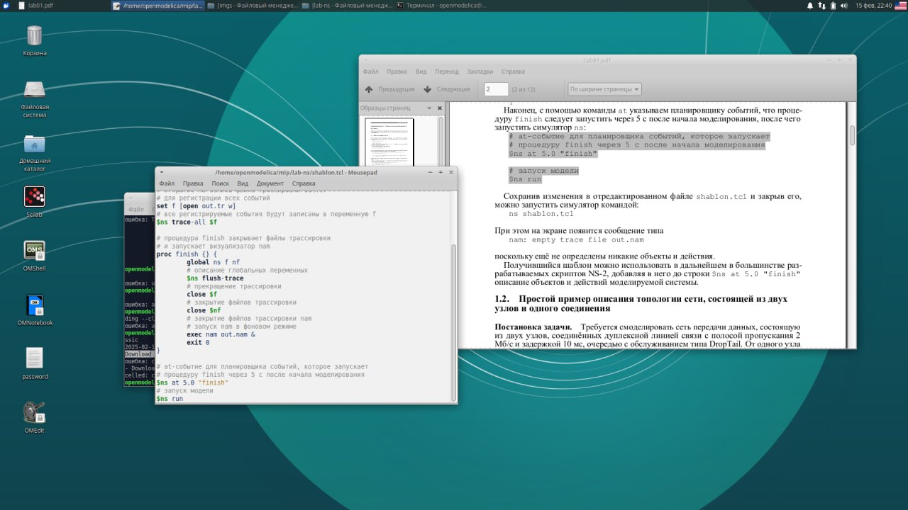{#fig:002 width=70%}

Сохранив изменения в отредактированном файле shablon.tcl и закрыв его,
можно запустить симулятор командой:
ns shablon.tcl
5298505225713353028.jpg

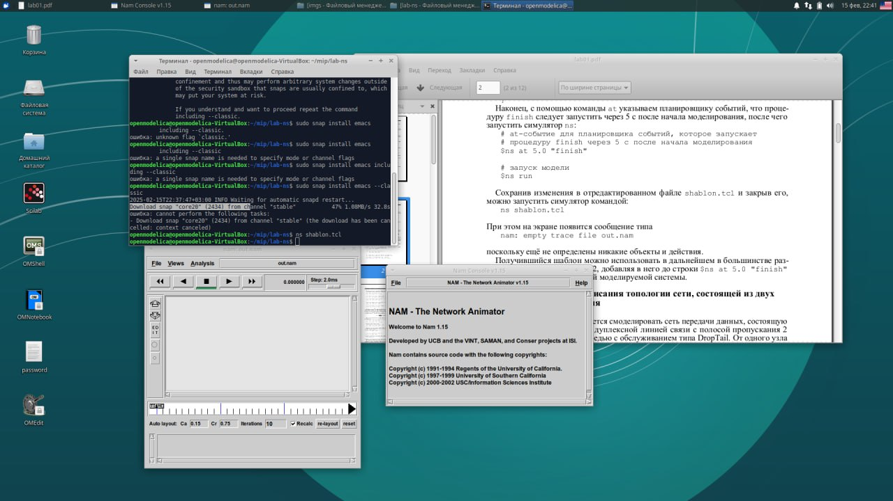{#fig:003 width=70%}

3.Простой пример описания топологии сети, состоящей из двух узлов и одного соединения

Требуется смоделировать сеть передачи данных, состоящую
из двух узлов, соединённых дуплексной линией связи с полосой пропускания 2
Мб/с и задержкой 10 мс, очередью с обслуживанием типа DropTail. От одного узла
к другому по протоколу UDP осуществляется передача пакетов, размером 500 байт,
с постоянной скоростью 200 пакетов в секунду.

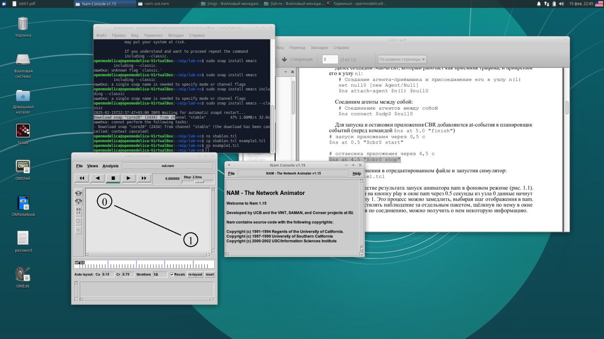{#fig:004 width=70%}

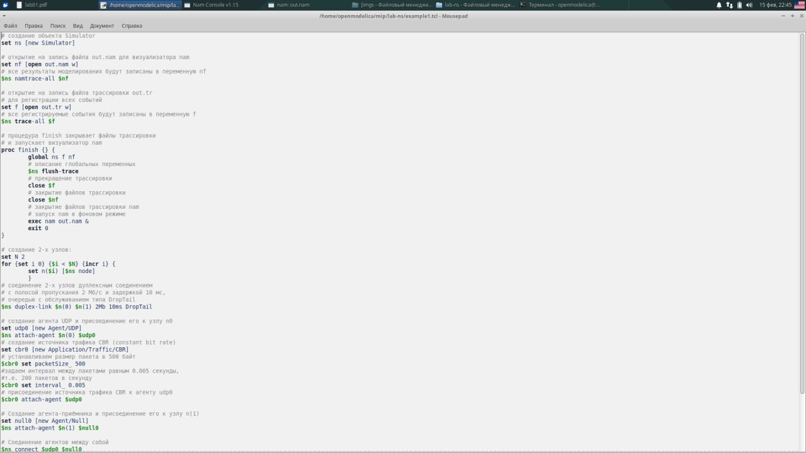{#fig:005 width=70%}

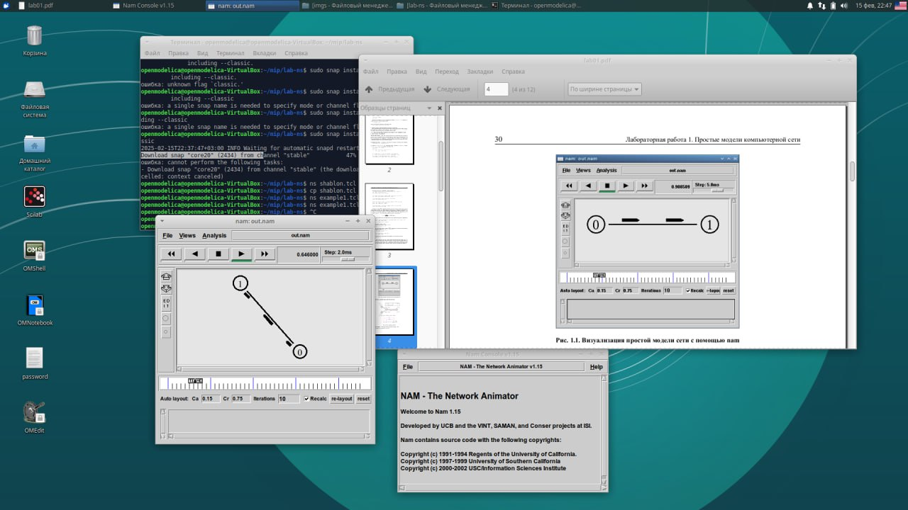{#fig:006 width=70%}

4.Пример с усложнённой топологией сети

Описание моделируемой сети:

– сеть состоит из 4 узлов (n0, n1, n2, n3);

– между узлами n0 и n2, n1 и n2 установлено дуплексное соединение с пропускной
способностью 2 Мбит/с и задержкой 10 мс;

– между узлами n2 и n3 установлено дуплексное соединение с пропускной способ-
ностью 1,7 Мбит/с и задержкой 20 мс;

– каждый узел использует очередь с дисциплиной DropTail для накопления пакетов,
максимальный размер которой составляет 10;

– TCP-источник на узле n0 подключается к TCP-приёмнику на узле n3
(по-умолчанию, максимальный размер пакета, который TCP-агент может генери-
ровать, равняется 1KByte)

– TCP-приёмник генерирует и отправляет ACK пакеты отправителю и откидывает
полученные пакеты;

– UDP-агент, который подсоединён к узлу n1, подключён к null-агенту на узле n3
(null-агент просто откидывает пакеты);

– генераторы трафика ftp и cbr прикреплены к TCP и UDP агентам соответственно;

– генератор cbr генерирует пакеты размером 1 Кбайт со скоростью 1 Мбит/с;

– работа cbr начинается в 0,1 секунду и прекращается в 4,5 секунды, а ftp начинает
работать в 1,0 секунду и прекращает в 4,0 секунды.

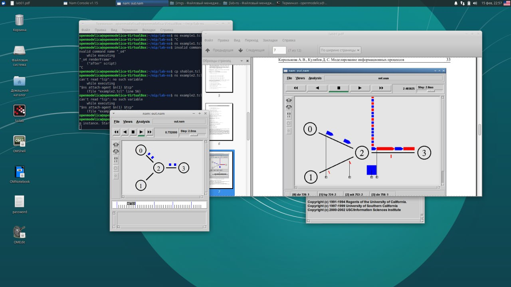{#fig:007 width=70%}

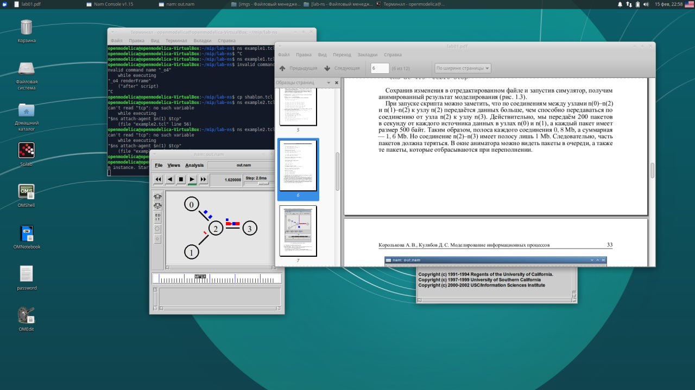{#fig:008 width=70%}

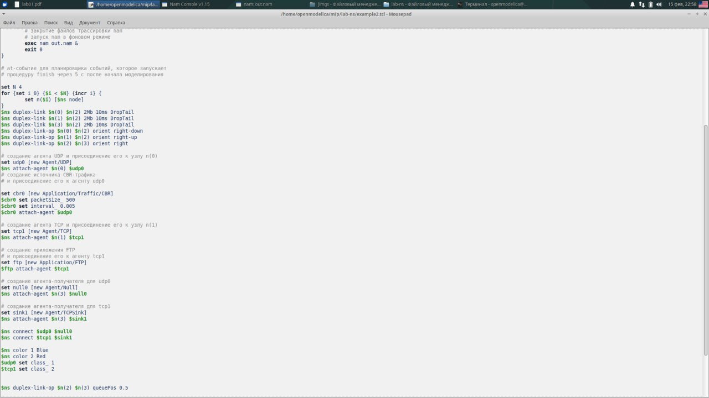{#fig:009 width=70%}

5.Пример с кольцевой топологией сети

Требуется построить модель передачи данных по сети с коль-
цевой топологией и динамической маршрутизацией пакетов:
– сеть состоит из 7 узлов, соединённых в кольцо;

– данные передаются от узла n(0) к узлу n(3) по кратчайшему пути;

– с 1 по 2 секунду модельного времени происходит разрыв соединения между
узлами n(1) и n(2);

– при разрыве соединения маршрут передачи данных должен измениться на резерв-
ный.

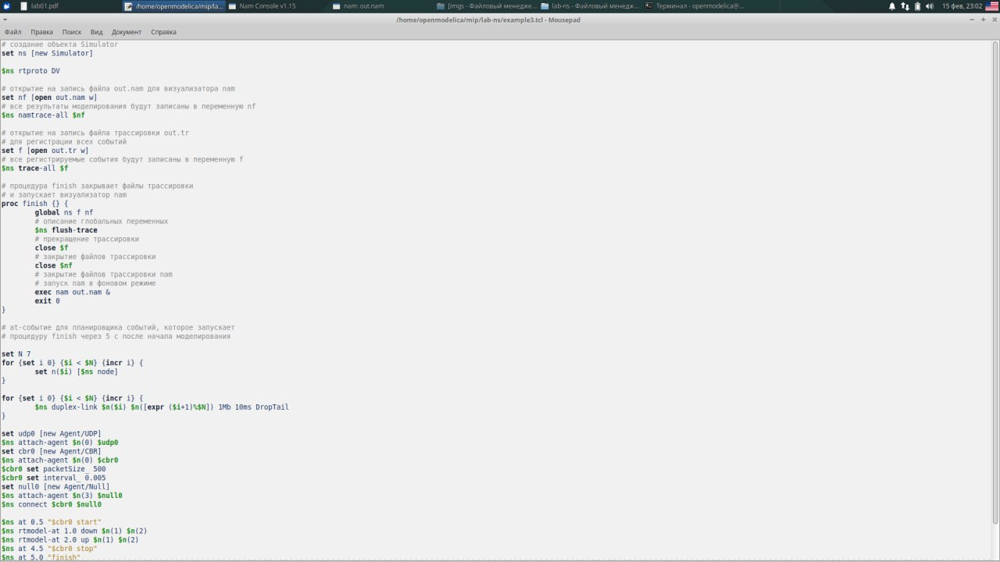{#fig:010 width=70%}

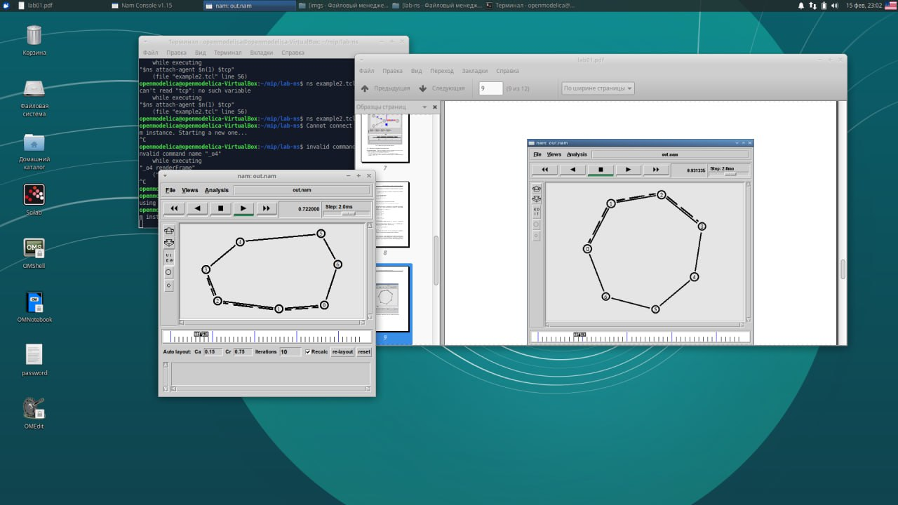{#fig:011 width=70%}

# Выводы

В результате данной лабораторной работы, я приобрела навыки моделирования сетей передачи данных с помощью средства имитационного моделирования NS-2, а также проанализировала полученные результаты
моделирования

