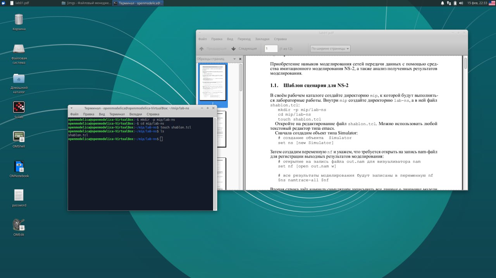
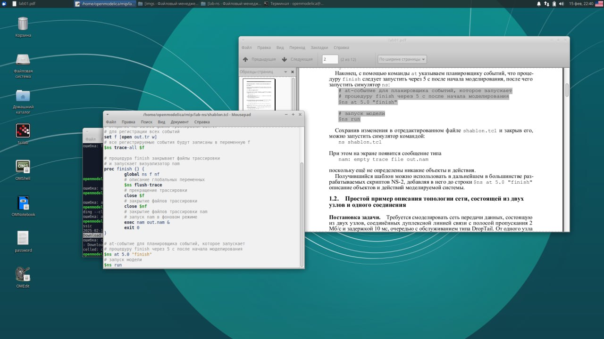
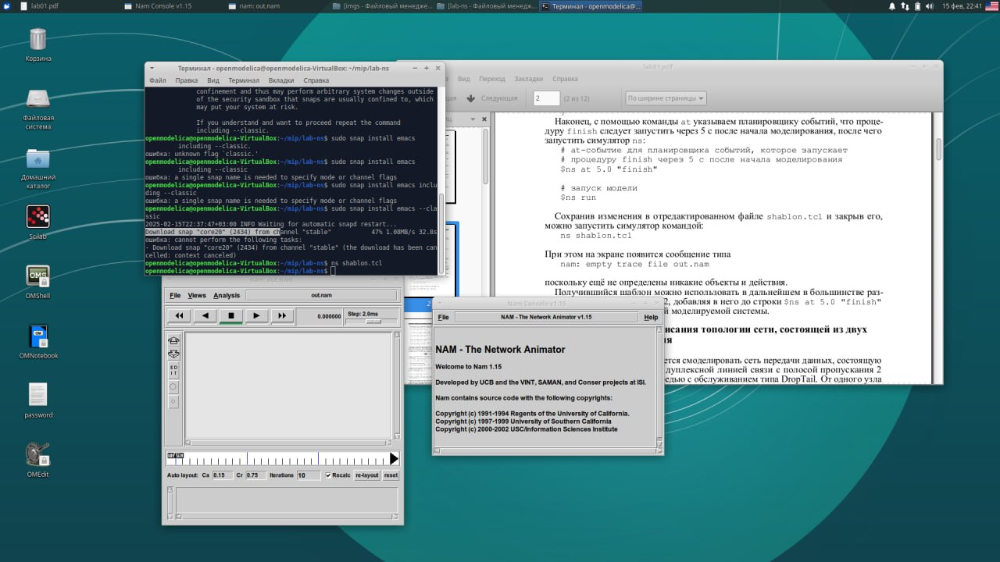
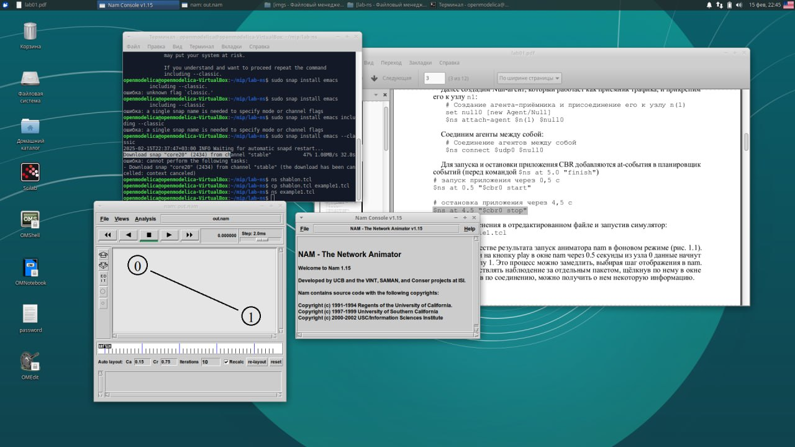
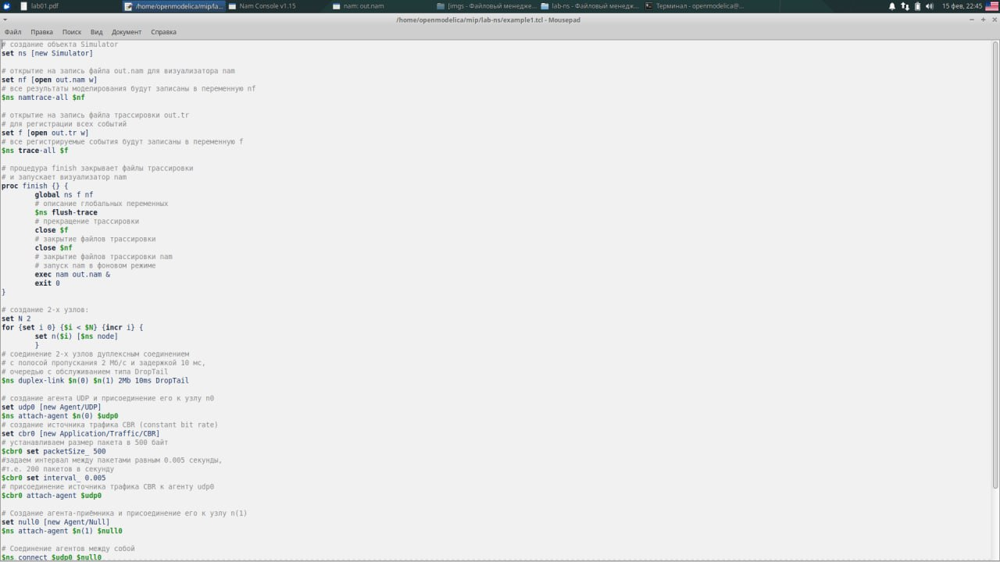
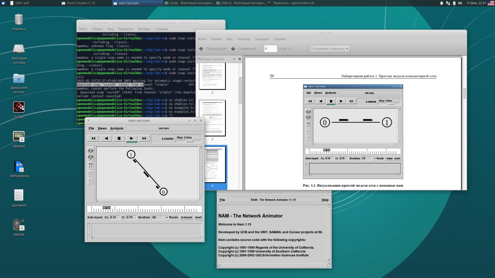
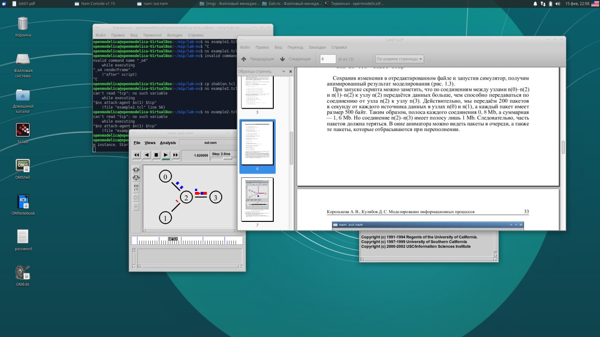
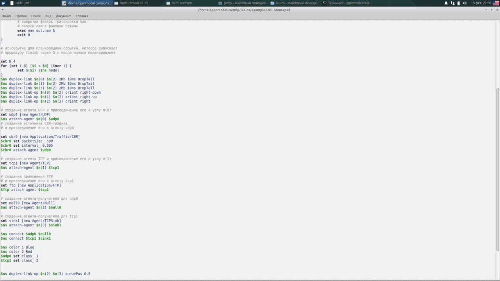
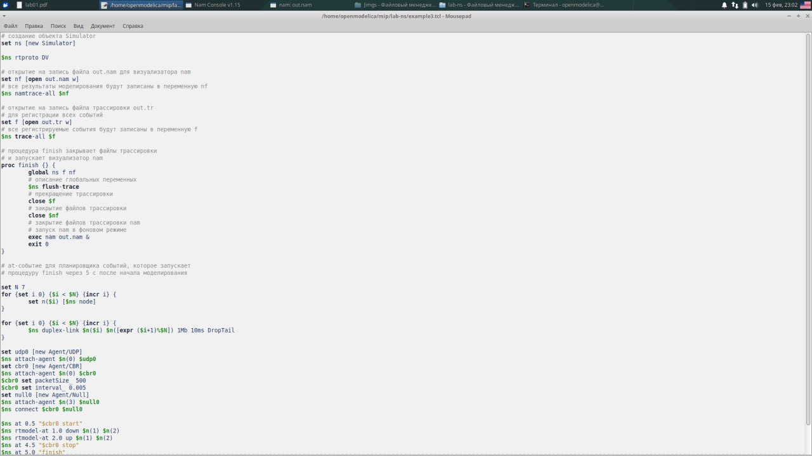
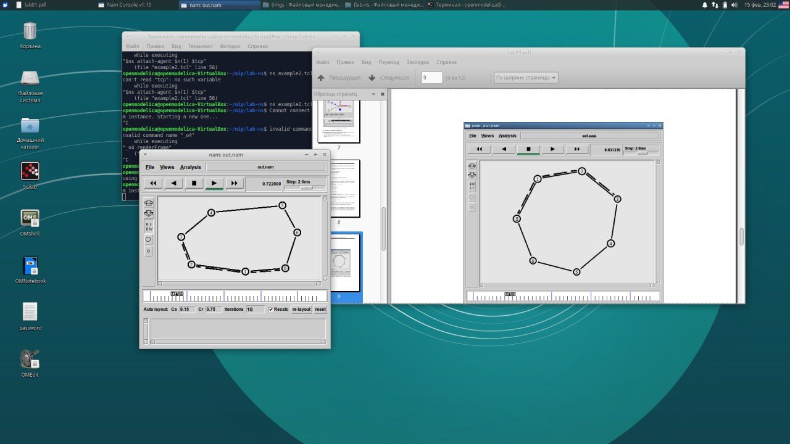

---
## Front matter
title: "Лабораторная работа 1"

author: "Акопян Сатеник Манвеловна"

## Generic otions
lang: ru-RU
toc-title: "Содержание"

## Bibliography
bibliography: bib/cite.bib
csl: pandoc/csl/gost-r-7-0-5-2008-numeric.csl

## Pdf output format
toc: true # Table of contents
toc-depth: 2
lof: true # List of figures
lot: true # List of tables
fontsize: 12pt
linestretch: 1.5
papersize: a4
documentclass: scrreprt
## I18n babel
babel-lang: russian
babel-otherlangs: english
## Fonts
mainfont: IBM Plex Serif
romanfont: IBM Plex Serif
sansfont: IBM Plex Sans
monofont: IBM Plex Mono
mathfont: STIX Two Math
mainfontoptions: Ligatures=Common,Ligatures=TeX,Scale=0.94
romanfontoptions: Ligatures=Common,Ligatures=TeX,Scale=0.94
sansfontoptions: Ligatures=Common,Ligatures=TeX,Scale=MatchLowercase,Scale=0.94
monofontoptions: Scale=MatchLowercase,Scale=0.94,FakeStretch=0.9
mathfontoptions:
## Biblatex
biblatex: true
biblio-style: "gost-numeric"
biblatexoptions:
  - parentracker=true
  - backend=biber
  - hyperref=auto
  - language=auto
  - autolang=other*
  - citestyle=gost-numeric
## Pandoc-crossref LaTeX customization
figureTitle: "Рис."
tableTitle: "Таблица"
listingTitle: "Листинг"
lofTitle: "Список иллюстраций"
lotTitle: "Список таблиц"
lolTitle: "Листинги"
## Misc options
indent: true
header-includes:
  - \usepackage{indentfirst}
  - \usepackage{float} # keep figures where there are in the text
  - \floatplacement{figure}{H} # keep figures where there are in the text
---

# Цель работы

Приобретение навыков моделирования сетей передачи данных с помощью сред-
ства имитационного моделирования NS-2, а также анализ полученных результатов
моделирования

# Выполнение лабораторной работы

1.В своём рабочем каталоге создайте директорию mip, к которой будут выполнять-
ся лабораторные работы. Внутри mip создайте директорию lab-ns, а в ней файл
shablon.tcl:

{#fig:001 width=70%}

2.Откройте на редактирование файл shablon.tcl

{#fig:002 width=70%}

Сохранив изменения в отредактированном файле shablon.tcl и закрыв его,
можно запустить симулятор командой:
ns shablon.tcl
5298505225713353028.jpg

{#fig:003 width=70%}

3.Простой пример описания топологии сети, состоящей из двух узлов и одного соединения

Требуется смоделировать сеть передачи данных, состоящую
из двух узлов, соединённых дуплексной линией связи с полосой пропускания 2
Мб/с и задержкой 10 мс, очередью с обслуживанием типа DropTail. От одного узла
к другому по протоколу UDP осуществляется передача пакетов, размером 500 байт,
с постоянной скоростью 200 пакетов в секунду.

{#fig:004 width=70%}

{#fig:005 width=70%}

{#fig:006 width=70%}

4.Пример с усложнённой топологией сети

Описание моделируемой сети:

– сеть состоит из 4 узлов (n0, n1, n2, n3);

– между узлами n0 и n2, n1 и n2 установлено дуплексное соединение с пропускной
способностью 2 Мбит/с и задержкой 10 мс;

– между узлами n2 и n3 установлено дуплексное соединение с пропускной способ-
ностью 1,7 Мбит/с и задержкой 20 мс;

– каждый узел использует очередь с дисциплиной DropTail для накопления пакетов,
максимальный размер которой составляет 10;

– TCP-источник на узле n0 подключается к TCP-приёмнику на узле n3
(по-умолчанию, максимальный размер пакета, который TCP-агент может генери-
ровать, равняется 1KByte)

– TCP-приёмник генерирует и отправляет ACK пакеты отправителю и откидывает
полученные пакеты;

– UDP-агент, который подсоединён к узлу n1, подключён к null-агенту на узле n3
(null-агент просто откидывает пакеты);

– генераторы трафика ftp и cbr прикреплены к TCP и UDP агентам соответственно;

– генератор cbr генерирует пакеты размером 1 Кбайт со скоростью 1 Мбит/с;

– работа cbr начинается в 0,1 секунду и прекращается в 4,5 секунды, а ftp начинает
работать в 1,0 секунду и прекращает в 4,0 секунды.

{#fig:007 width=70%}

{#fig:008 width=70%}

{#fig:009 width=70%}

5.Пример с кольцевой топологией сети

Требуется построить модель передачи данных по сети с коль-
цевой топологией и динамической маршрутизацией пакетов:
– сеть состоит из 7 узлов, соединённых в кольцо;

– данные передаются от узла n(0) к узлу n(3) по кратчайшему пути;

– с 1 по 2 секунду модельного времени происходит разрыв соединения между
узлами n(1) и n(2);

– при разрыве соединения маршрут передачи данных должен измениться на резерв-
ный.

{#fig:010 width=70%}

{#fig:011 width=70%}

# Выводы

В результате данной лабораторной работы, я приобрела навыки моделирования сетей передачи данных с помощью средства имитационного моделирования NS-2, а также проанализировала полученные результаты
моделирования

# Список литературы{.unnumbered}

::: {#refs}
:::
