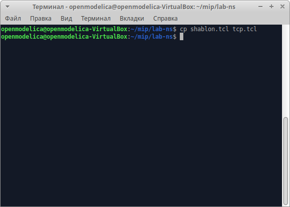

---
## Front matter
lang: ru-RU
title: Лабораторная работа №2
subtitle: Исследование протокола TCP и алгоритма управления очередью RED
author: 
 - Акопян Сатеник

institute:
  - Российский университет дружбы народов, Москва, Россия
# date: 22 января 1950

## i18n babel
babel-lang: russian
babel-otherlangs: english

## Formatting pdf
toc: false
toc-title: Содержание
slide_level: 2
aspectratio: 169
section-titles: true
theme: metropolis
header-includes:
 - \metroset{progressbar=frametitle,sectionpage=progressbar,numbering=fraction}
---

## Цель работы

Исследование протокола TCP и алгоритма управления очередью RED.

## Задание

Описание моделируемой сети:

– сеть состоит из 6 узлов;

– между всеми узлами установлено дуплексное соединение с различными пропуск-
ной способностью и задержкой 10 мс;

– узел r1 использует очередь с дисциплиной RED для накопления пакетов, макси-
мальный размер которой составляет 25;

– TCP-источники на узлах s1 и s2 подключаются к TCP-приёмнику на узле s3;

– генераторы трафика FTP прикреплены к TCP-агентам.

Требуется разработать сценарий, реализующий модель согласно, по-
строить в Xgraph график изменения TCP-окна, график изменения длины очереди
и средней длины очереди

## Теоретическое введение

Протокол управления передачей (Transmission Control Protocol, TCP) имеет средства управления потоком и коррекции ошибок, ориентирован на установление
соединения.

Oбъект мониторинга очереди оповещает диспетчера очереди о поступлении пакета.
Диспетчер очереди осуществляет мониторинг очереди.

## Выполнение лабораторной работы

1. Создается файл tcp.tcl на основе шаблона shablon.tcl c реализацией модели 

{#fig:001 width=50%}

## Выполнение лабораторной работы

{#fig:002 width=50%}

## Выполнение лабораторной работы

{#fig:003 width=50%}

## Выполнение лабораторной работы

Графики окна TCP и очереди 

{#fig:004 width=50%}

## Выполнение лабораторной работы

{#fig:005 width=50%}

## Выполнение лабораторной работы

2. Измените в модели на узле s1 тип протокола TCP с Reno на NewReno, затем на
Vegas. 

Меняем  TCP/Reno -> TCP/Newreno

{#fig:006 width=50%}

## Выполнение лабораторной работы

{#fig:007 width=50%}

## Выполнение лабораторной работы

Меняем  TCP/Reno -> TCP/Vegas 

{#fig:008 width=50%}

## Выполнение лабораторной работы

{#fig:009 width=50%}

## Выполнение лабораторной работы

{#fig:010 width=50%}

## Выполнение лабораторной работы

3. Внесите изменения при отображении окон с графиками (измените цвет фона,
цвет траекторий, подписи к осям, подпись траектории в легенде)

Поменяла red -> red!!!!

{#fig:011 width=50%}

## Выполнение лабораторной работы

{#fig:012 width=50%}

## Выполнение лабораторной работы

Поменяла цвета траекторий:

{#fig:013 width=50%}

## Выполнение лабораторной работы

{#fig:014 width=50%}

## Выводы

В результате данной лабораторной работы я исследовала протокол TCP и алгоритм управления очередью RED.

