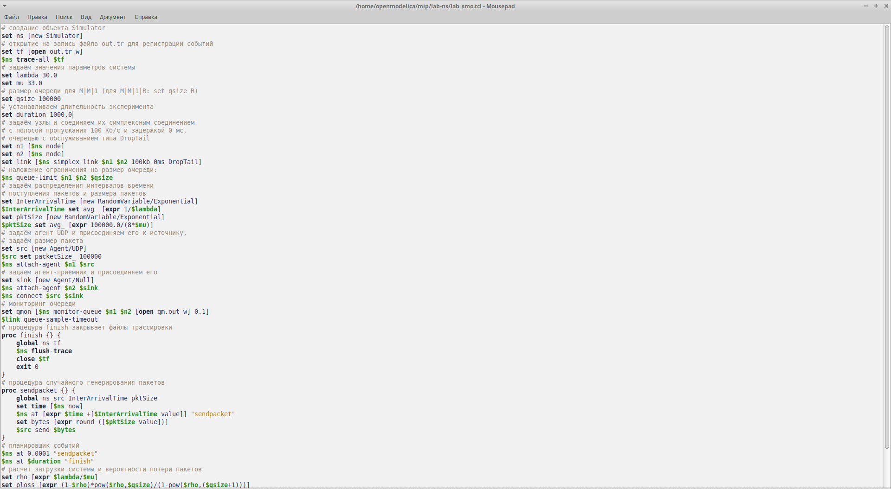
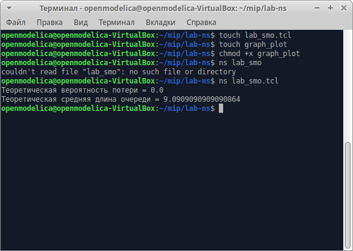
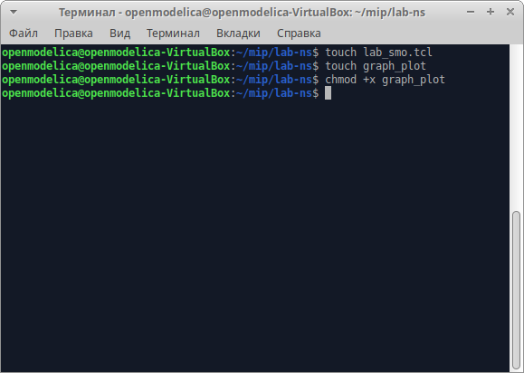
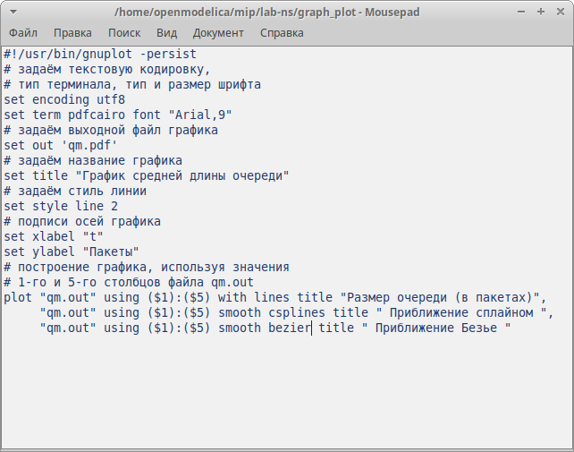
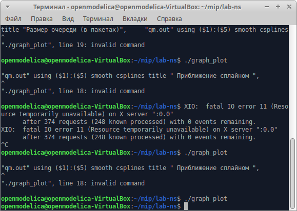
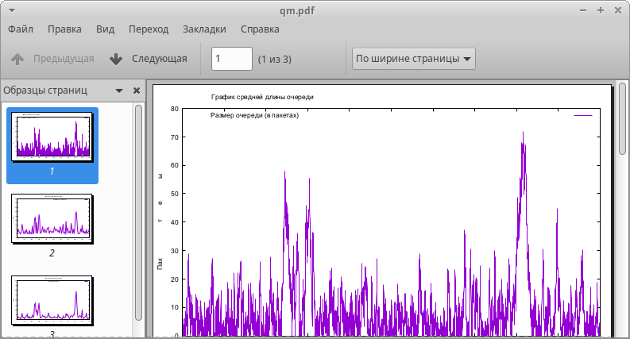
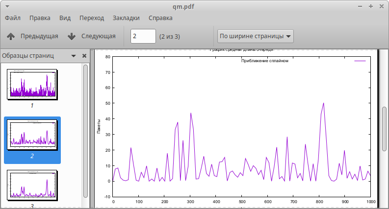
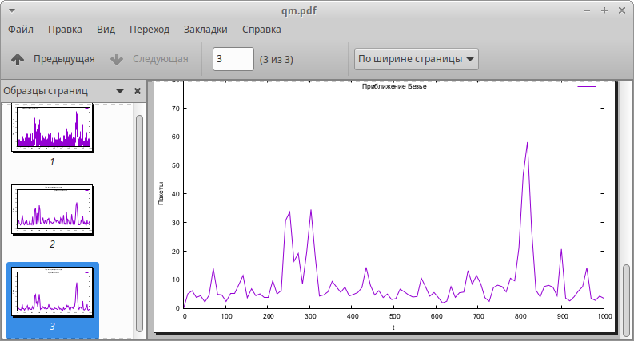

---
## Front matter
lang: ru-RU
title: Лабораторная работа №3
subtitle: Моделирование стохастических процессов
author:
  - Акопян С.М.
institute:
  - Российский университет дружбы народов, Москва, Россия
# date: 01 января 1950

## i18n babel
babel-lang: russian
babel-otherlangs: english

## Formatting pdf
toc: false
toc-title: Содержание
slide_level: 2
aspectratio: 169
section-titles: true
theme: metropolis
header-includes:
 - \metroset{progressbar=frametitle,sectionpage=progressbar,numbering=fraction}
---
## Цель работы

Целью данной лабораторной работы является освоить первоначальные знания по моделированию стохастических процессов.

## Теоретическое введение

Здесь описываются теоретические аспекты, связанные с выполнением работы.
$M |M |1$ — однолинейная СМО с накопителем бесконечной ёмкости. Поступаю-
щий поток заявок — пуассоновский с интенсивностью $λ$. Времена обслуживания
заявок — независимые в совокупности случайные величины, распределённые по
экспоненциальному закону с параметром $μ$.

$M |M |n|R$ — однолинейная СМО с накопителем конечной ёмкости R. Поступаю-
щий поток заявок — пуассоновский с интенсивностью $λ$. Времена обслуживания
заявок — независимые в совокупности случайные величины, распределённые по
экспоненциальному закону с параметром $μ$.

## Выполнение лабораторной работы

1. Реализация модели на NS-2 .

{#fig:001 width=50%}

## Выполнение лабораторной работы

2. Запускем модель, получаем теоретическую вероятность потери и теоретическую длину очереди

{#fig:002 width=50%}

## Выполнение лабораторной работы

3. В каталоге с проектом создаю отдельный файл, graph_plot, делаю его исполняемым 

{#fig:003 width=50%} 

## Выполнение лабораторной работы

{#fig:004 width=50%} 

## Выполнение лабораторной работы

4. Запускаю скрипт в созданном файле graph_plot, который создает файл файл qm.pdf с результатами моделирования 

{#fig:005 width=50%} 

## Выполнение лабораторной работы

{#fig:006 width=50%} 

## Выполнение лабораторной работы

{#fig:007 width=50%} 

## Выполнение лабораторной работы

{#fig:008 width=50%} 

## Выводы

В результате данной лабораторной работы я освоила первоначальные знания по моделированию стохастических процессов.
