---
## Front matter
lang: ru-RU
title: Лабораторная работа №4
subtitle: Задание для самостоятельного выполнения
author:
  - Акопян Сатеник
institute:
  - Российский университет дружбы народов, Москва, Россия
  # - Объединённый институт ядерных исследований, Дубна, Россия
# date: 01 января 1950

## i18n babel
babel-lang: russian
babel-otherlangs: english

## Formatting pdf
toc: false
toc-title: Содержание
slide_level: 2
aspectratio: 169
section-titles: true
theme: metropolis
header-includes:
 - \metroset{progressbar=frametitle,sectionpage=progressbar,numbering=fraction}
---
## Цель работы

Выполнить задание для самостоятельного выполнения 

## Задание

1. Для приведённой схемы разработать имитационную модель в пакете NS-2.
2. Построить график изменения размера окна TCP (в Xgraph и в GNUPlot);
3. Построить график изменения длины очереди и средней длины очереди на первом
маршрутизаторе.

**Описание моделируемой сети**:

– сеть состоит из N TCP-источников, N TCP-приёмников, двух маршрутизаторов
R1 и R2 между источниками и приёмниками (N — не менее 20);

– между TCP-источниками и первым маршрутизатором установлены дуплексные
соединения с пропускной способностью 100 Мбит/с и задержкой 20 мс очередью
типа DropTail;

## Задание

– между TCP-приёмниками и вторым маршрутизатором установлены дуплексные
соединения с пропускной способностью 100 Мбит/с и задержкой 20 мс очередью
типа DropTail;

– между маршрутизаторами установлено симплексное соединение (R1–R2) с про-
пускной способностью 20 Мбит/с и задержкой 15 мс очередью типа RED,
размером буфера 300 пакетов; в обратную сторону — симплексное соедине-
ние (R2–R1) с пропускной способностью 15 Мбит/с и задержкой 20 мс очередью
типа DropTail;

– данные передаются по протоколу FTP поверх TCPReno;

– параметры алгоритма RED: qmin = 75, qmax = 150, qw = 0, 002, pmax = 0.1;

– максимальный размер TCP-окна 32; размер передаваемого пакета 500 байт; время
моделирования — не менее 20 единиц модельного времени

## Выполнение лабораторной работы

1. Создаем файл для разработки описанной в задании имитационной модели.

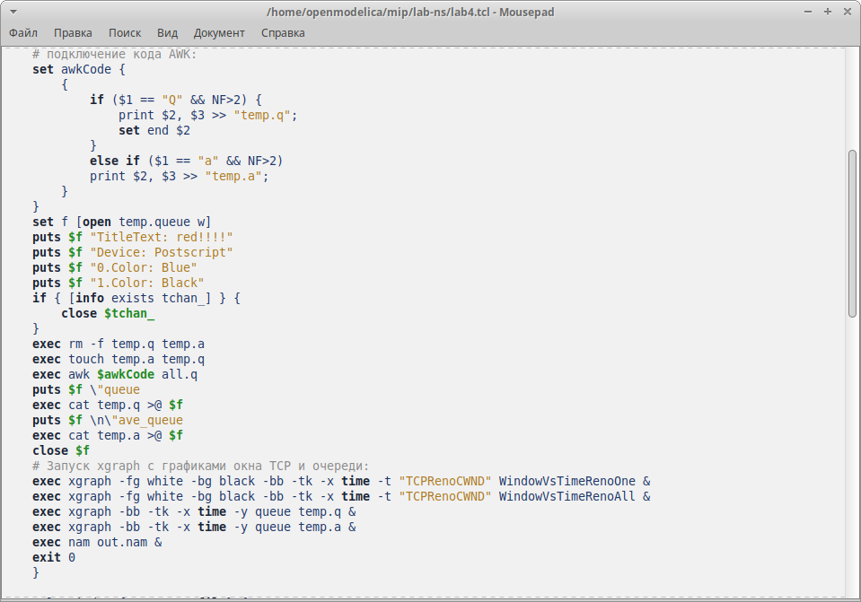{#fig:001 width=50%}

## Выполнение лабораторной работы

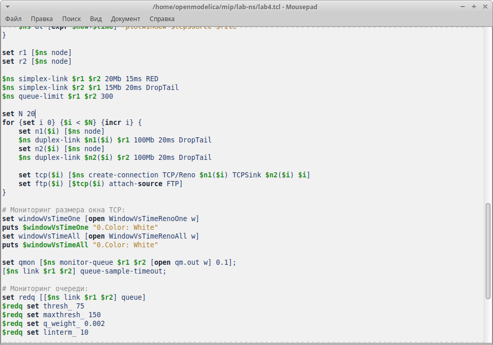{#fig:002 width=50%}

## Выполнение лабораторной работы

2. Запускаем скрипт и получаем на выходе схему моделируемой сети и графики

{#fig:003 width=50%}

## Выполнение лабораторной работы

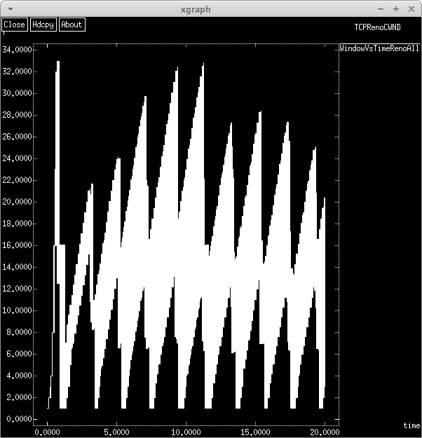 {#fig:004 width=50%}

## Выполнение лабораторной работы

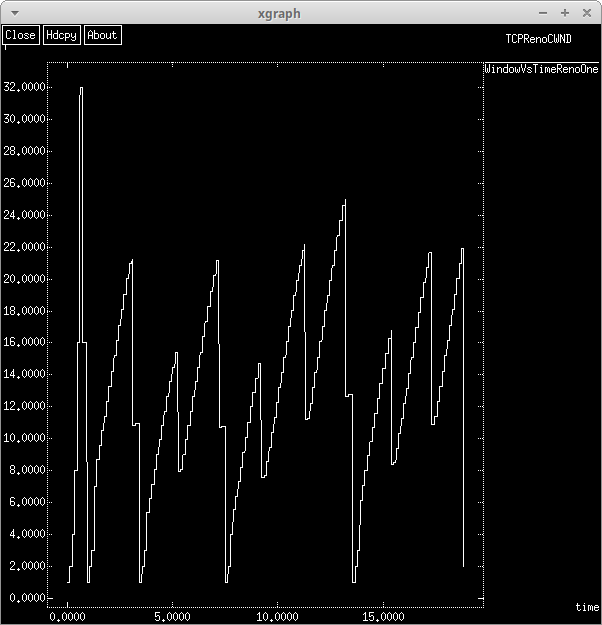{#fig:005 width=50%}

## Выполнение лабораторной работы

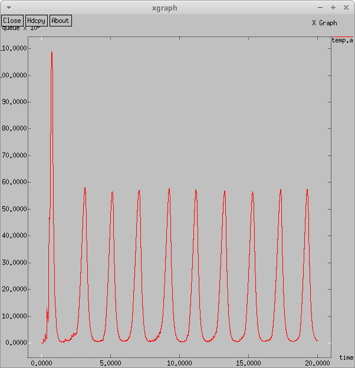{#fig:006 width=50%}

## Выполнение лабораторной работы

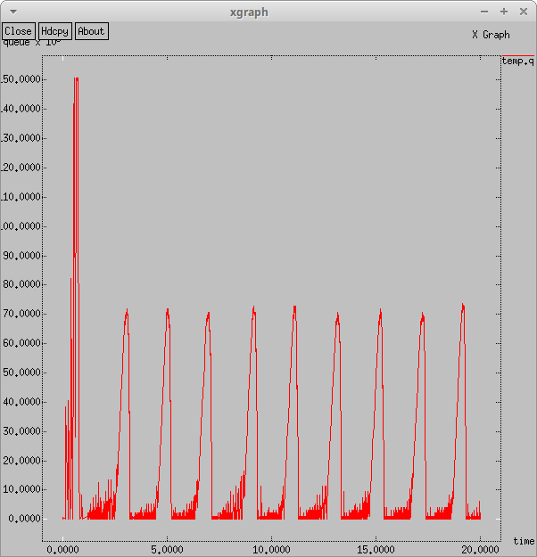{#fig:007 width=50%}

## Выполнение лабораторной работы

3. Создаем файл для построения графиков

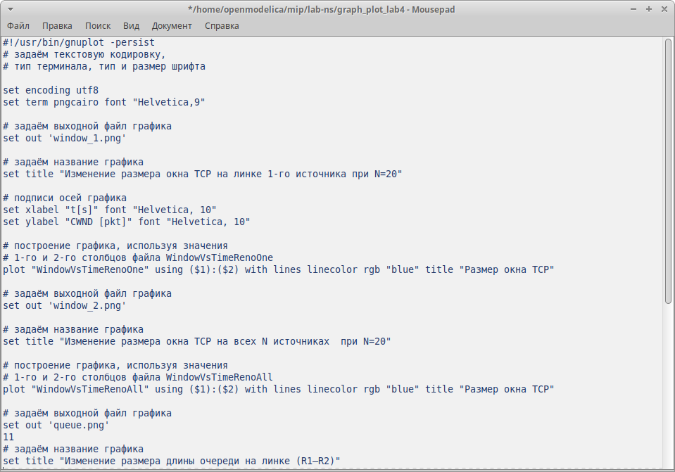{#fig:008 width=50%}

## Выполнение лабораторной работы

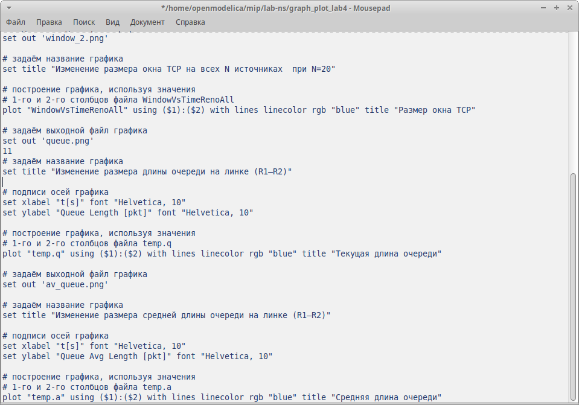{#fig:009 width=50%}

## Выполнение лабораторной работы

4. Делаем файл исполняемым и запускаем

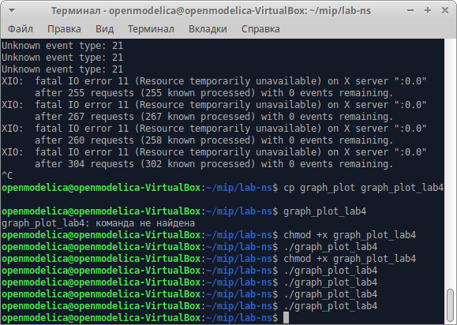{#fig:011 width=50%}

## Выполнение лабораторной работы

Получаем следующие графики:

{#fig:012 width=50%}

## Выполнение лабораторной работы

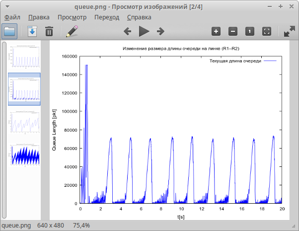{#fig:013 width=50%}

## Выполнение лабораторной работы

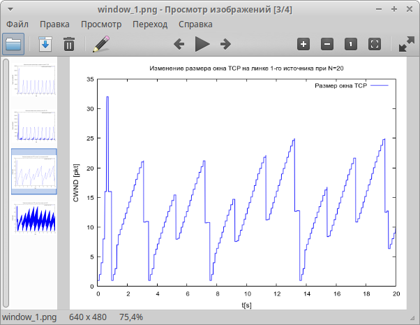{#fig:014 width=50%}

## Выполнение лабораторной работы

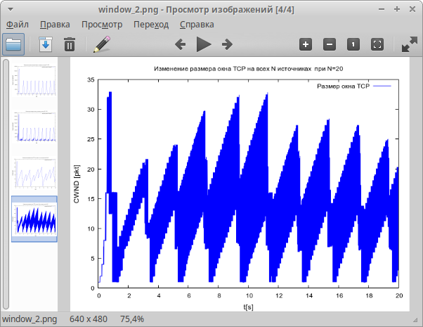{#fig:015 width=50%}

## Выводы

В результате данной лабораторной работы, было выполнено самостоятельное задание. 
