---
## Front matter
lang: ru-RU
title: Лабораторная работа №5
subtitle: Модель эпидемии (SIR)
author:
  - Акопян Сатеник
institute:
  - Российский университет дружбы народов, Москва, Россия
  # - Объединённый институт ядерных исследований, Дубна, Россия
# date: 01 января 1950

## i18n babel
babel-lang: russian
babel-otherlangs: english

## Formatting pdf
toc: false
toc-title: Содержание
slide_level: 2
aspectratio: 169
section-titles: true
theme: metropolis
header-includes:
 - \metroset{progressbar=frametitle,sectionpage=progressbar,numbering=fraction}
---

## Цель работы

Целью данной лабораторной работы является реализовать модель SIR

## Теоретическое введение

Модель SIR предложена в 1927 г. (W. O. Kermack, A. G. McKendrick).

Предполагается, что особи популяции размера N могут находиться в трёх различ-
ных состояниях:

– S (susceptible, уязвимые) — здоровые особи, которые находятся в группе риска
и могут подхватить инфекцию;

– I (infective, заражённые, распространяющие заболевание) — заразившиеся пере-
носчики болезни;

– R (recovered/removed, вылечившиеся) — те, кто выздоровел и перестал распро-
странять болезнь (в эту категорию относят, например, приобретших иммунитет
или умерших).

Внутри каждой из выделенных групп особи считаются неразличимыми по свой-
ствам. 

## Выполнение лабораторной работы

1. **Реализация модели в xcos**

В меню Моделирование, Задать переменные окружения зададим значения переменных $β$ и $ν$ (рис. [-@fig:001]).

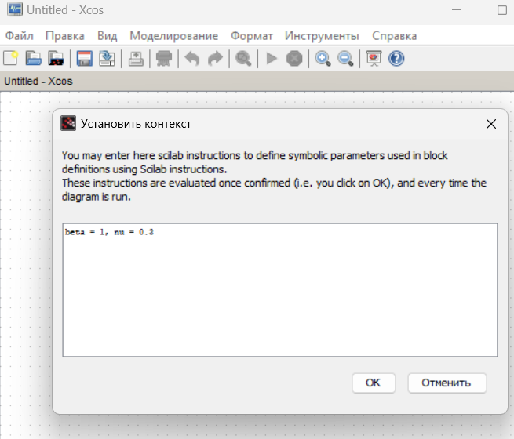{#fig:001 width=50%}

Готовая модель SIR представлена на (рис. [-@fig:002])
Первое уравнение модели задано верхним блоком интегрирования, блоком
произведения и блоком задания коэффициента β. Блок произведения соединён с вы-
ходами верхнего и среднего блоков интегрирования и блоком коэффициента β, что
реализует математическую конструкцию s(t)i(t)β.

## Выполнение лабораторной работы

Третье уравнение модели задано нижним блоком интегрирования и блоком
задания коэффициента ν. Для реализации математической конструкции νi(t) соеди-
няем выход среднего блока интегрирования и вход блока задания коэффициента ν,
а результат передаём на вход нижнего блока интегрирования.
Средний блок интегрирования и блок суммирования определяют второе уравне-
ние модели, которое по сути является суммой правых частей первого и третьего уравнений. Для реализации соединяем входы верхнего и нижнего блоков интегрирования с входами блока суммирования, меняя при этом в его параметрах оба знака на минус. Выход блока суммирования соединяем с входом среднего блока интегрирования.

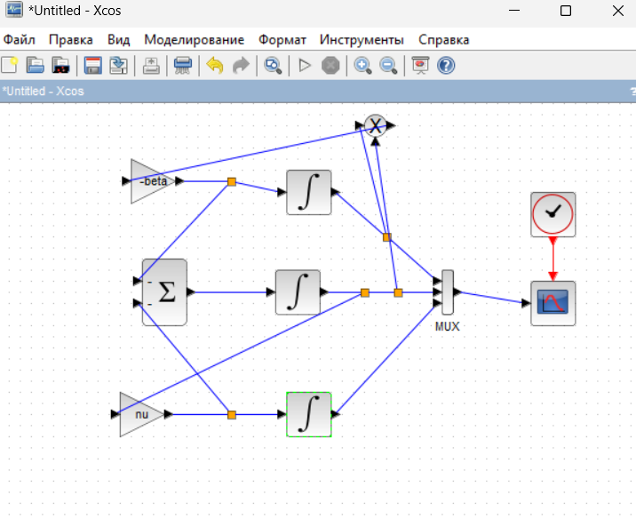{#fig:002 width=50%}

## Выполнение лабораторной работы

Меняем количество выходов мультиплексора до 3 (рис. [-@fig:003])

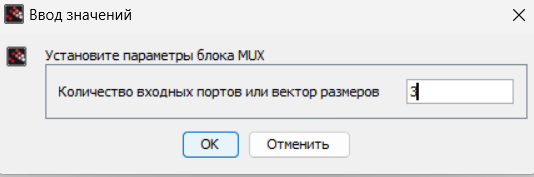{#fig:003 width=50%}

## Выполнение лабораторной работы

Выходы трёх блоков интегрирования соединяем с мультиплексором.
В параметрах верхнего и среднего блока интегрирования необходимо задать
начальные значения $s(0) = 0$, $0.999$ и $i(0) = 0.001$  (рис. [-@fig:005], [-@fig:006])

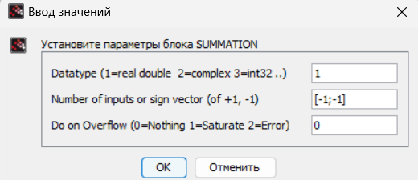{#fig:004 width=50%}

## Выполнение лабораторной работы

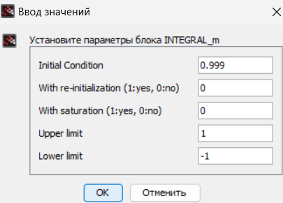{#fig:005 width=50%}

## Выполнение лабораторной работы

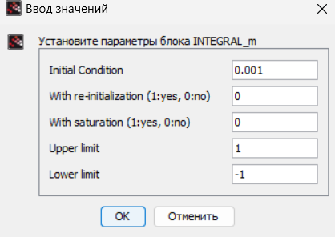{#fig:006 width=50%}

## Выполнение лабораторной работы

В меню Моделирование, Установка необходимо задать конечное время интегри-
рования, равным времени моделирования (в данном случае 30)

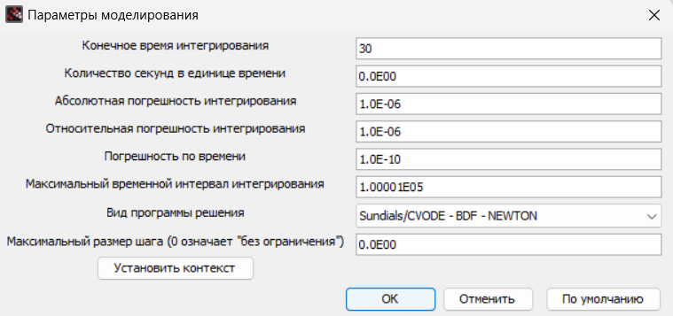{#fig:007 width=50%}

## Выполнение лабораторной работы

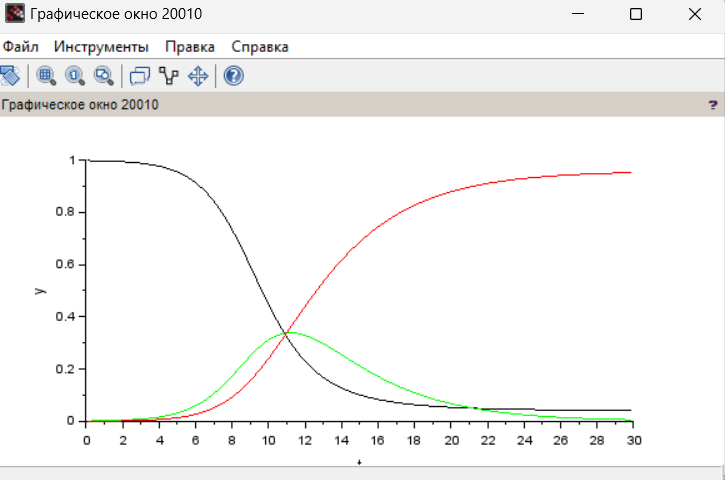{#fig:008 width=50%}

## Выполнение лабораторной работы

2. **Реализация модели с помощью блока Modelica в xcos**

Готовая модель SIR представлена на (рис. [-@fig:009])

Для реализации модели с помощью языка Modelica помимо блоков CLOCK_c,
CSCOPE, TEXT_f и MUX требуются блоки CONST_m — задаёт константу; MBLOCK
(Modelica generic) — блок реализации кода на языке Modelica. 

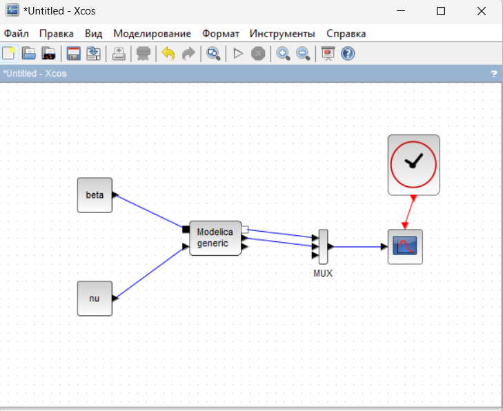{#fig:009 width=50%}

## Выполнение лабораторной работы

Параметры блока Modelica представлены на (рис. [-@fig:010], [-@fig:011]). Переменные на входе (“beta”,
“nu”) и выходе (“s”, “i”, “r”) блока заданы как внешние (“E”).

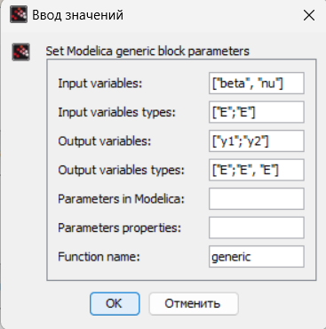{#fig:010 width=50%}

## Выполнение лабораторной работы

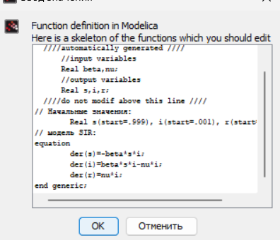{#fig:011 width=50%}

## Выполнение лабораторной работы

Результат моделирования совпал с результатом при реализации модели с помощью блоков интегрирования

{#fig:012 width=50%}

## Выводы

В результате данной лабораторной работы, была реализована модель SIR.
