---
## Front matter
title: "Лабораторная работа 6."
subtitle: "Модель «хищник–жертва»"
author: "Акопян Сатеник"

## Generic otions
lang: ru-RU
toc-title: "Содержание"

## Bibliography
bibliography: bib/cite.bib
csl: pandoc/csl/gost-r-7-0-5-2008-numeric.csl

## Pdf output format
toc: true # Table of contents
toc-depth: 2
lof: true # List of figures
lot: true # List of tables
fontsize: 12pt
linestretch: 1.5
papersize: a4
documentclass: scrreprt
## I18n polyglossia
polyglossia-lang:
  name: russian
  options:
	- spelling=modern
	- babelshorthands=true
polyglossia-otherlangs:
  name: english
## I18n babel
babel-lang: russian
babel-otherlangs: english
## Fonts
mainfont: IBM Plex Serif
romanfont: IBM Plex Serif
sansfont: IBM Plex Sans
monofont: IBM Plex Mono
mathfont: STIX Two Math
mainfontoptions: Ligatures=Common,Ligatures=TeX,Scale=0.94
romanfontoptions: Ligatures=Common,Ligatures=TeX,Scale=0.94
sansfontoptions: Ligatures=Common,Ligatures=TeX,Scale=MatchLowercase,Scale=0.94
monofontoptions: Scale=MatchLowercase,Scale=0.94,FakeStretch=0.9
mathfontoptions:
## Biblatex
biblatex: true
biblio-style: "gost-numeric"
biblatexoptions:
  - parentracker=true
  - backend=biber
  - hyperref=auto
  - language=auto
  - autolang=other*
  - citestyle=gost-numeric
## Pandoc-crossref LaTeX customization
figureTitle: "Рис."
tableTitle: "Таблица"
listingTitle: "Листинг"
lofTitle: "Список иллюстраций"
lotTitle: "Список таблиц"
lolTitle: "Листинги"
## Misc options
indent: true
header-includes:
  - \usepackage{indentfirst}
  - \usepackage{float} # keep figures where there are in the text
  - \floatplacement{figure}{H} # keep figures where there are in the text
---

# Цель работы

Целью данной лабораторной работы является реализация модели «хищник–жертва» в xcos

# Теоретическое введение

Модель «хищник–жертва» (модель Лотки — Вольтерры) представляет собой модель
межвидовой конкуренции.

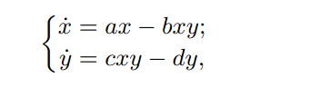

где x — количество жертв; y — количество хищников; a, b, c, d — коэффициен-
ты, отражающие взаимодействия между видами: a — коэффициент рождаемости
жертв; b — коэффициент убыли жертв; c — коэффициент рождения хищников; d —
коэффициент убыли хищников.

# Выполнение лабораторной работы

1. Реализация модели в xcos

1.2 Зафиксируем начальные данные: $a = 2, b = 1, c = 0, 3, d = 1, x(0) = 2, y(0) = 1$.
В меню Моделирование, Задать переменные окружения зададим значения коэф-
фициентов $a, b, c, d$ (рис. [-@fig:001]).

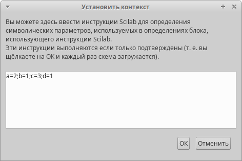{#fig:001 width=70%}

1.3 Для реализации модели (6.1) в дополнение к блокам $CLOCK_c, CSCOPE, TEXT_f,
MUX, INTEGRAL_m, GAINBLK_f, SUMMATION, PROD_f $ потребуется блок $ CSCOPXY $—
регистрирующее устройство для построения фазового портрета. (рис. [-@fig:002])

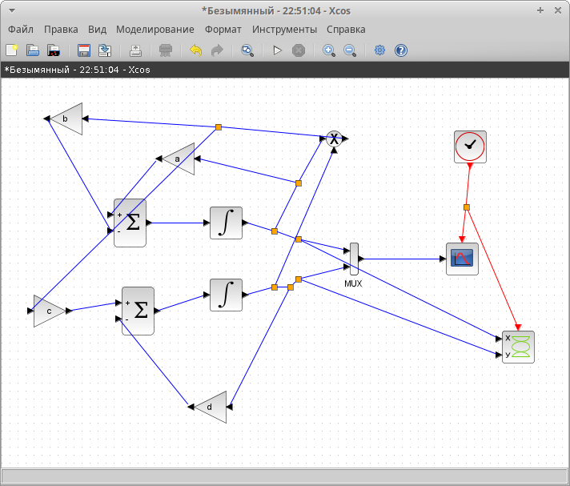{#fig:002 width=70%}

1.4 В параметрах блоков интегрирования необходимо задать начальные значения
$ x(0) = 2, y(0) = 1$ (рис. [-@fig:003], [-@fig:004])

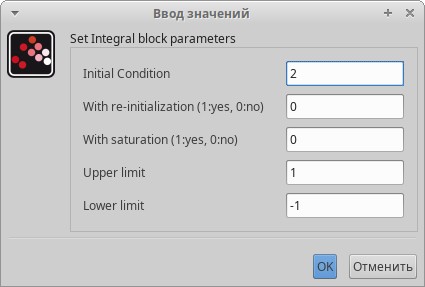{#fig:003 width=70%}

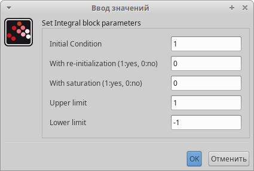{#fig:004 width=70%}

Результат моделирования представлен на (рис. [-@fig:005])

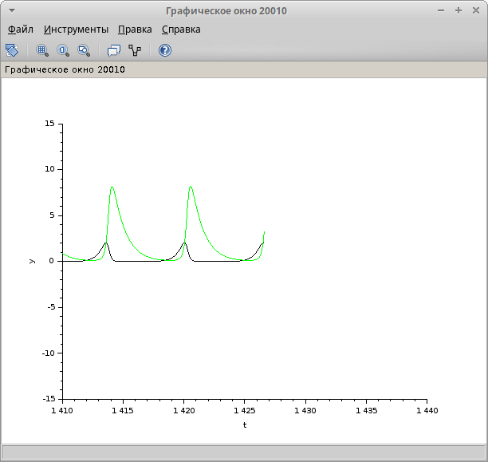{#fig:005 width=70%}

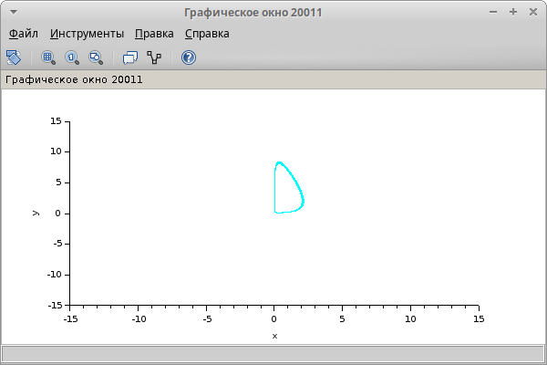{#fig:006 width=70%}

2. Реализация модели с помощью блока Modelica в xcos

Для реализации модели с помощью языка Modelica потребуются следующие
блоки xcos: CLOCK_c, CSCOPE, CSCOPXY, TEXT_f, MUX, CONST_m и MBLOCK (Modelica
generic).

Как и ранее, задаём значения коэффициентов a, b, c, d

Параметры блока Modelica представлены на (рис. [-@fig:007], [-@fig:008])

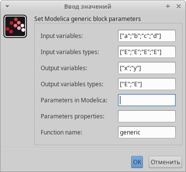{#fig:007 width=70%}

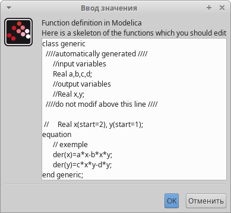{#fig:008 width=70%}

Готовая модель «хищник–жертва» представлена на (рис. [-@fig:009])

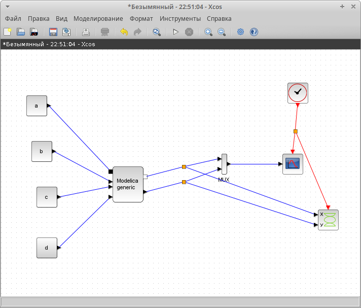{#fig:009 width=70%}

Результаты моделирования представлены на (рис. [-@fig:010], [-@fig:011])

{#fig:010 width=70%}

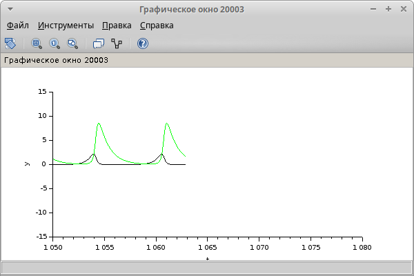{#fig:011 width=70%}

# Выводы

В результате данной лабораторной работы была реализована модель «хищник–жертва» в xcos.