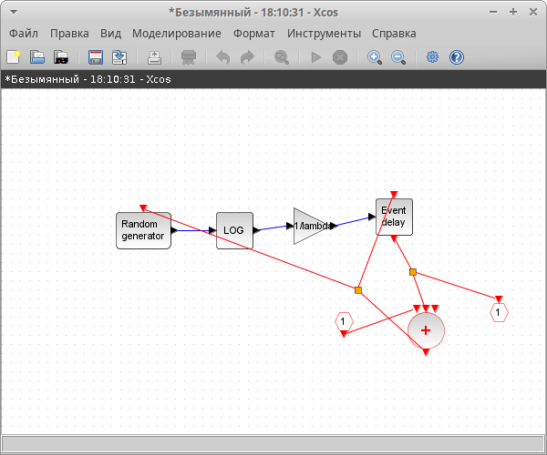
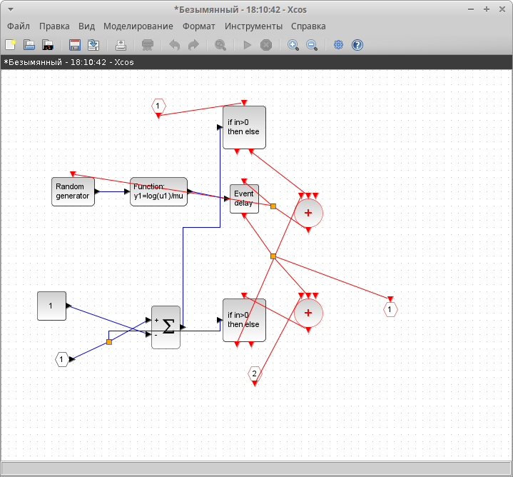
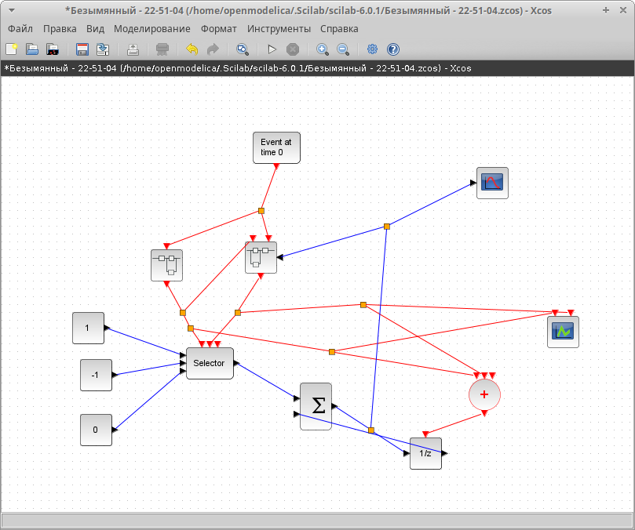
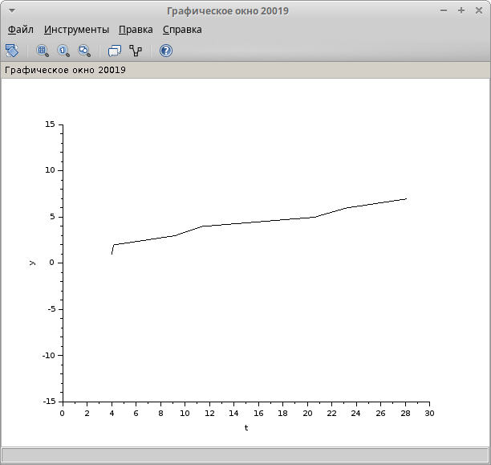
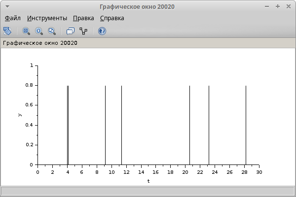

---
## Front matter
lang: ru-RU
title: Лабораторная работа 7
subtitle: Модель $M |M |1|∞$
author:
  - Акопян Сатеник
institute:
  - Российский университет дружбы народов, Москва, Россия
  # - Объединённый институт ядерных исследований, Дубна, Россия
# date: 01 января 1950

## i18n babel
babel-lang: russian
babel-otherlangs: english

## Formatting pdf
toc: false
toc-title: Содержание
slide_level: 2
aspectratio: 169
section-titles: true
theme: metropolis
header-includes:
 - \metroset{progressbar=frametitle,sectionpage=progressbar,numbering=fraction}
---

## Цель работы

Смоделировать в xcos системы массового обслуживания типа M |M |1|∞

## Выполнение лабораторной работы

Зафиксируем начальные данные: $λ = 0, 3, μ = 0, 35, z_0 = 6$. Суперблок, моделирующий поступление заявок, представлен на (рис. [-@fig:001]).

{#fig:001 width=50%}

## Выполнение лабораторной работы

Суперблок, моделирующий процесс обработки заявок, представлен на (рис. [-@fig:002]).

{#fig:002 width=50%}

## Выполнение лабораторной работы

Готовая модель $M |M |1|∞$ представлена на  (рис. [-@fig:003]).

{#fig:003 width=50%}

## Выполнение лабораторной работы

Результат моделирования представлен на (рис. [-@fig:004], [-@fig:005]).

{#fig:004 width=50%}

## Выполнение лабораторной работы

{#fig:005 width=50%}

## Выводы

В результате данной лабораторной работы была смоделирована модель системы массового обслуживания типа $M |M |1|∞$ в xcos 
