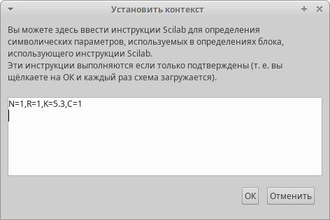
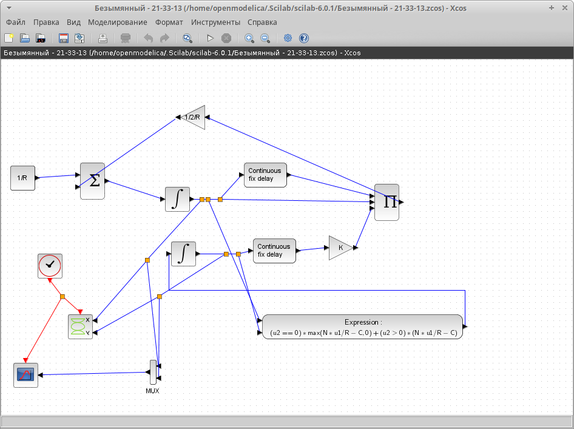
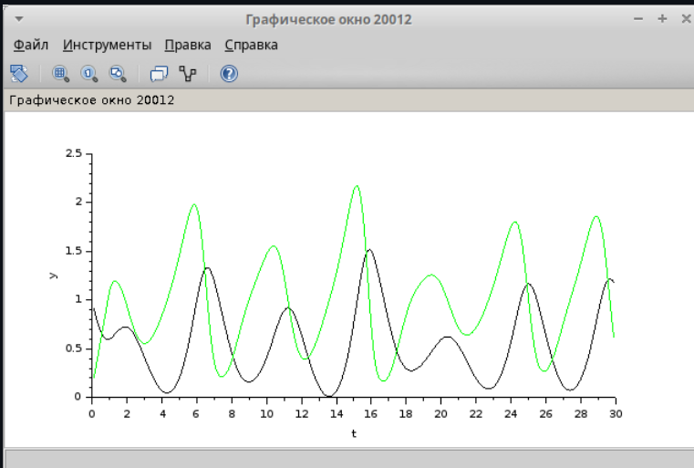
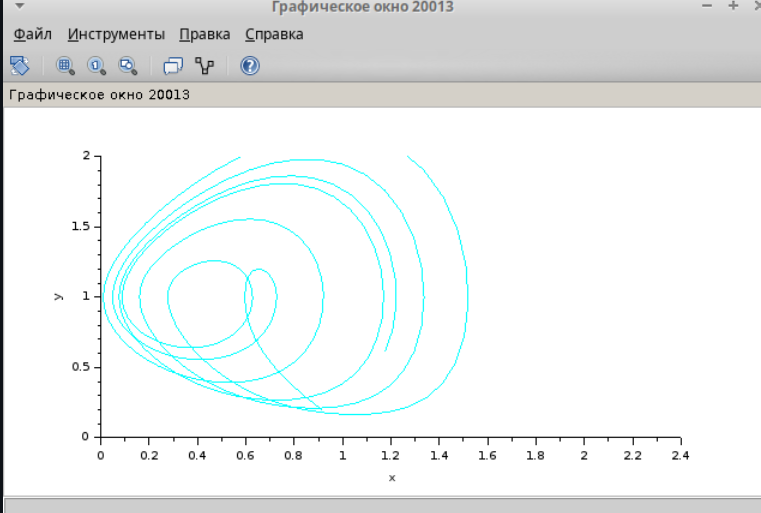

---
## Front matter
lang: ru-RU
title: Лабораторная работа №8
subtitle: Модель TCP/AQM
author:
  - Акопян Сатеник
institute:
  - Российский университет дружбы народов, Москва, Россия
  # - Объединённый институт ядерных исследований, Дубна, Россия
# date: 01 января 1950

## i18n babel
babel-lang: russian
babel-otherlangs: english

## Formatting pdf
toc: false
toc-title: Содержание
slide_level: 2
aspectratio: 169
section-titles: true
theme: metropolis
header-includes:
 - \metroset{progressbar=frametitle,sectionpage=progressbar,numbering=fraction}
---

## Цель работы

Целью данной лабораторной работы является смоделировать модель TCP/AQM в xcos

## Выполнение лабораторной работы

Задаем переменные окружения в xcos с начальными значениями $N = 1, R = 1, K = 5, 3, C = 1, W (0) = 0, 1, Q(0) = 1$ (рис. [-@fig:001])

{#fig:001 width=50%}

## Выполнение лабораторной работы

Схема xcos, моделирующая систему, с начальными значениями пара-
метров $N = 1, R = 1, K = 5, 3, C = 1, W (0) = 0, 1, Q(0) = 1$ приведена на (рис. [-@fig:002]).

{#fig:002 width=50%}

## Выполнение лабораторной работы

В результате получим динамику изменения размера TCP окна W(t) (зеленая линия) и размера очереди Q(t) (черная линия) (рис. [-@fig:003]), а также фазовый портрет, который показывает наличие автоколебаний параметров системы — фазовая траектория осциллирует вокруг своей стационарной точки (рис. [-@fig:004])

{#fig:003 width=50%}

## Выполнение лабораторной работы

{#fig:004 width=50%}

## Выводы

В результате данной лабораторной работы была смоделирована модель TCP/AQM в xcos
