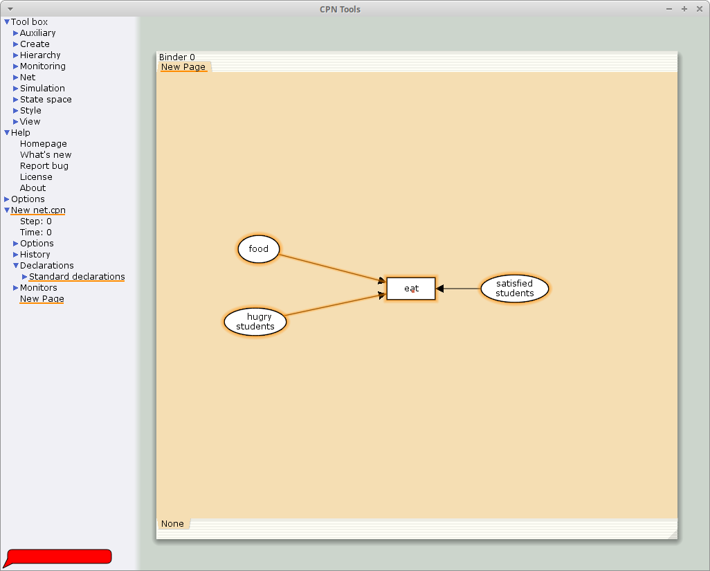
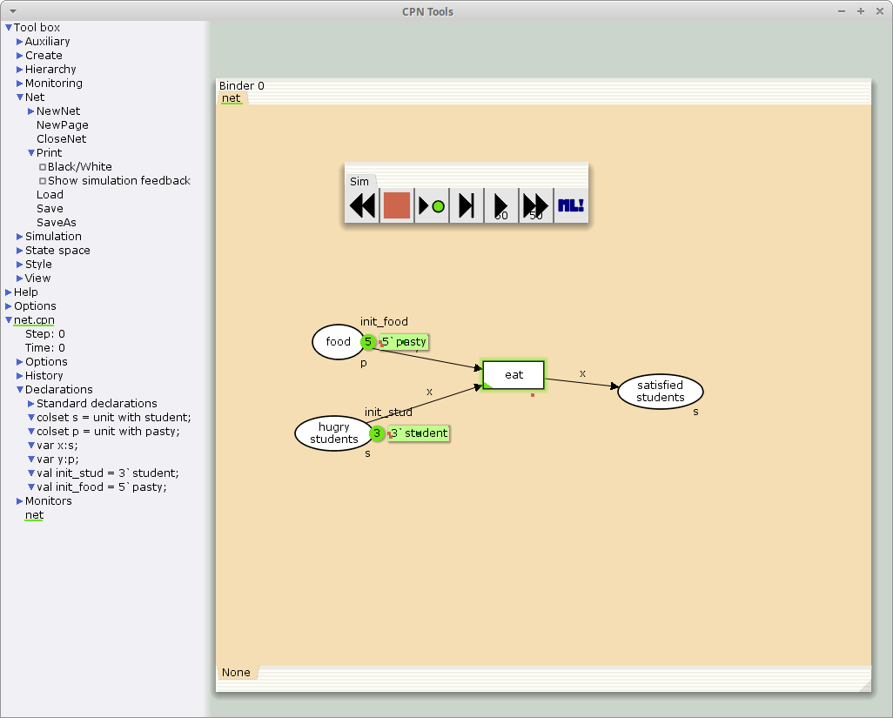
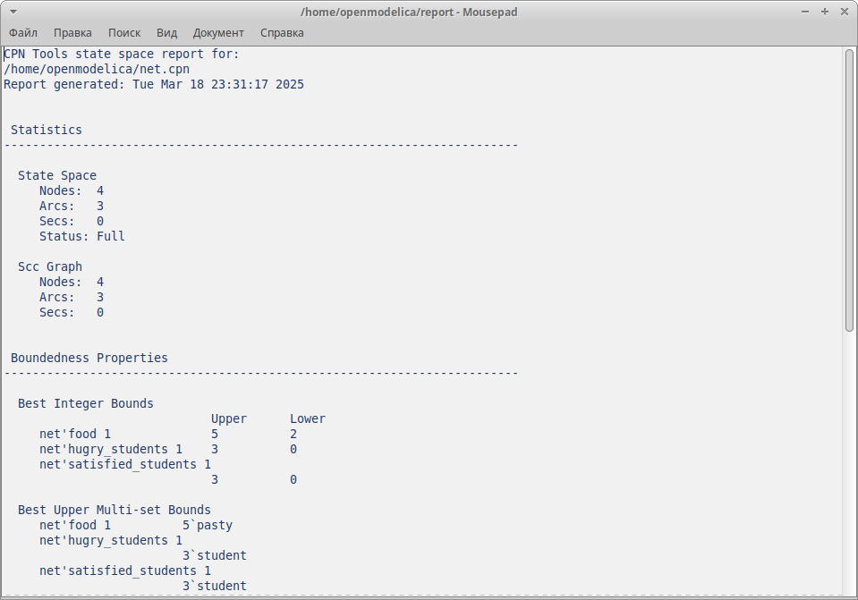

---
## Front matter
lang: ru-RU
title: Лабораторная работа №9
subtitle: Модель «Накорми студентов»
author:
  - Акопян Сатеник
institute:
  - Российский университет дружбы народов, Москва, Россия
  # - Объединённый институт ядерных исследований, Дубна, Россия
# date: 01 января 1950

## i18n babel
babel-lang: russian
babel-otherlangs: english

## Formatting pdf
toc: false
toc-title: Содержание
slide_level: 2
aspectratio: 169
section-titles: true
theme: metropolis
header-includes:
 - \metroset{progressbar=frametitle,sectionpage=progressbar,numbering=fraction}
---

## Цель работы

Целью данной лабораторной работы является смоделировать модель «Накорми студентов» с помощью CPNtools.

## Теоретическое введение

Голодный студент становится сытым после того, как съедает пирог.

Таким образом, имеем:

– два типа фишек: «пироги» и «студенты»;

– три позиции: «голодный студент», «пирожки», «сытый студент»;

– один переход: «съесть пирожок».

## Выполнение лабораторной работы

1. Рисуем граф сети. Для этого с помощью контекстного меню создаём новую сеть, добавляем позиции, переход и дуги 
(рис. [-@fig:001]).

{#fig:001 width=50%}

## Выполнение лабораторной работы

2. В меню задаём новые декларации модели: типы фишек, начальные значения
позиций, выражения для дуг.
После этого задаем тип s фишкам, относящимся к студентам, тип p — фишкам,
относящимся к пирогам, задаём значения переменных x и y для дуг и начальные
значения мультимножеств init_stud и init_food (рис. [-@fig:002]):

## Выполнение лабораторной работы

В результате получаем работающую модель (рис. [-@fig:002]).

```code
colset s=unit with student;
colset p=unit with pasty;
var x:s;
var y:p;
val init_stud = 3`student;
val init_food = 5`pasty;
```
## Выполнение лабораторной работы

{#fig:002 width=50%}

## Выполнение лабораторной работы

3. Вычисляем пространство состояний и сохраняем отчет (рис. [-@fig:003])

{#fig:003 width=50%}


## Выводы

В результате данной лабораторной работы была смоделирована модель «Накорми студентов» с помощью CPNtools.