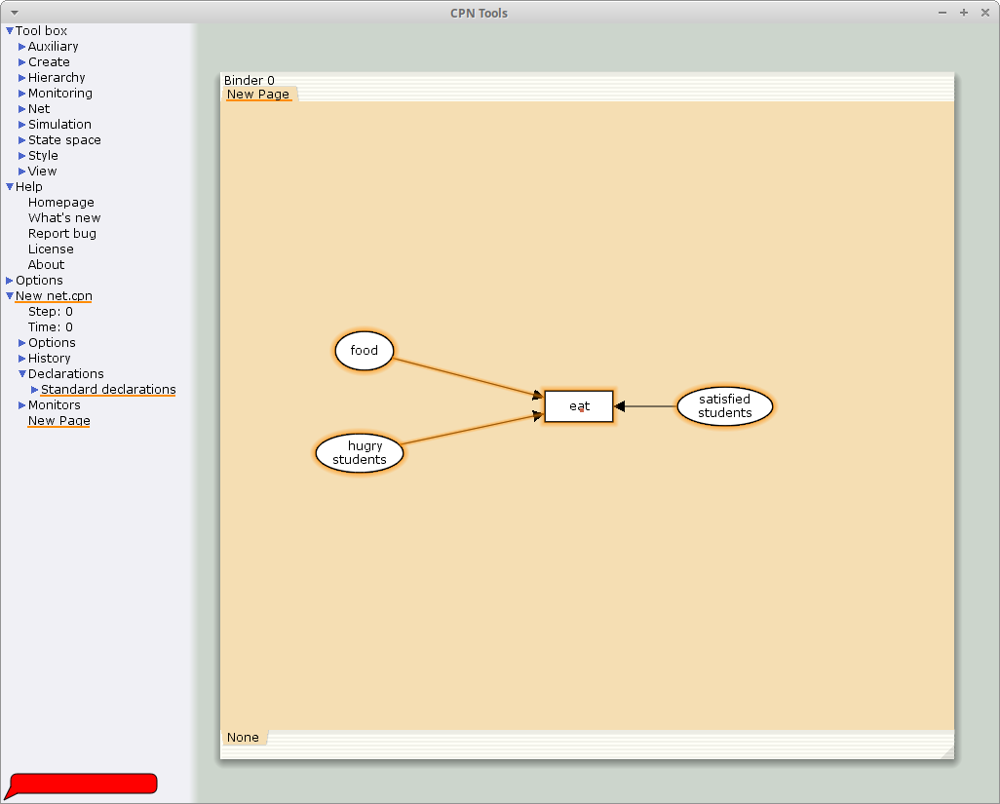
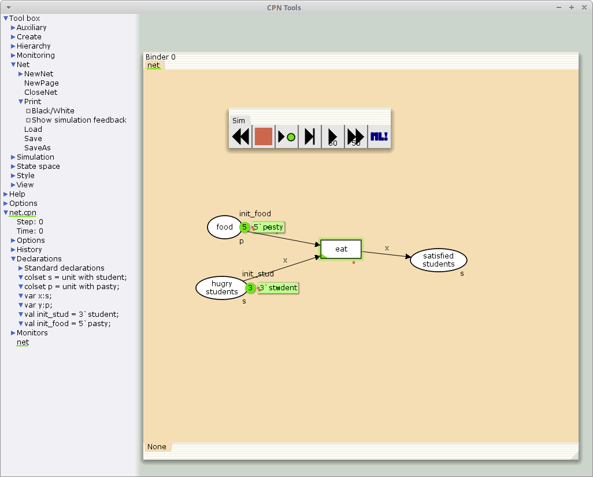
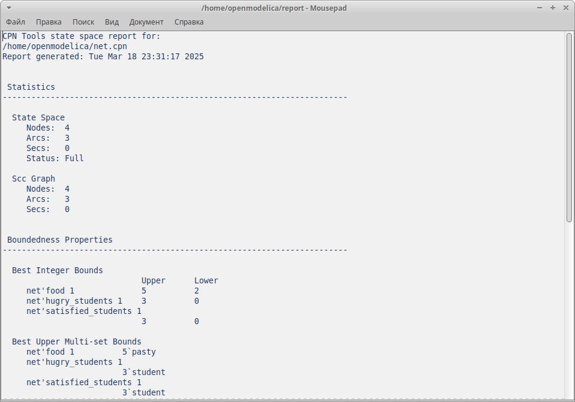

---
## Front matter
title: "Лабораторная работа №9"
subtitle: "Модель «Накорми студентов»"
author: "Акопян Сатеник"

## Generic otions
lang: ru-RU
toc-title: "Содержание"

## Bibliography
bibliography: bib/cite.bib
csl: pandoc/csl/gost-r-7-0-5-2008-numeric.csl

## Pdf output format
toc: true # Table of contents
toc-depth: 2
lof: true # List of figures
lot: true # List of tables
fontsize: 12pt
linestretch: 1.5
papersize: a4
documentclass: scrreprt
## I18n polyglossia
polyglossia-lang:
  name: russian
  options:
	- spelling=modern
	- babelshorthands=true
polyglossia-otherlangs:
  name: english
## I18n babel
babel-lang: russian
babel-otherlangs: english
## Fonts
mainfont: IBM Plex Serif
romanfont: IBM Plex Serif
sansfont: IBM Plex Sans
monofont: IBM Plex Mono
mathfont: STIX Two Math
mainfontoptions: Ligatures=Common,Ligatures=TeX,Scale=0.94
romanfontoptions: Ligatures=Common,Ligatures=TeX,Scale=0.94
sansfontoptions: Ligatures=Common,Ligatures=TeX,Scale=MatchLowercase,Scale=0.94
monofontoptions: Scale=MatchLowercase,Scale=0.94,FakeStretch=0.9
mathfontoptions:
## Biblatex
biblatex: true
biblio-style: "gost-numeric"
biblatexoptions:
  - parentracker=true
  - backend=biber
  - hyperref=auto
  - language=auto
  - autolang=other*
  - citestyle=gost-numeric
## Pandoc-crossref LaTeX customization
figureTitle: "Рис."
tableTitle: "Таблица"
listingTitle: "Листинг"
lofTitle: "Список иллюстраций"
lotTitle: "Список таблиц"
lolTitle: "Листинги"
## Misc options
indent: true
header-includes:
  - \usepackage{indentfirst}
  - \usepackage{float} # keep figures where there are in the text
  - \floatplacement{figure}{H} # keep figures where there are in the text
---

# Цель работы

Целью данной лабораторной работы является смоделировать модель «Накорми студентов» с помощью CPNtools.

# Теоретическое введение

Голодный студент становится сытым после того, как съедает пирог.

Таким образом, имеем:

– два типа фишек: «пироги» и «студенты»;

– три позиции: «голодный студент», «пирожки», «сытый студент»;

– один переход: «съесть пирожок».

# Выполнение лабораторной работы

1. Рисуем граф сети. Для этого с помощью контекстного меню создаём новую сеть, добавляем позиции, переход и дуги 
(рис. [-@fig:001]).

{#fig:001 width=70%}

2. В меню задаём новые декларации модели: типы фишек, начальные значения
позиций, выражения для дуг.
После этого задаем тип s фишкам, относящимся к студентам, тип p — фишкам,
относящимся к пирогам, задаём значения переменных x и y для дуг и начальные
значения мультимножеств init_stud и init_food (рис. [-@fig:002]):

В результате получаем работающую модель (рис. [-@fig:002]).

```code
colset s=unit with student;
colset p=unit with pasty;
var x:s;
var y:p;
val init_stud = 3`student;
val init_food = 5`pasty;
```
{#fig:002 width=70%}

3. Вычисляем пространство состояний и сохраняем отчет (рис. [-@fig:003])

{#fig:003 width=70%}


# Выводы

В результате данной лабораторной работы была смоделирована модель «Накорми студентов» с помощью CPNtools.
# Список литературы{.unnumbered}

::: {#refs}
:::
