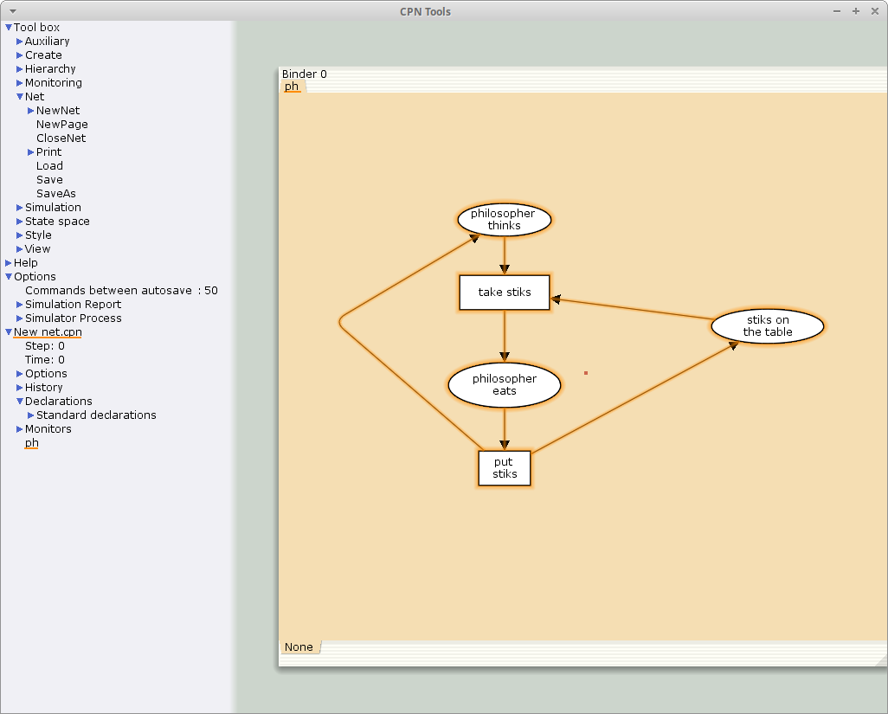
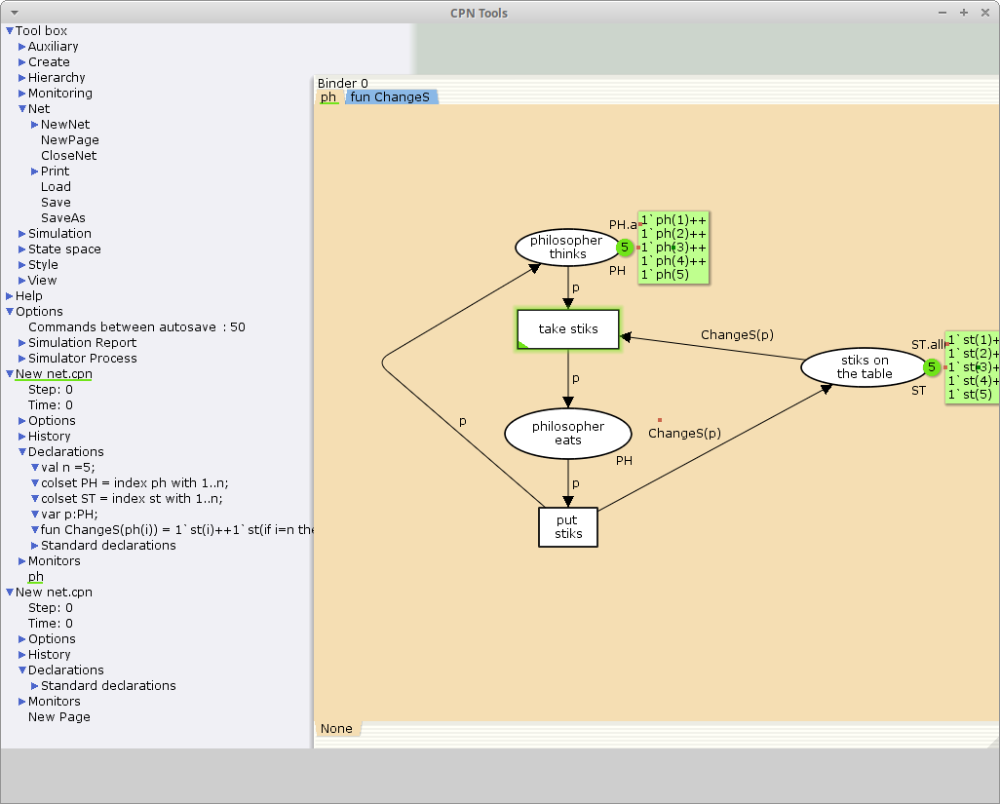
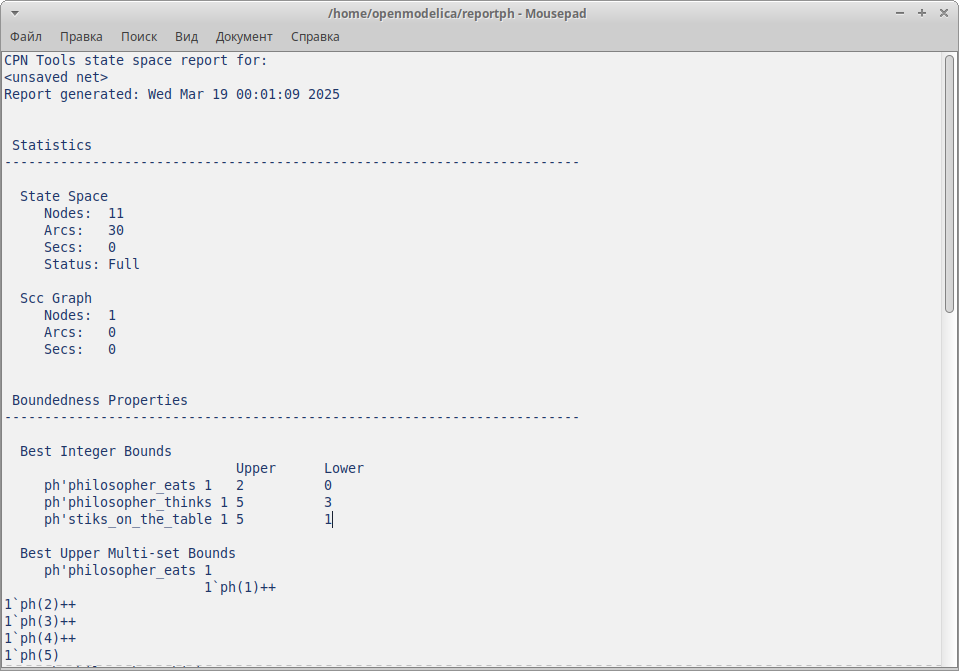

---
## Front matter
lang: ru-RU
title: Лабораторная работа №10
subtitle: Задача об обедающих мудрецах
author:
  - Акопян Сатеник
institute:
  - Российский университет дружбы народов, Москва, Россия
  # - Объединённый институт ядерных исследований, Дубна, Россия
# date: 01 января 1950

## i18n babel
babel-lang: russian
babel-otherlangs: english

## Formatting pdf
toc: false
toc-title: Содержание
slide_level: 2
aspectratio: 169
section-titles: true
theme: metropolis
header-includes:
 - \metroset{progressbar=frametitle,sectionpage=progressbar,numbering=fraction}
---

## Цель работы

Целью данной лабораторной работы является смоделировать  задачу об обедающих мудрецах с помощью CPNtools.

## Выполнение лабораторной работы

1. Рисуем граф сети. Для этого с помощью контекстного меню создаём новую сеть,
добавляем позиции, переходы и дуги 

Начальные данные:

– позиции: мудрец размышляет (philosopher thinks), мудрец ест (philosopher eats),
палочки находятся на столе (sticks on the table)

– переходы: взять палочки (take sticks), положить палочки (put sticks) (рис. [-@fig:001]).

## Выполнение лабораторной работы

{#fig:001 width=50%}

## Выполнение лабораторной работы

2. В меню задаём новые декларации модели: типы фишек, начальные значения
позиций, выражения для дуг:

– n — число мудрецов и палочек (n = 5);

– p — фишки, обозначающие мудрецов, имеют перечисляемый тип PH от 1 до n;

– s — фишки, обозначающие палочки, имеют перечисляемый тип ST от 1 до n;

## Выполнение лабораторной работы

– функция ChangeS(p) ставит в соответствие мудрецам палочки (возвращает но-
мера палочек, используемых мудрецами); по условию задачи мудрецы сидят по
кругу и мудрец p(i) может взять i и i + 1 палочки, поэтому функция ChangeS(p) определяется следующим образом (рис. [-@fig:002]):

```code
fun ChangeS (ph(i))=
1`st(i)++st(if = n then 1 else i+1)
```

## Выполнение лабораторной работы

{#fig:002 width=50%}

## Выполнение лабораторной работы

В результате получаем работающую модель (рис. [-@fig:003]).

{#fig:003 width=50%}

## Выполнение лабораторной работы

3. Вычисляем пространство состояний и сохраняем отчет (рис. [-@fig:004])

{#fig:004 width=50%}


# Выводы

В результате данной лабораторной работы была смоделирована  задача об обедающих мудрецах с помощью CPNtools.