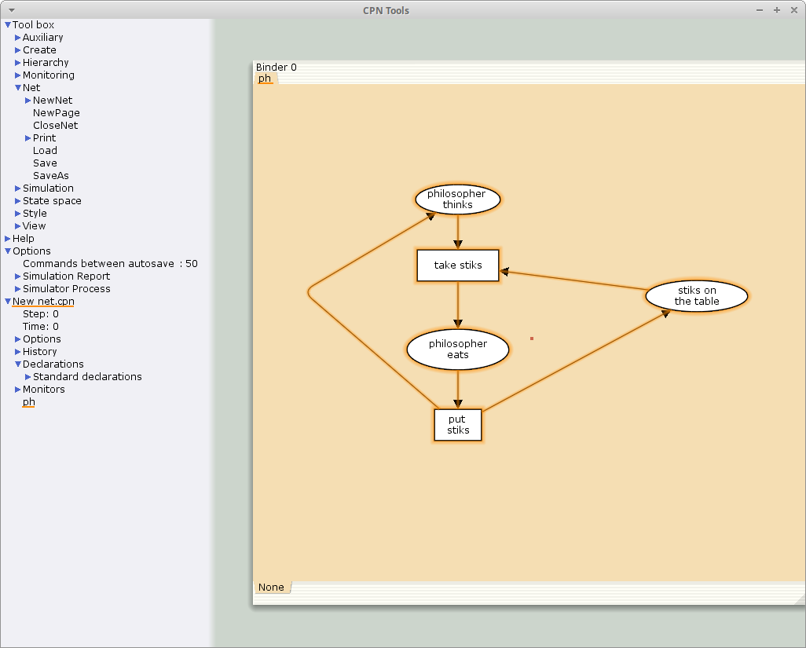
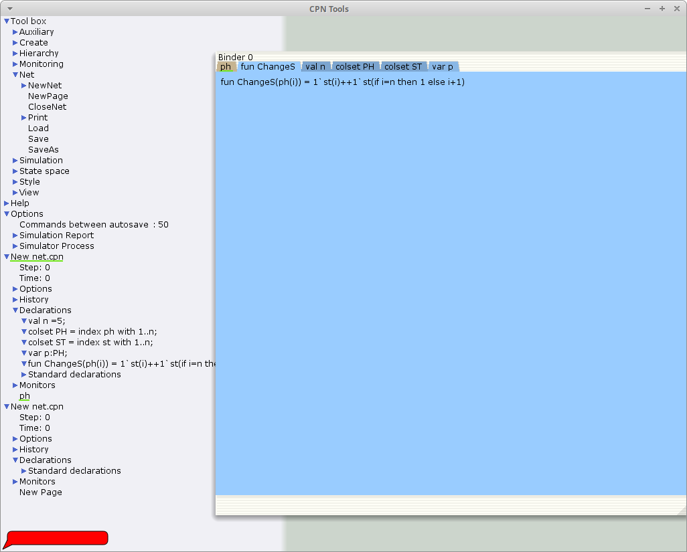
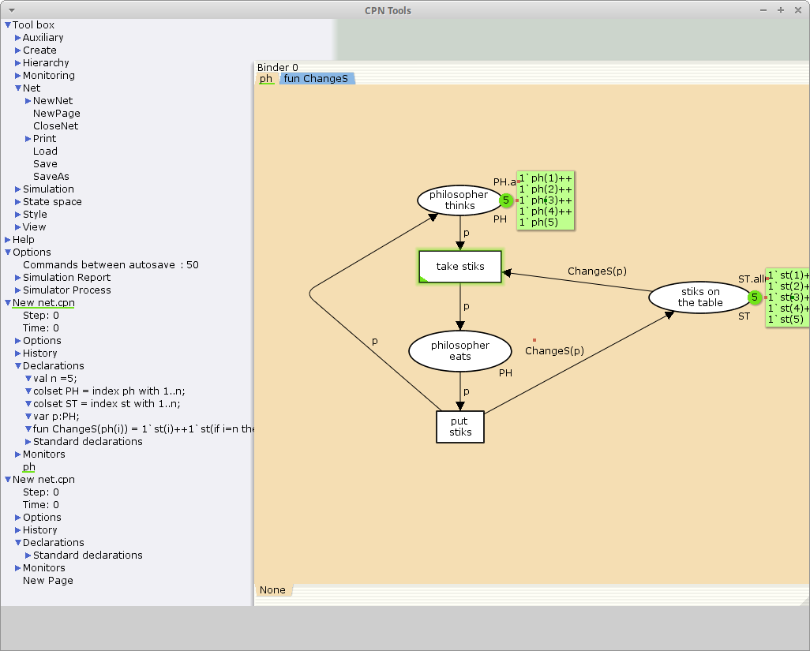
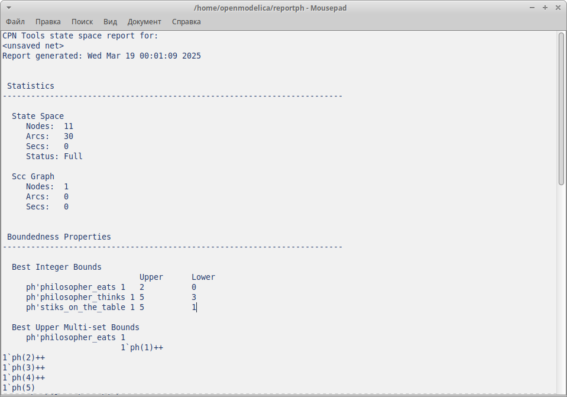

---
## Front matter
title: "Лабораторная работа №10"
subtitle: "Задача об обедающих мудрецах"
author: "Акопян Сатеник"

## Generic otions
lang: ru-RU
toc-title: "Содержание"

## Bibliography
bibliography: bib/cite.bib
csl: pandoc/csl/gost-r-7-0-5-2008-numeric.csl

## Pdf output format
toc: true # Table of contents
toc-depth: 2
lof: true # List of figures
lot: true # List of tables
fontsize: 12pt
linestretch: 1.5
papersize: a4
documentclass: scrreprt
## I18n polyglossia
polyglossia-lang:
  name: russian
  options:
	- spelling=modern
	- babelshorthands=true
polyglossia-otherlangs:
  name: english
## I18n babel
babel-lang: russian
babel-otherlangs: english
## Fonts
mainfont: IBM Plex Serif
romanfont: IBM Plex Serif
sansfont: IBM Plex Sans
monofont: IBM Plex Mono
mathfont: STIX Two Math
mainfontoptions: Ligatures=Common,Ligatures=TeX,Scale=0.94
romanfontoptions: Ligatures=Common,Ligatures=TeX,Scale=0.94
sansfontoptions: Ligatures=Common,Ligatures=TeX,Scale=MatchLowercase,Scale=0.94
monofontoptions: Scale=MatchLowercase,Scale=0.94,FakeStretch=0.9
mathfontoptions:
## Biblatex
biblatex: true
biblio-style: "gost-numeric"
biblatexoptions:
  - parentracker=true
  - backend=biber
  - hyperref=auto
  - language=auto
  - autolang=other*
  - citestyle=gost-numeric
## Pandoc-crossref LaTeX customization
figureTitle: "Рис."
tableTitle: "Таблица"
listingTitle: "Листинг"
lofTitle: "Список иллюстраций"
lotTitle: "Список таблиц"
lolTitle: "Листинги"
## Misc options
indent: true
header-includes:
  - \usepackage{indentfirst}
  - \usepackage{float} # keep figures where there are in the text
  - \floatplacement{figure}{H} # keep figures where there are in the text
---

# Цель работы

Целью данной лабораторной работы является смоделировать  задачу об обедающих мудрецах с помощью CPNtools.

# Выполнение лабораторной работы

1. Рисуем граф сети. Для этого с помощью контекстного меню создаём новую сеть,
добавляем позиции, переходы и дуги 

Начальные данные:

– позиции: мудрец размышляет (philosopher thinks), мудрец ест (philosopher eats),
палочки находятся на столе (sticks on the table)

– переходы: взять палочки (take sticks), положить палочки (put sticks) (рис. [-@fig:001]).

{#fig:001 width=70%}

2. В меню задаём новые декларации модели: типы фишек, начальные значения
позиций, выражения для дуг:

– n — число мудрецов и палочек (n = 5);

– p — фишки, обозначающие мудрецов, имеют перечисляемый тип PH от 1 до n;

– s — фишки, обозначающие палочки, имеют перечисляемый тип ST от 1 до n;

– функция ChangeS(p) ставит в соответствие мудрецам палочки (возвращает но-
мера палочек, используемых мудрецами); по условию задачи мудрецы сидят по
кругу и мудрец p(i) может взять i и i + 1 палочки, поэтому функция ChangeS(p) определяется следующим образом (рис. [-@fig:002]):

```code
fun ChangeS (ph(i))=
1`st(i)++st(if = n then 1 else i+1)
```

{#fig:002 width=70%}


В результате получаем работающую модель (рис. [-@fig:003]).

{#fig:003 width=70%}

3. Вычисляем пространство состояний и сохраняем отчет (рис. [-@fig:004])

{#fig:004 width=70%}


# Выводы

В результате данной лабораторной работы была смоделирована  задача об обедающих мудрецах с помощью CPNtools.