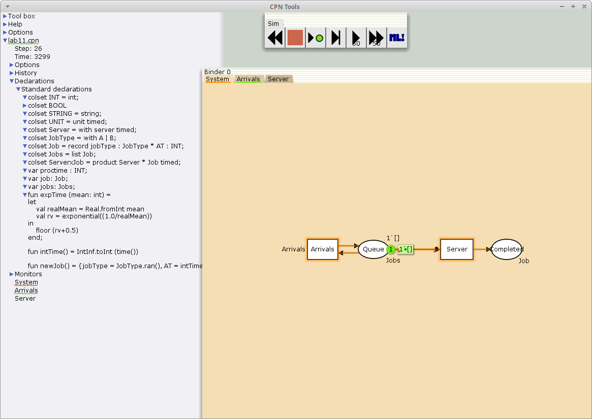
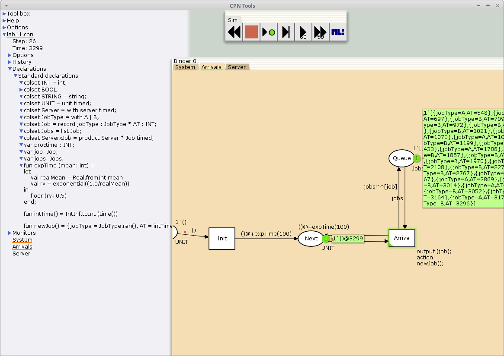
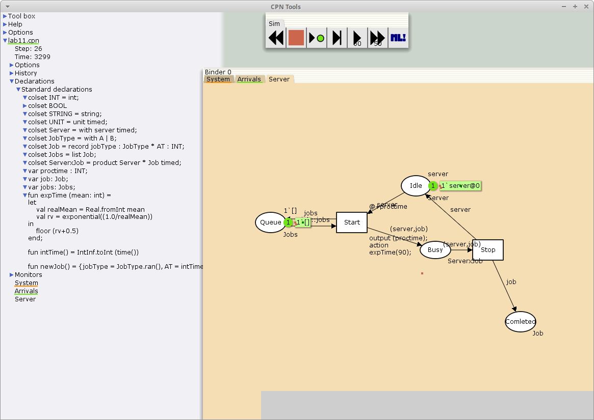
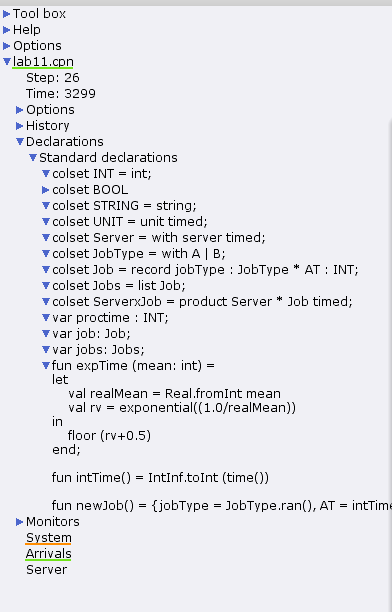
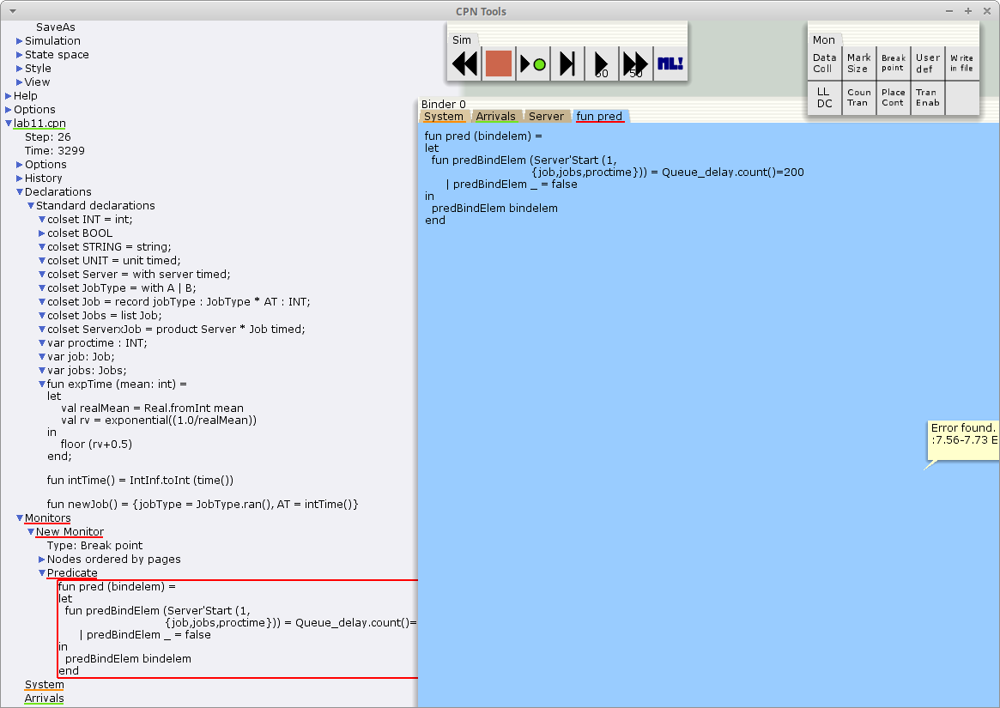
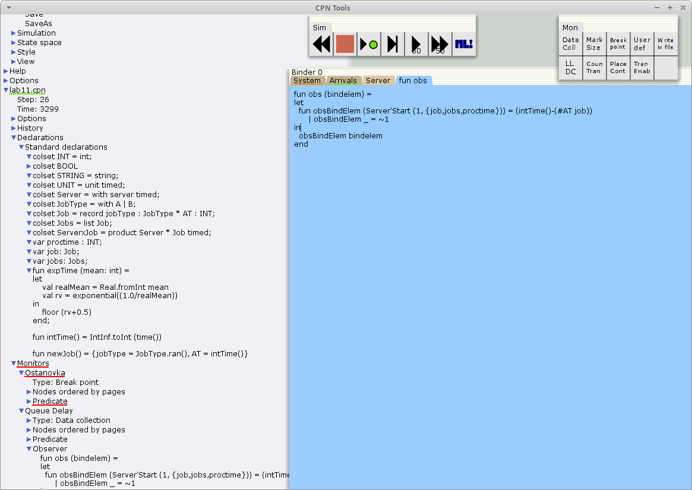
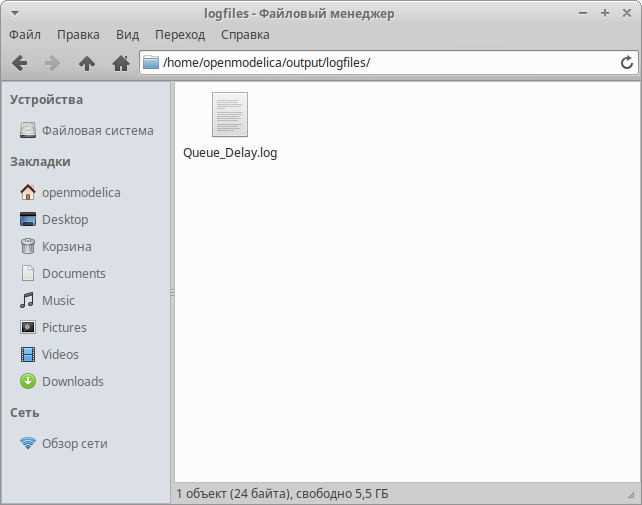

---
## Front matter
lang: ru-RU
title: Лабораторная работа 11
subtitle: Модель системы массового обслуживания M |M |1
author:
  - Акопян Сатеник
institute:
  - Российский университет дружбы народов, Москва, Россия
  - Объединённый институт ядерных исследований, Дубна, Россия
# date: 01 января 1940

## i18n babel
babel-lang: russian
babel-otherlangs: english

## Formatting pdf
toc: false
toc-title: Содержание
slide_level: 2
aspectratio: 169
section-titles: true
theme: metropolis
header-includes:
 - \metroset{progressbar=frametitle,sectionpage=progressbar,numbering=fraction}
---

## Цель работы

Построить модель системы массового обслуживания M |M |1

## Задание

В систему поступает поток заявок двух типов, распределённый по пуассоновскому
закону. Заявки поступают в очередь сервера на обработку. Дисциплина очереди -
FIFO. Если сервер находится в режиме ожидания (нет заявок на сервере), то заявка
поступает на обработку сервером

## Выполнение лабораторной работы

1. Будем использовать три отдельных листа: на первом листе опишем граф системы
(рис. [-@fig:001]), на втором — генератор заявок (рис. [-@fig:002]), на третьем — сервер обработки
заявок (рис. [-@fig:003]), также зададим параметры модели на графах сети.

{#fig:001 width=40%}

## Выполнение лабораторной работы

{#fig:002 width=40%}

## Выполнение лабораторной работы

{#fig:003 width=40%}

## Выполнение лабораторной работы

2. Зададим декларации системы  (рис. [-@fig:004]).

Определим множества цветов системы (colorset):

– фишки типа UNIT определяют моменты времени;

– фишки типа INT определяют моменты поступления заявок в систему.

– фишки типа JobType определяют 2 типа заявок — A и B;

– кортеж Job имеет 2 поля: jobType определяет тип работы соответственно име-
ет тип JobType, поле AT имеет тип INT и используется для хранения времени
нахождения заявки в системе;

– фишки Jobs — список заявок;

– фишки типа ServerxJob — определяют состояние сервера, занятого обработкой
заявок.

## Выполнение лабораторной работы

{#fig:004 width=40%}

## Выполнение лабораторной работы

3. Мониторинг параметров моделируемой системы

Необходимо внести изменения в функцию Predicate, которая будет выполняться при запуске монитора

Изначально, когда функция начинает работать, она возвращает значение true,
в противном случае — false. В теле функции вызывается процедура predBindElem,
которую определяем в предварительных декларациях.
Зададим число шагов, через которое будем останавливать мониторинг. Для этого
true заменим на Queue_Delay.count()=200  (рис. [-@fig:005])

## Выполнение лабораторной работы

{#fig:005 width=40%}

## Выполнение лабораторной работы

Изменим функцию Observer так, чтобы получить значение задержки в очереди. Для этого необходи-
мо из текущего времени intTime() вычесть временную метку AT , означающую
приход заявки в очередь (рис. [-@fig:006])

{#fig:006 width=40%}

## Выполнение лабораторной работы

После запуска программы на выполнение в каталоге с кодом программы появит-
ся файл Queue_Delay.log, содержащий в первой колонке — значение задержки
очереди, во второй — счётчик, в третьей — шаг, в четвёртой — время
(рис. [-@fig:007])

{#fig:007 width=40%}

## Выводы

В результате была построена модель системы массового обслуживания M |M |1 с помощью cpntools
