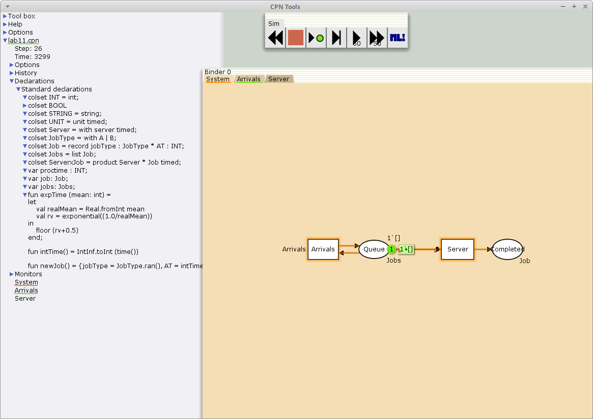
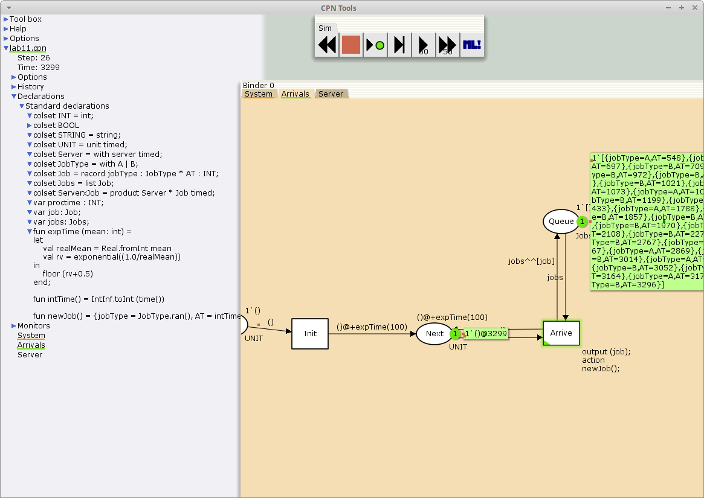
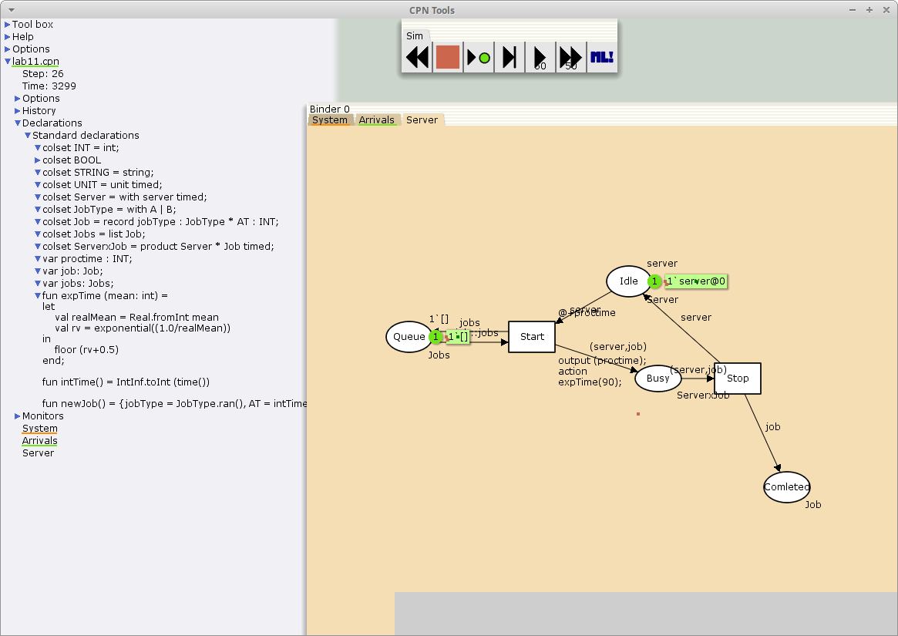
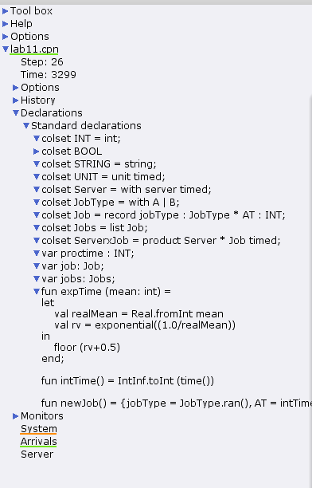
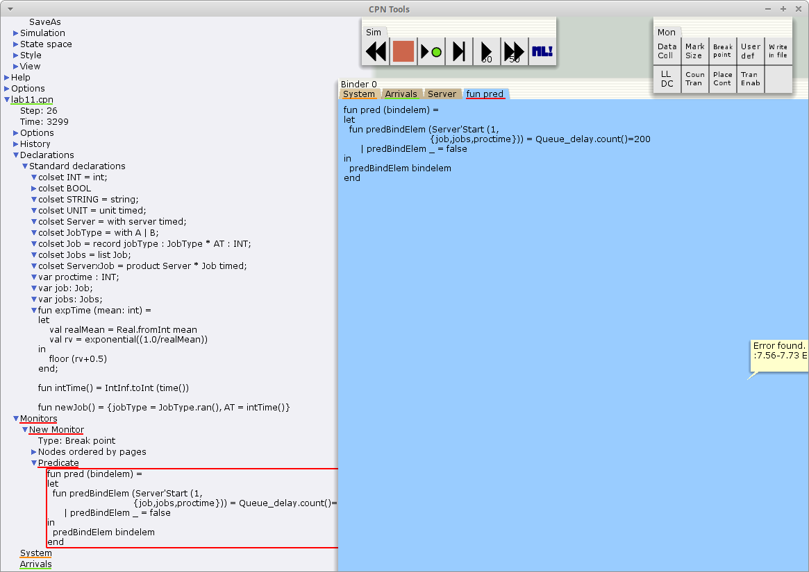
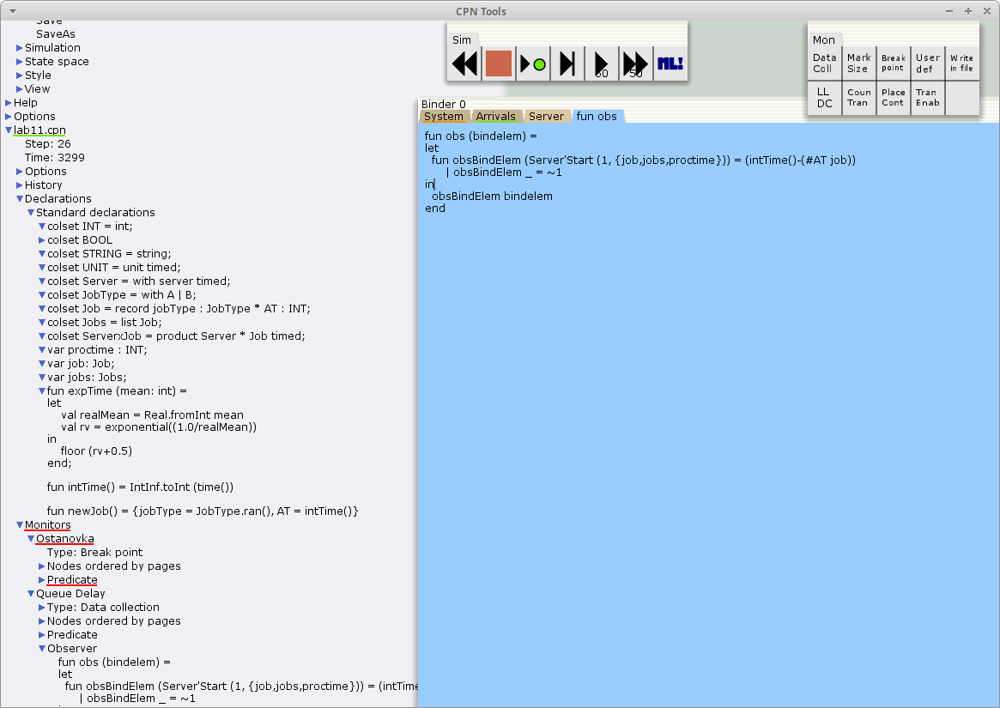
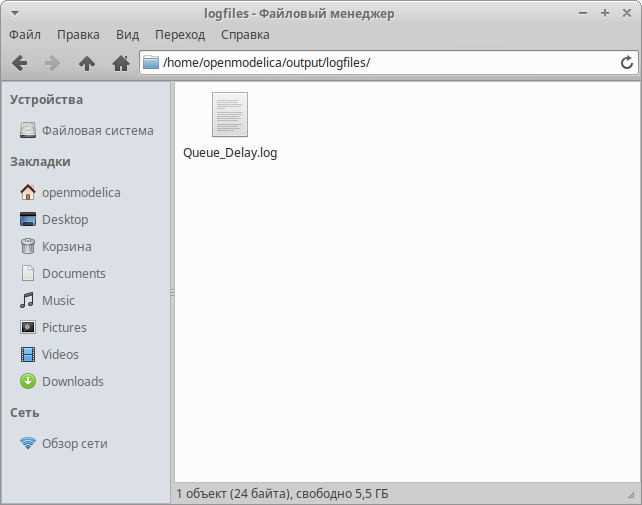

---
## Front matter
title: "Лабораторная работа 11"
subtitle: "Модель системы массового обслуживания M |M |1"
author: "Акопян Сатеник"

## Generic otions
lang: ru-RU
toc-title: "Содержание"

## Bibliography
bibliography: bib/cite.bib
csl: pandoc/csl/gost-r-7-0-5-2008-numeric.csl

## Pdf output format
toc: true # Table of contents
toc-depth: 2
lof: true # List of figures
lot: true # List of tables
fontsize: 12pt
linestretch: 1.5
papersize: a4
documentclass: scrreprt
## I18n polyglossia
polyglossia-lang:
  name: russian
  options:
	- spelling=modern
	- babelshorthands=true
polyglossia-otherlangs:
  name: english
## I18n babel
babel-lang: russian
babel-otherlangs: english
## Fonts
mainfont: IBM Plex Serif
romanfont: IBM Plex Serif
sansfont: IBM Plex Sans
monofont: IBM Plex Mono
mathfont: STIX Two Math
mainfontoptions: Ligatures=Common,Ligatures=TeX,Scale=0.94
romanfontoptions: Ligatures=Common,Ligatures=TeX,Scale=0.94
sansfontoptions: Ligatures=Common,Ligatures=TeX,Scale=MatchLowercase,Scale=0.94
monofontoptions: Scale=MatchLowercase,Scale=0.94,FakeStretch=0.9
mathfontoptions:
## Biblatex
biblatex: true
biblio-style: "gost-numeric"
biblatexoptions:
  - parentracker=true
  - backend=biber
  - hyperref=auto
  - language=auto
  - autolang=other*
  - citestyle=gost-numeric
## Pandoc-crossref LaTeX customization
figureTitle: "Рис."
tableTitle: "Таблица"
listingTitle: "Листинг"
lofTitle: "Список иллюстраций"
lotTitle: "Список таблиц"
lolTitle: "Листинги"
## Misc options
indent: true
header-includes:
  - \usepackage{indentfirst}
  - \usepackage{float} # keep figures where there are in the text
  - \floatplacement{figure}{H} # keep figures where there are in the text
---

# Цель работы

Построить модель системы массового обслуживания M |M |1

# Задание

В систему поступает поток заявок двух типов, распределённый по пуассоновскому
закону. Заявки поступают в очередь сервера на обработку. Дисциплина очереди -
FIFO. Если сервер находится в режиме ожидания (нет заявок на сервере), то заявка
поступает на обработку сервером

# Выполнение лабораторной работы

1. Будем использовать три отдельных листа: на первом листе опишем граф системы
(рис. [-@fig:001]), на втором — генератор заявок (рис. [-@fig:002]), на третьем — сервер обработки
заявок (рис. [-@fig:003]), также зададим параметры модели на графах сети.

{#fig:001 width=70%}

{#fig:002 width=70%}

{#fig:003 width=70%}

2. Зададим декларации системы  (рис. [-@fig:004]).

Определим множества цветов системы (colorset):

– фишки типа UNIT определяют моменты времени;

– фишки типа INT определяют моменты поступления заявок в систему.

– фишки типа JobType определяют 2 типа заявок — A и B;

– кортеж Job имеет 2 поля: jobType определяет тип работы соответственно име-
ет тип JobType, поле AT имеет тип INT и используется для хранения времени
нахождения заявки в системе;

– фишки Jobs — список заявок;

– фишки типа ServerxJob — определяют состояние сервера, занятого обработкой
заявок.

{#fig:004 width=70%}

3. Мониторинг параметров моделируемой системы

Необходимо внести изменения в функцию Predicate, которая будет выполняться при запуске монитора

Изначально, когда функция начинает работать, она возвращает значение true,
в противном случае — false. В теле функции вызывается процедура predBindElem,
которую определяем в предварительных декларациях.
Зададим число шагов, через которое будем останавливать мониторинг. Для этого
true заменим на Queue_Delay.count()=200  (рис. [-@fig:005])

{#fig:005 width=70%}

Изменим функцию Observer так, чтобы получить значение задержки в очереди. Для этого необходи-
мо из текущего времени intTime() вычесть временную метку AT , означающую
приход заявки в очередь (рис. [-@fig:006])

{#fig:006 width=70%}

После запуска программы на выполнение в каталоге с кодом программы появит-
ся файл Queue_Delay.log, содержащий в первой колонке — значение задержки
очереди, во второй — счётчик, в третьей — шаг, в четвёртой — время
(рис. [-@fig:007])

{#fig:007 width=70%}

# Выводы

В результате была построена модель системы массового обслуживания M |M |1 с помощью cpntools

# Список литературы{.unnumbered}

::: {#refs}
:::
