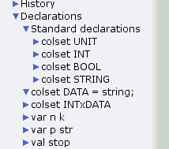
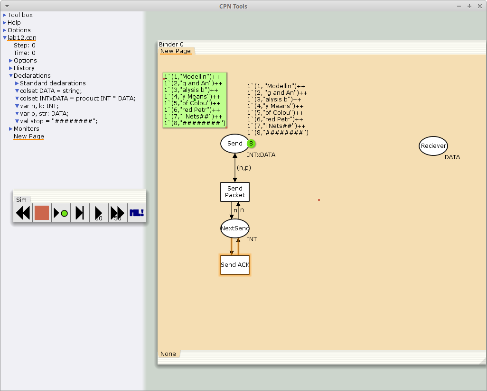
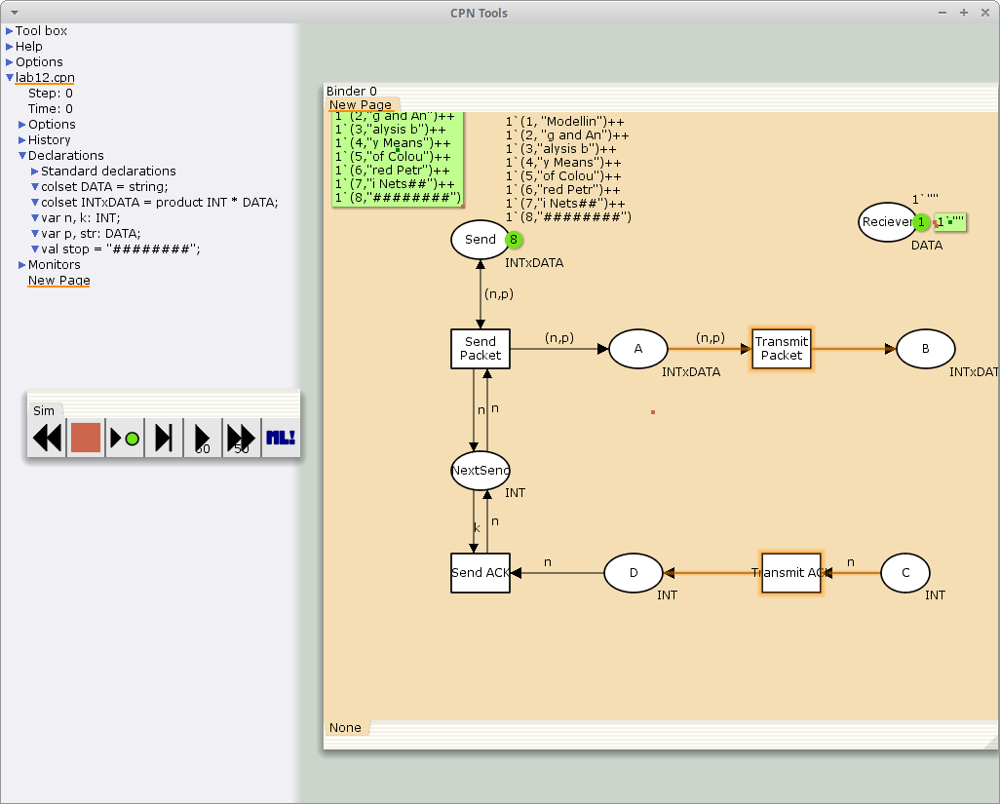
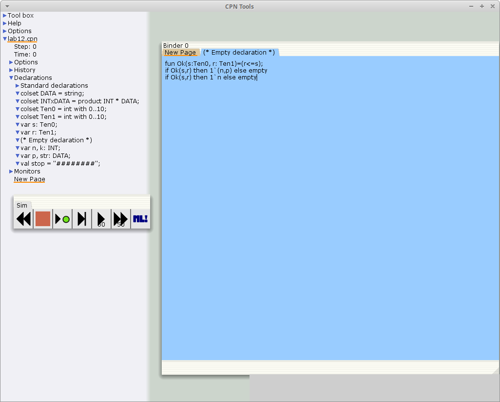
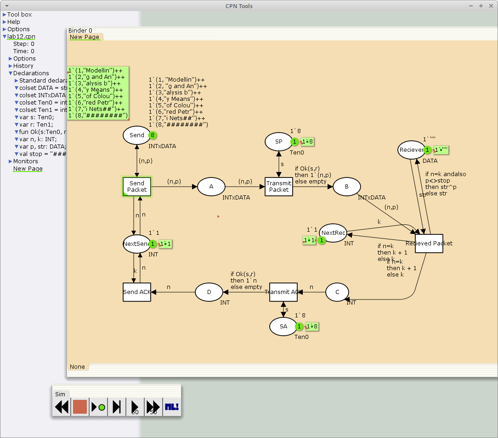

---
## Front matter
lang: ru-RU
title: Лабораторная работа 12
subtitle: Пример моделирования простого протокола передачи данных
author:
  - Акопян Сатеник
institute:
  - Российский университет дружбы народов, Москва, Россия
  - Объединённый институт ядерных исследований, Дубна, Россия
date: 01 января 1940

## i18n babel
babel-lang: russian
babel-otherlangs: english

## Formatting pdf
toc: false
toc-title: Содержание
slide_level: 2
aspectratio: 169
section-titles: true
theme: metropolis
header-includes:
 - \metroset{progressbar=frametitle,sectionpage=progressbar,numbering=fraction}
---
## Цель работы

Смоделировать простой протокол передачи данных.

## Задание

Рассмотрим ненадёжную сеть передачи данных, состоящую из источника, получате-
ля.
Перед отправкой очередной порции данных источник должен получить от полу-
чателя подтверждение о доставке предыдущей порции данных.
Считаем, что пакет состоит из номера пакета и строковых данных. Передавать
будем сообщение «Modelling and Analysis by Means of Coloured Petry Nets», разбитое по 8 символов.

## Выполнение лабораторной работы

1. Зададим декларации модели (рис. [-@fig:001]).

{#fig:001 width=40%}

## Выполнение лабораторной работы

2. Стоповый байт ("########") определяет, что сообщение закончилось.
Состояние Receiver имеет тип DATA и начальное значение 1`"" (т.е. пустая
строка, поскольку состояние собирает данные и номер пакета его не интересует).
Состояние NextSend имеет тип INT и начальное значение 1`1.
Поскольку пакеты представляют собой кортеж, состоящий из номера пакета и стро-
ки, то выражение у двусторонней дуги будет иметь значение (n,p).
Кроме того, необходимо взаимодействовать с состоянием, которое будет сообщать
номер следующего посылаемого пакета данных. Поэтому переход Send Packet
соединяем с состоянием NextSend двумя дугами с выражениями n (рис. 12.1).
Также необходимо получать информацию с подтверждениями о получении дан-
ных. От перехода Send Packet к состоянию NextSend дуга с выражением n,
обратно — k. (рис. [-@fig:002])

## Выполнение лабораторной работы

{#fig:002 width=40%} 

## Выполнение лабораторной работы

3. Зададим промежуточные состояния (A, B с типом INTxDATA, C, D с типом
INTxDATA) для переходов (рис. 12.2): передать пакет Transmit Packet (передаём
(n,p)), передать подтверждение Transmit ACK (передаём целое число k).
Добавляем переход получения пакета (Receive Packet).
От состояния Receiver идёт дуга к переходу Receive Packet со значением той
строки (str), которая находится в состоянии Receiver. Обратно: проверяем, что
номер пакета новый и строка не равна стоп-биту. Если это так, то строку добавляем
к полученным данным.

## Выполнение лабораторной работы

Кроме того, необходимо знать, каким будет номер следующего пакета. Для этого
добавляем состояние NextRec с типом INT и начальным значением 1`1 (один пакет),
связываем его дугами с переходом Receive Packet. Причём к переходу идёт дуга
с выражением k, от перехода — if n=k then k+1 else k.
Связываем состояния B и C с переходом Receive Packet. От состояния B
к переходу Receive Packet — выражение (n,p), от перехода Receive Packet
к состоянию C — выражение if n=k then k+1 else k.
От перехода Receive Packet к состоянию Receiver:
if n=k andalso p<>stop then str^p else str

## Выполнение лабораторной работы

{#fig:003 width=40%} 

## Выполнение лабораторной работы

4. 
На переходах Transmit Packet и Transmit ACK зададим потерю пакетов. Для
этого на интервале от 0 до 10 зададим пороговое значение и, если передаваемое
значение превысит этот порог, то считаем, что произошла потеря пакета, если нет, то
передаём пакет дальше. Для этого задаём вспомогательные состояния SP и SA с типом
Ten0 и начальным значением 1`8, соединяем с соответствующими переходами.

## Выполнение лабораторной работы

В декларациях задаём:
```code
colset Ten0 = int with 0..10;
colset Ten1 = int with 0..10;
var s: Ten0;
var r: Ten1;
```
(рис. [-@fig:004])

## Выполнение лабораторной работы

Таким образом, получим модель простого протокола передачи данных (рис. [-@fig:005]).

{#fig:004 width=40%} 

## Выполнение лабораторной работы

{#fig:005 width=40%} 

## Выводы

В результате был смоделирован простой протокол передачи данных.
