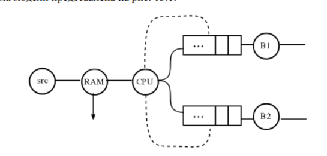
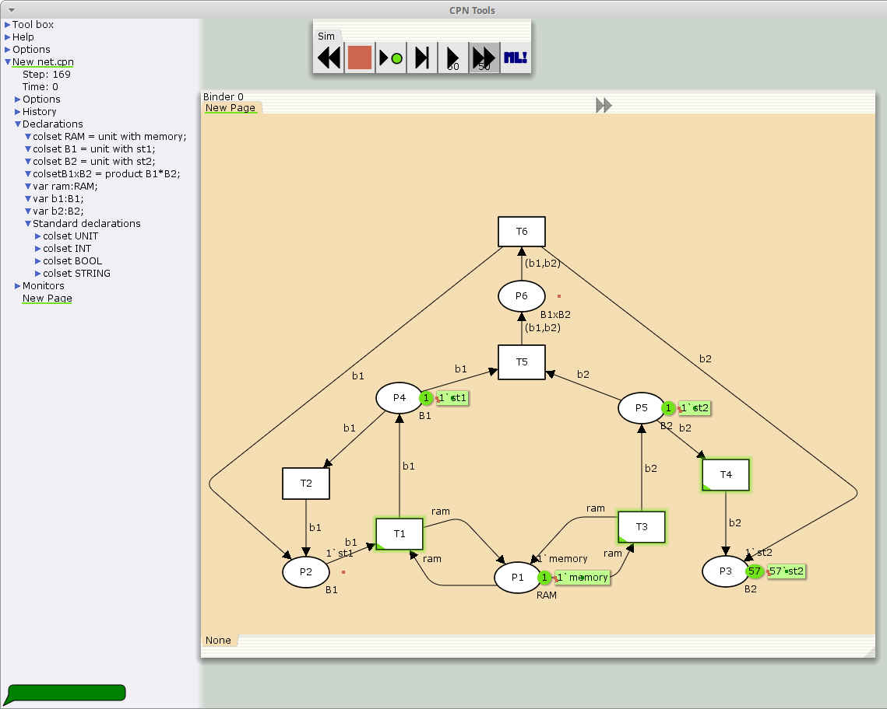
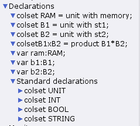
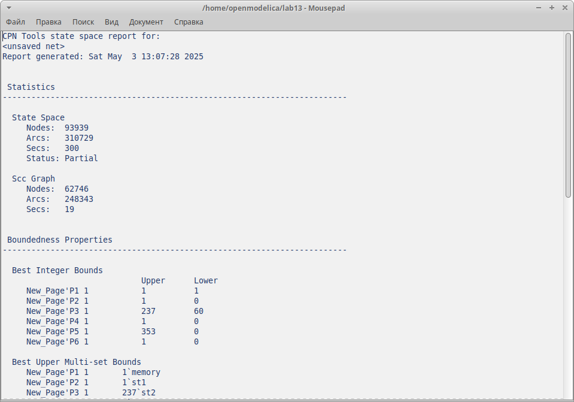
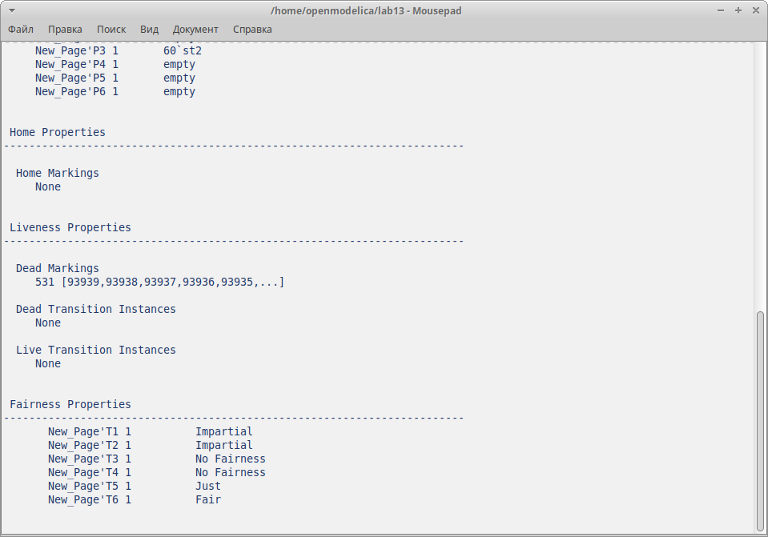

---
## Front matter
lang: ru-RU
title: Лабораторная работа 13
subtitle: Задание для самостоятельного выполнения
author:
  - Акопян Сатеник
institute:
  - Российский университет дружбы народов, Москва, Россия
  - Объединённый институт ядерных исследований, Дубна, Россия
date: 01 января 1970

## i18n babel
babel-lang: russian
babel-otherlangs: english

## Formatting pdf
toc: false
toc-title: Содержание
slide_level: 2
aspectratio: 169
section-titles: true
theme: metropolis
header-includes:
 - \metroset{progressbar=frametitle,sectionpage=progressbar,numbering=fraction}
---
## Цель работы

Выполнить самостоятельное задание

## Задание
1. Используя теоретические методы анализа сетей Петри, проведите анализ сети,
(с помощью построения дерева достижимости). Опре-
делите, является ли сеть безопасной, ограниченной, сохраняющей, имеются ли
тупики.

2. Промоделируйте сеть Петри с помощью CPNTools.

3. Вычислите пространство состояний. Сформируйте отчёт о пространстве состоя-
ний и проанализируйте его. Постройте граф пространства состояний.

## Теоретическое введение

Заявка (команды программы, операнды) поступает в оперативную память (ОП), затем
передается на прибор (центральный процессор, ЦП) для обработки. После этого
заявка может равновероятно обратиться к оперативной памяти или к одному из двух
внешних запоминающих устройств (B1 и B2). Прежде чем записать информацию на
внешний накопитель, необходимо вторично обратиться к центральному процессору,
определяющему состояние накопителя и выдающему необходимую управляющую
информацию. Накопители (B1 и B2) могут работать в 3-х режимах:

1) B1 — занят, B2 — свободен;

2) B2 — свободен, B1 — занят;

3) B1 — занят, B2 — занят.

## Теоретическое введение

Схема модели представлена на (рис. [-@fig:001])

{#fig:001 width=40%}

## Выполнение лабораторной работы

Граф сети Петри моделируемой системы представлена на (рис. [-@fig:001]).

{#fig:002 width=40%}

## Выполнение лабораторной работы

Множество позиций:

P1 — состояние оперативной памяти (свободна / занята);

P2 — состояние внешнего запоминающего устройства B1 (свободно / занято);

P3 — состояние внешнего запоминающего устройства B2 (свободно / занято);

P4 — работа на ОП и B1 закончена;

P5 — работа на ОП и B2 закончена;

P6 — работа на ОП, B1 и B2 закончена;

## Выполнение лабораторной работы

Множество переходов:

T1 — ЦП работает только с RAM и B1;

T2 — обрабатываются данные из RAM и с B1 переходят на устройство вывода;

T3 — CPU работает только с RAM и B2;

T4 — обрабатываются данные из RAM и с B2 переходят на устройство вывода;

T5 — CPU работает только с RAM и с B1, B2;

T6 — обрабатываются данные из RAM, B1, B2 и переходят на устройство вывода.

## Выполнение лабораторной работы

{#fig:003 width=40%}

Функционирование сети Петри можно расматривать как срабатывание переходов,
в ходе которого происходит перемещение маркеров по позициям:

– работа CPU с RAM и B1 отображается запуском перехода T1 (удаление маркеров
из P1, P2 и появление в P1, P4), что влечет за собой срабатывание перехода T2,
т.е. передачу данных с RAM и B1 на устройство вывода;

– работа CPU с RAM и B2 отображается запуском перехода T3 (удаление маркеров
из P1 и P3 и появление в P1 и P5), что влечет за собой срабатывание перехода T4,
т.е. передачу данных с RAM и B2 на устройство вывода;

## Выполнение лабораторной работы

– работа CPU с RAM, B1 и B2 отображается запуском перехода T5 (удаление
маркеров из P4 и P5 и появление в P6), далее срабатывание перехода T6, и данные
из RAM, B1 и B2 передаются на устройство вывода;

– состояние устройств восстанавливается при срабатывании: RAM — переходов
T1 или T2; B1 — переходов T2 или T6; B2 — переходов T4 или T6.

## Выполнение лабораторной работы

Полученный в результате моделирования отчет о пространстве состояний  на (рис. [-@fig:004], [-@fig:005]).

{#fig:004 width=40%}

## Выполнение лабораторной работы

{#fig:005 width=40%}

## Выводы

В результате была смоделирована сеть петри с помощью cpntools

