---
## Front matter
title: "Лабораторная работа №14"
subtitle: "Модели обработки заказов"
author: "Акопян Сатеник"

## Generic otions
lang: ru-RU
toc-title: "Содержание"

## Bibliography
bibliography: bib/cite.bib
csl: pandoc/csl/gost-r-7-0-5-2008-numeric.csl

## Pdf output format
toc: true # Table of contents
toc-depth: 2
lof: true # List of figures
lot: true # List of tables
fontsize: 12pt
linestretch: 1.5
papersize: a4
documentclass: scrreprt
## I18n polyglossia
polyglossia-lang:
  name: russian
  options:
	- spelling=modern
	- babelshorthands=true
polyglossia-otherlangs:
  name: english
## I18n babel
babel-lang: russian
babel-otherlangs: english
## Fonts
mainfont: IBM Plex Serif
romanfont: IBM Plex Serif
sansfont: IBM Plex Sans
monofont: IBM Plex Mono
mathfont: STIX Two Math
mainfontoptions: Ligatures=Common,Ligatures=TeX,Scale=0.94
romanfontoptions: Ligatures=Common,Ligatures=TeX,Scale=0.94
sansfontoptions: Ligatures=Common,Ligatures=TeX,Scale=MatchLowercase,Scale=0.94
monofontoptions: Scale=MatchLowercase,Scale=0.94,FakeStretch=0.9
mathfontoptions:
## Biblatex
biblatex: true
biblio-style: "gost-numeric"
biblatexoptions:
  - parentracker=true
  - backend=biber
  - hyperref=auto
  - language=auto
  - autolang=other*
  - citestyle=gost-numeric
## Pandoc-crossref LaTeX customization
figureTitle: "Рис."
tableTitle: "Таблица"
listingTitle: "Листинг"
lofTitle: "Список иллюстраций"
lotTitle: "Список таблиц"
lolTitle: "Листинги"
## Misc options
indent: true
header-includes:
  - \usepackage{indentfirst}
  - \usepackage{float} # keep figures where there are in the text
  - \floatplacement{figure}{H} # keep figures where there are in the text
---

# Цель работы

Смоделировать модель обработки заказов в среде gpss world.

# Выполнение лабораторной работы

1. В интернет-магазине заказы принимает один оператор. Интервалы поступления
заказов распределены равномерно с интервалом 15 ± 4 мин. Время оформления
заказа также распределено равномерно на интервале 10 ± 2 мин. Обработка по-
ступивших заказов происходит в порядке очереди (FIFO). Требуется разработать
модель обработки заказов в течение 8 часов.

Порядок блоков в модели соответствует порядку фаз обработки заказа в реальной
системе:

1) клиент оставляет заявку на заказ в интернет-магазине;

2) если необходимо, заявка от клиента ожидает в очереди освобождения оператора
для оформления заказа;

3) заявка от клиента принимается оператором для оформления заказа;

4) оператор оформляет заказ;

5) клиент получает подтверждение об оформлении заказа (покидает систему).

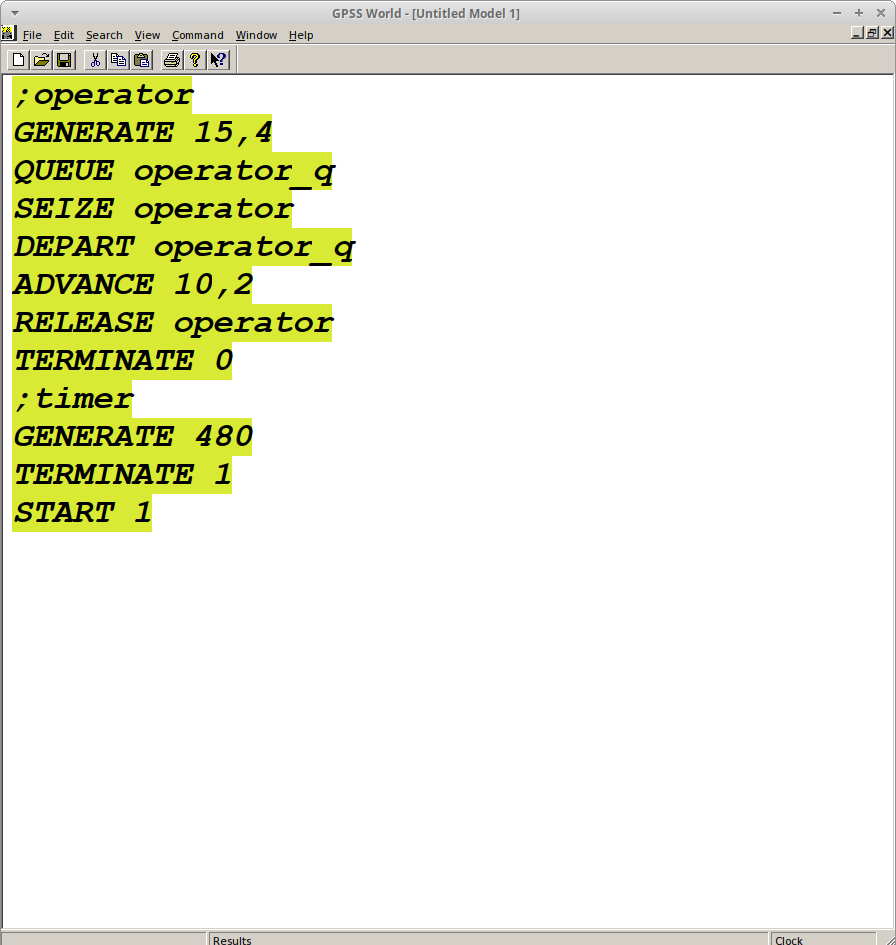{#fig:001 width=70%}

После запуска симуляции получаем отчёт (рис. [-@fig:002]).

Результаты работы модели:

– модельное время в начале моделирования: START TIME=0.0;

– абсолютное время или момент, когда счетчик завершений принял значение 0:
END TIME=480.0;

– количество блоков, использованных в текущей модели, к моменту завершения
моделирования: BLOCKS=9;

– количество одноканальных устройств, использованных в модели к моменту за-
вершения моделирования: FACILITIES=1;

– количество многоканальных устройств, использованных в текущей модели к мо-
менту завершения моделирования: STORAGES=0.

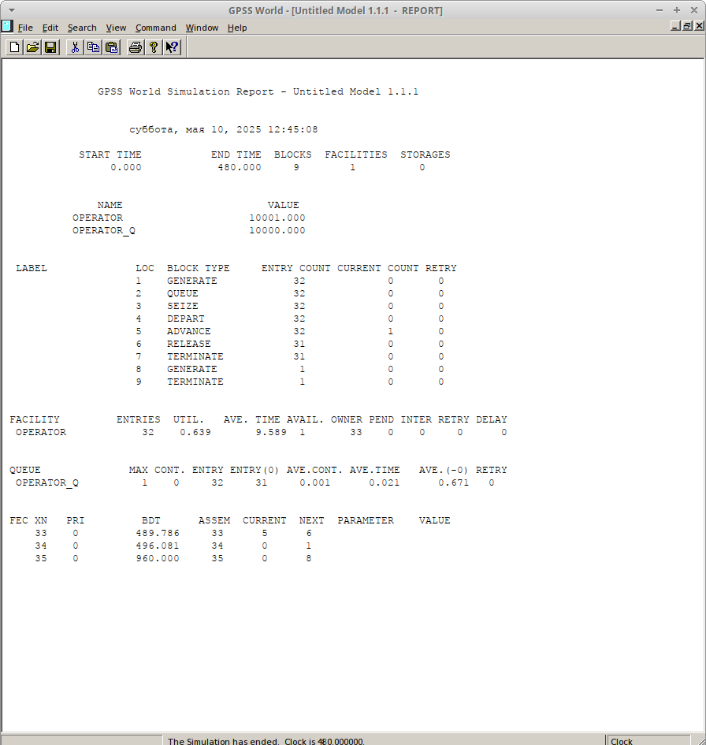{#fig:002 width=70%}

Скорректируйте модель в соответствии с изменениями входных
данных: интервалы поступления заказов распределены равномерно с интервалом
3.14 ± 1.7 мин; время оформления заказа также распределено равномерно на интервале 6.66 ± 1.7 мин.

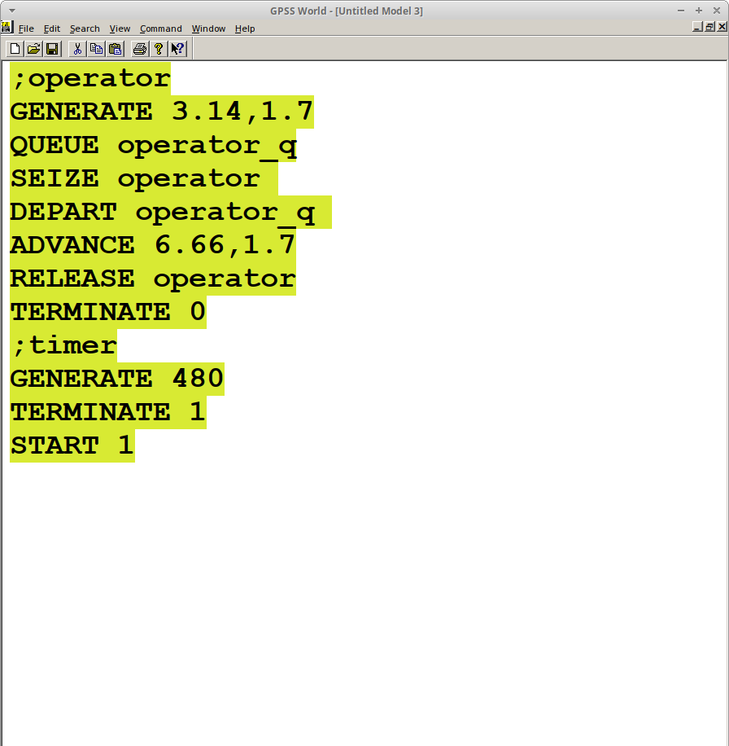{#fig:003 width=70%}

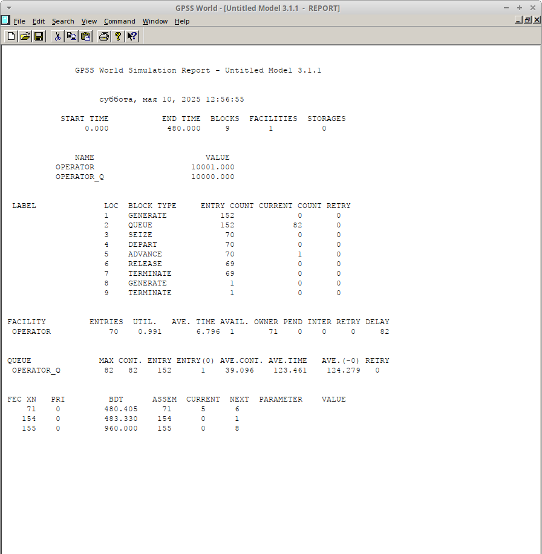{#fig:004 width=70%}

2. Построение гистограммы распределения заявок в очереди

Предположим требуется построить гистограмму распределения заявок, ожидаю-
щих обработки в очереди в примере из предыдущего упражнения. Для построения
гистограммы необходимо сформировать таблицу значений заявок в очереди, запи-
сываемых в неё с определённой частотой.

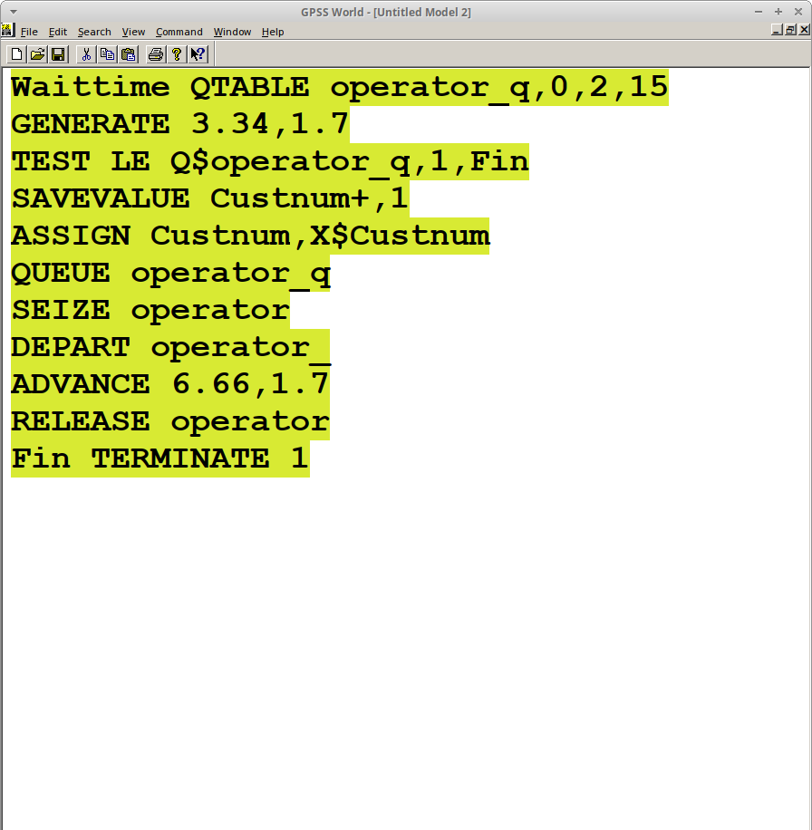{#fig:005 width=70%}

3. Модель обслуживания двух типов заказов от клиентов
в интернет-магазине

В интернет-магазин к одному оператору поступают два типа заявок от клиентов —
обычный заказ и заказ с оформление дополнительного пакета услуг. Заявки первого
типа поступают каждые 15 ± 4 мин. Заявки второго типа — каждые 30 ± 8 мин.
Оператор обрабатывает заявки по принципу FIFO («первым пришел — первым
обслужился»). Время, затраченное на оформление обычного заказа, составляет 10 ±
2 мин, а на оформление дополнительного пакета услуг — 5 ± 2 мин. Требуется
разработать модель обработки заказов в течение 8 часов, обеспечив сбор данных об
очереди заявок от клиентов.

Необходимо реализовать отличие в оформлении обычных заказов и заказов с допол-
нительным пакетом услуг. Такую систему можно промоделировать с помощью двух
сегментов. Один из них моделирует оформление обычных заказов, а второй — зака-
зов с дополнительным пакетом услуг. В каждом из сегментов пара QUEUE–DEPART
должна описывать одну и ту же очередь, а пара блоков SEIZE–RELEASE должна
описывать в каждом из двух сегментов одно и то же устройство и моделировать
работу оператора.

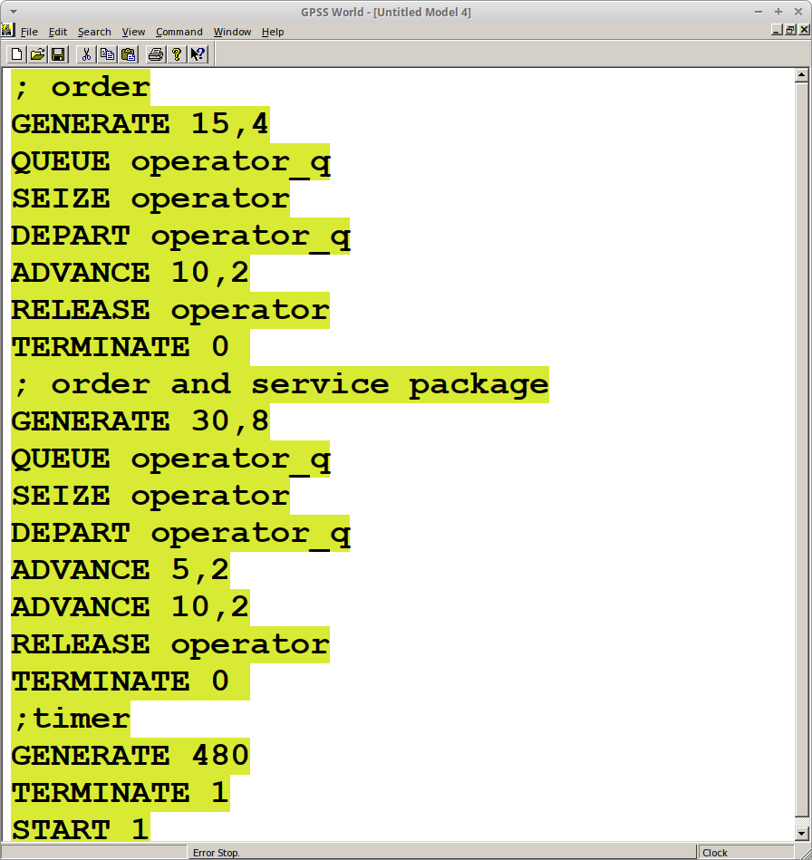{#fig:006 width=70%}

После запуска симуляции получаем отчёт (рис. [-@fig:007]).

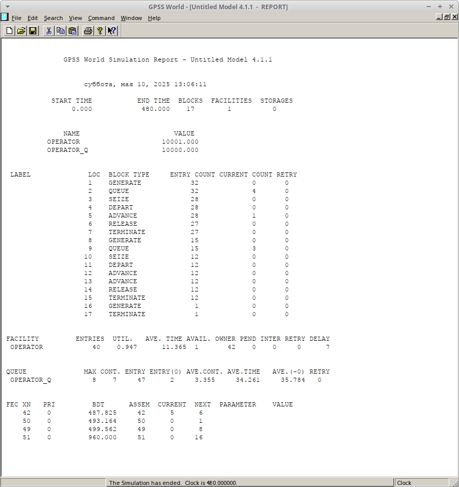{#fig:007 width=70%}

4. Скорректируйте модель так, чтобы учитывалось условие, что число
заказов с дополнительным пакетом услуг составляет 30% от общего числа заказов.
Используйте оператор TRANSFER.

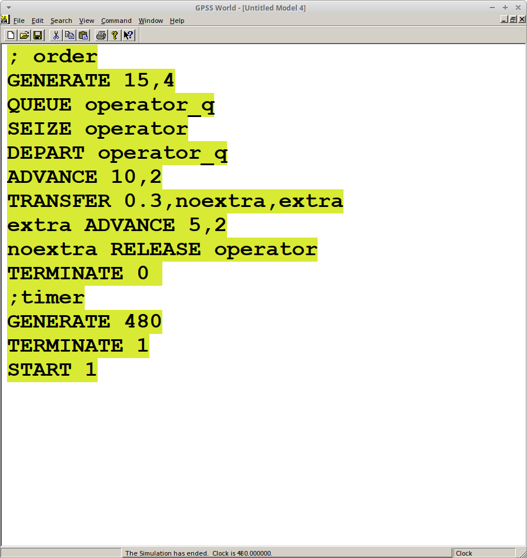{#fig:008 width=70%}

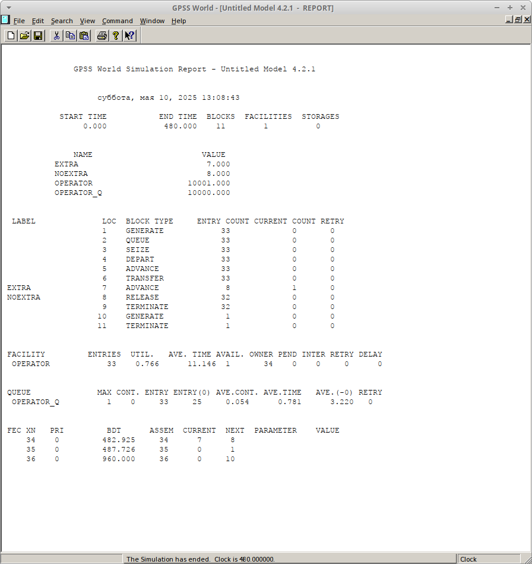{#fig:009 width=70%}

5. Модель оформления заказов несколькими операторами

В интернет-магазине заказы принимают 4 оператора. Интервалы поступления зака-
зов распределены равномерно с интервалом 5 ± 2 мин. Время оформления заказа
каждым оператором также распределено равномерно на интервале 10 ± 2 мин. Об-
работка поступивших заказов происходит в порядке очереди (FIFO). Требуется
определить характеристики очереди заявок на оформление заказов при условии, что
заявка может обрабатываться одним из 4-х операторов в течение восьмичасового
рабочего дня.

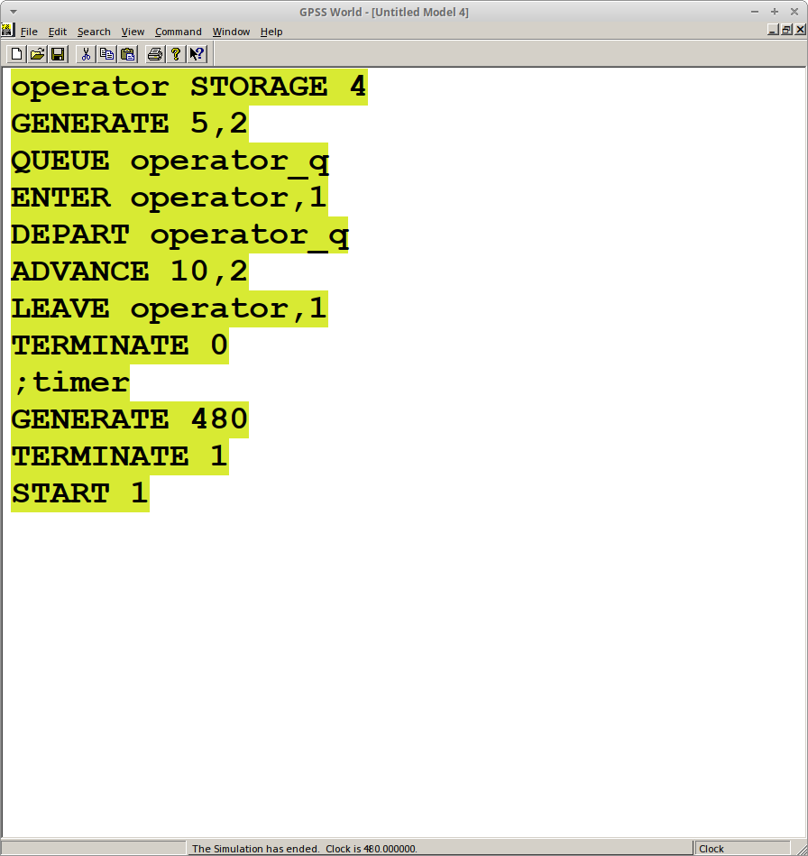{#fig:010 width=70%}

После запуска симуляции получаем отчёт (рис. [-@fig:011]).

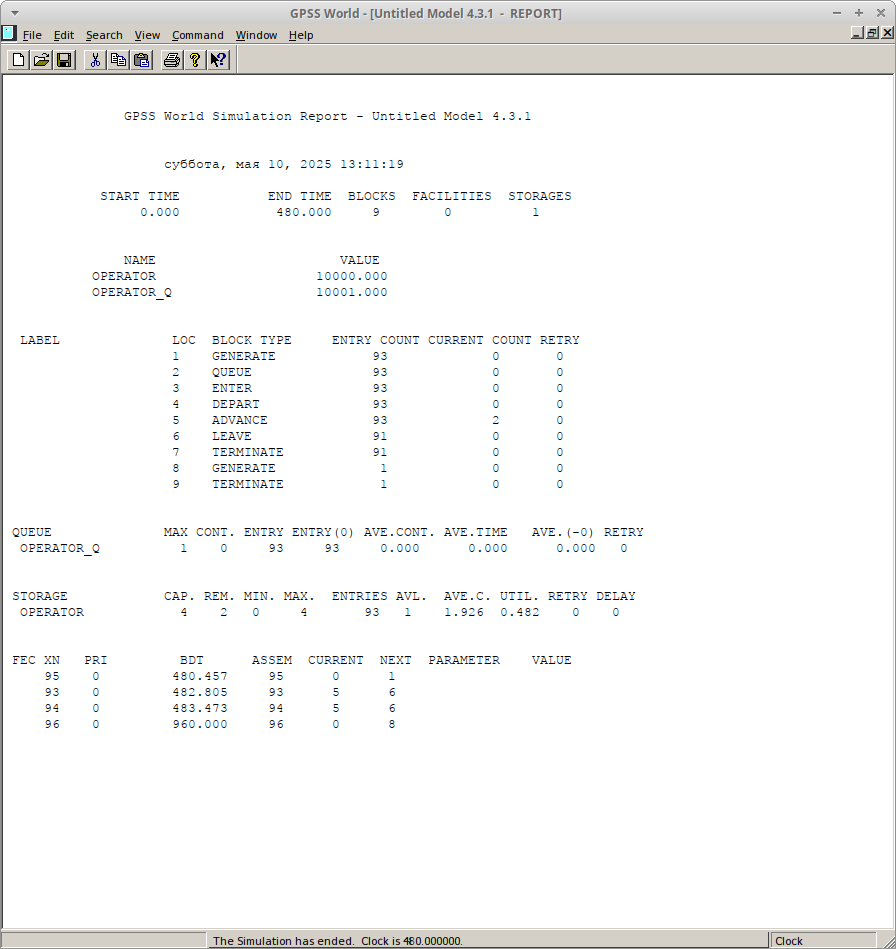{#fig:011 width=70%}

6. Измените модель: требуется учесть в ней возможные отказы клиентов от заказа
— когда при подаче заявки на заказ клиент видит в очереди более двух других
заявок, он отказывается от подачи заявки, то есть отказывается от обслуживания
(используйте блок TEST и стандартный числовой атрибут Qj текущей длины
очереди j)

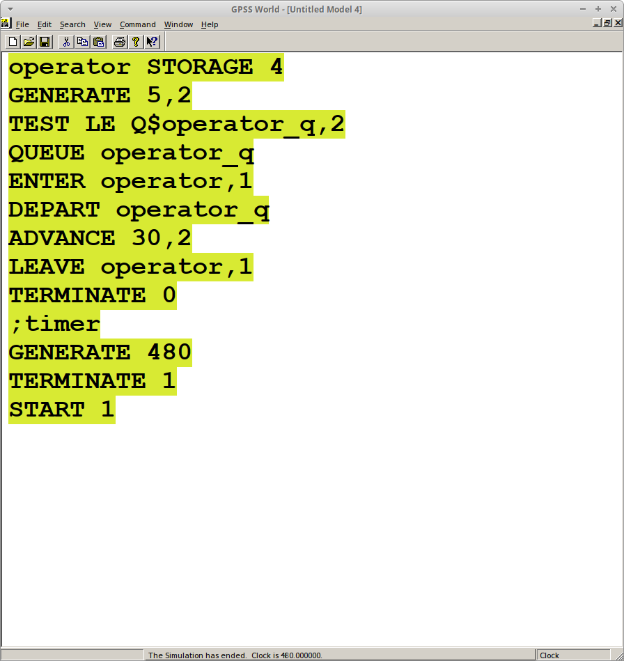{#fig:012 width=70%}

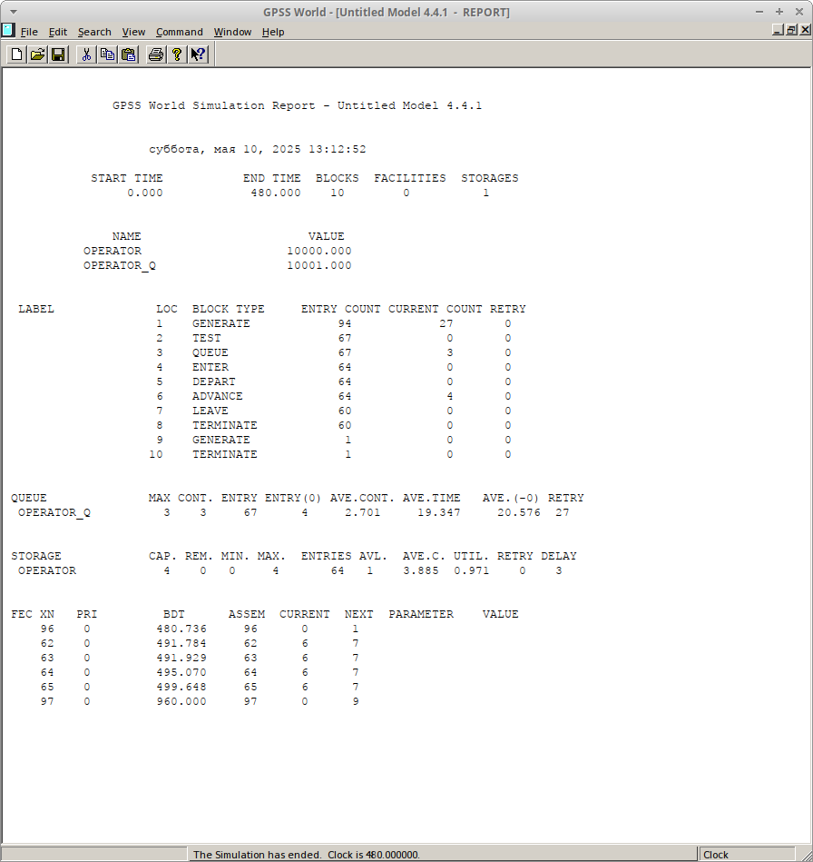{#fig:013 width=70%}

# Выводы

В результате была смоделирована модель обработки заказов в среде gpss world.

# Список литературы{.unnumbered}

::: {#refs}
:::
