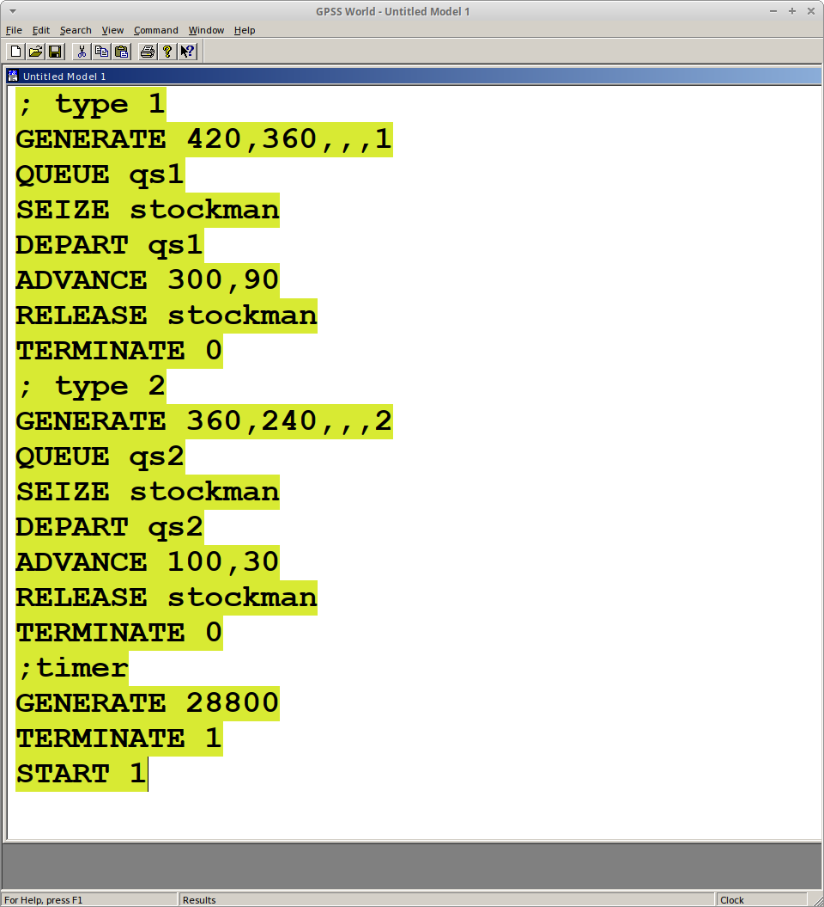
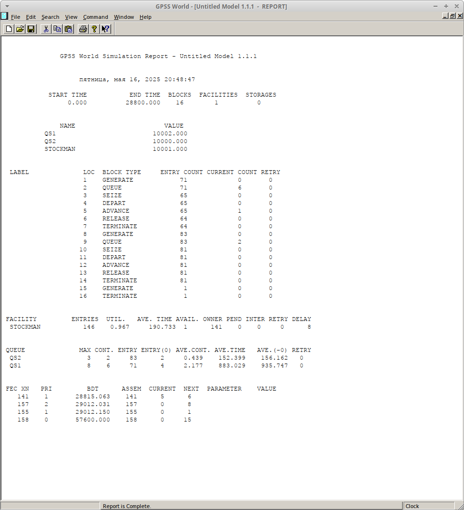
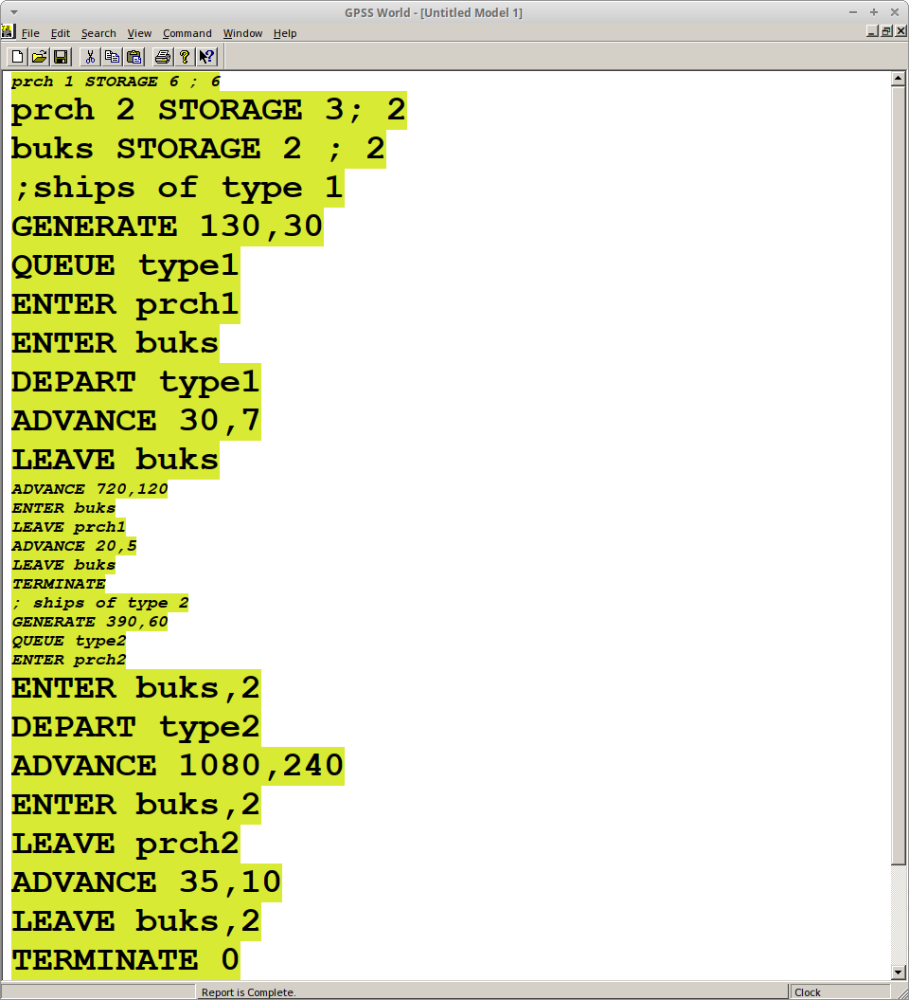

---
## Front matter
lang: ru-RU
title: Лабораторная работа №15
subtitle: Модели обслуживания с приоритетами
author:
  - Акопян Сатеник
institute:
  - Российский университет дружбы народов, Москва, Россия
  - Объединённый институт ядерных исследований, Дубна, Россия
date: 01 января 1970

## i18n babel
babel-lang: russian
babel-otherlangs: english

## Formatting pdf
toc: false
toc-title: Содержание
slide_level: 2
aspectratio: 169
section-titles: true
theme: metropolis
header-includes:
 - \metroset{progressbar=frametitle,sectionpage=progressbar,numbering=fraction}
---

## Цель работы

Построить модели обслуживания с приоритетами

## Выполнение лабораторной работы

1. На фабрике на складе работает один кладовщик, который выдает запасные части
механикам, обслуживающим станки. Время, необходимое для удовлетворения за-
проса, зависит от типа запасной части. Запросы бывают двух категорий. Для первой
категории интервалы времени прихода механиков 420 ± 360 сек., время обслужива-
ния — 300 ± 90 сек. Для второй категории интервалы времени прихода механиков
360 ± 240 сек., время обслуживания — 100 ± 30 сек.

## Выполнение лабораторной работы

Порядок обслуживания механиков кладовщиком такой: запросы первой категории
обслуживаются только в том случае, когда в очереди нет ни одного запроса второй
категории. Внутри одной категории дисциплина обслуживания — «первым пришел –
первым обслужился». Необходимо создать модель работы кладовой, моделирование
выполнять в течение восьмичасового рабочего дня.

Есть два различных типа заявок, поступающих на обслуживание к одному устрой-
ству. Различаются распределения интервалов приходов и времени обслуживания
для этих типов заявок. Приоритеты запросов задаются путем использования для
операнда E блока GENERATE запросов второй категории большего значения, чем для
запросов первой категории.

## Выполнение лабораторной работы

Модель можно представить следующим образом:

(рис. [-@fig:001]).

{#fig:001 width=40%}

## Выполнение лабораторной работы

После запуска симуляции получаем отчёт (рис. [-@fig:002]).

{#fig:002 width=40%}

## Выполнение лабораторной работы

Результаты работы модели:

модельное время в начале моделирования: START TIME=0.0;
абсолютное время или момент, когда счетчик завершений принял значение 0: END TIME=28800.0;
количество блоков, использованных в текущей модели, к моменту завершения моделирования: BLOCKS=16;
количество одноканальных устройств, использованных в модели к моменту завершения моделирования: FACILITIES=1;
количество многоканальных устройств, использованных в текущей модели к моменту завершения моделирования: STORAGES=0. Имена, используемые в программе модели: QS1(первый тип заявок), QS2(второй тип заявок), STOCKMAN(обработчик заявок).

Далее идёт информация о блоках текущей модели, в частности, ENTRY COUNT -- количество транзактов, вошедших в блок с начала процедуры моделирования. Было сгенерировано 71 заявка первого типа и 83 второго, а обработано 64 и 81 соответственно.

## Выполнение лабораторной работы

Затем идёт информация об одноканальном устройстве FACILITY (оператор, оформляющий заказ), откуда видим, что к оператору на обработку попало всего 146 заказов обоих типов. Полезность работы оператора составила 0,967. При этом среднее время занятости оператора составило 190,733 мин.

Далее информация об очередях:

QUEUE=QS1 -- имя объекта типа «очередь» для первого типа заявок;

MAX=8 -- максимальное число ожидающих заявок от клиента в очереди;

CONT=6 -- количество заявок в очереди на момент завершения моделирования;

ENTRIES=71 -- общее число заявок от клиентов, прошедших через очередь в течение периода моделирования;

## Выполнение лабораторной работы

ENTRIES(O)=4 -- число заявок от клиентов, попавших к оператору без ожидания в очереди;

AVE.CONT=2,177 заявок от клиентов в среднем были в очереди;

AVE.TIME=883,029 минут в среднем заявки от клиентов провели в очереди (с учётом всех входов в очередь);

AVE.(–0)=935,747 минут в среднем заявки от клиентов провели в очереди (без учета «нулевых» входов в очередь).

QUEUE=QS2 -- имя объекта типа «очередь» для второго типа заявок;

## Выполнение лабораторной работы

MAX=3 -- максимальное число ожидающих заявок от клиента в очереди;

CONT=2 -- количество заявок в очереди на момент завершения моделирования;

ENTRIES=83 -- общее число заявок от клиентов, прошедших через очередь в течение периода моделирования;

ENTRIES(O)=2 -- число заявок от клиентов, попавших к оператору без ожидания в очереди;

AVE.CONT=0,439 заявок от клиентов в среднем были в очереди;

## Выполнение лабораторной работы

AVE.TIME=152,399 минут в среднем заявки от клиентов провели в очереди (с учётом всех входов в очередь);

AVE.(–0)=152,162 минут в среднем заявки от клиентов провели в очереди (без учета «нулевых» входов в очередь).

## Выполнение лабораторной работы

В конце отчёта идёт информация о будущих событиях:

XN=141 -- порядковый номер заявки от клиента, ожидающей поступления для оформления заказа у оператора;
PRI=1 -- следующая заявка с приоритетом 1, то есть первого типа;
BDT=28815,063 -- время назначенного события, связанного с данным транзактом;
ASSEM=141 -- номер семейства транзактов;
CURRENT=5 -- номер блока, в котором находится транзакт;
NEXT=6 -- номер блока, в который должен войти транзакт.

## Выполнение лабораторной работы

2. Морские суда двух типов прибывают в порт, где происходит их разгрузка. В порту
есть два буксира, обеспечивающих ввод и вывод кораблей из порта. К первому
типу судов относятся корабли малого тоннажа, которые требуют использования
одного буксира. Корабли второго типа имеют большие размеры, и для их ввода
и вывода из порта требуется два буксира. Из-за различия размеров двух типов
кораблей необходимы и причалы различного размера. Кроме того, корабли имеют
различное время погрузки/разгрузки.

## Выполнение лабораторной работы

Требуется построить модель системы, в которой можно оценить время ожидания
кораблями каждого типа входа в порт. Время ожидания входа в порт включает время
ожидания освобождения причала и буксира. Корабль, ожидающий освобождения
причала, не обслуживается буксиром до тех пор, пока не будет предоставлен нужный
причал. Корабль второго типа не займёт буксир до тех пор, пока ему не будут
доступны оба буксира.

## Выполнение лабораторной работы

Параметры модели:
– для корабля первого типа:
– интервал прибытия: 130 ± 30 мин;
– время входа в порт: 30 ± 7 мин;
– количество доступных причалов: 6;
– время погрузки/разгрузки: 12 ± 2 час;
– время выхода из порта: 20 ± 5 мин;
– для корабля второго типа:
– интервал прибытия: 390 ± 60 мин;
– время входа в порт: 45 ± 12 мин;
– количество доступных причалов: 3;
– время погрузки/разгрузки: 18 ± 4 час;
– время выхода из порта: 35 ± 10 мин.
– время моделирования: 365 дней по 8 часов.

## Выполнение лабораторной работы

Модель можно представить следующим образом:

(рис. [-@fig:003]).

{#fig:003 width=40%}

## Выводы

В результате была построена модель обслуживания с приоритетами