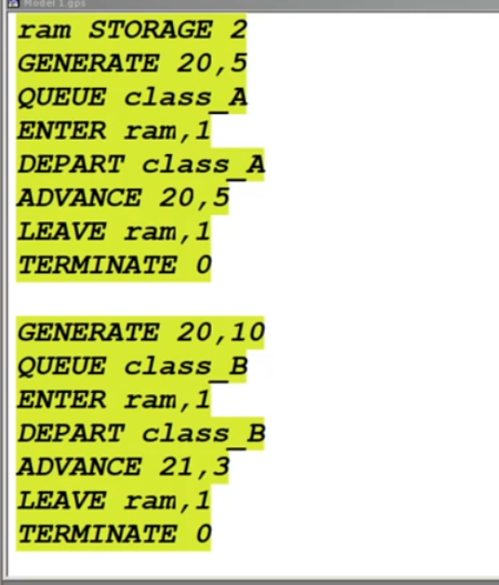
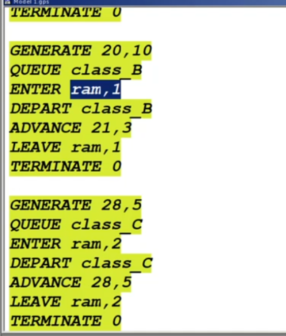
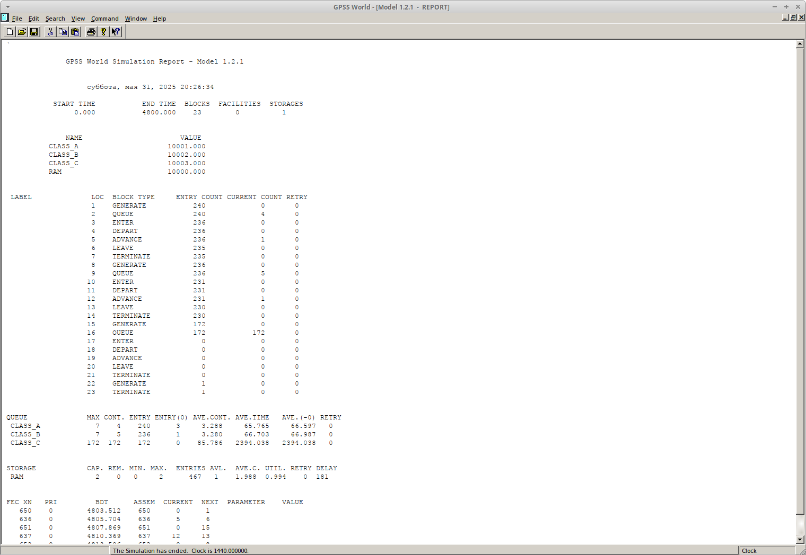
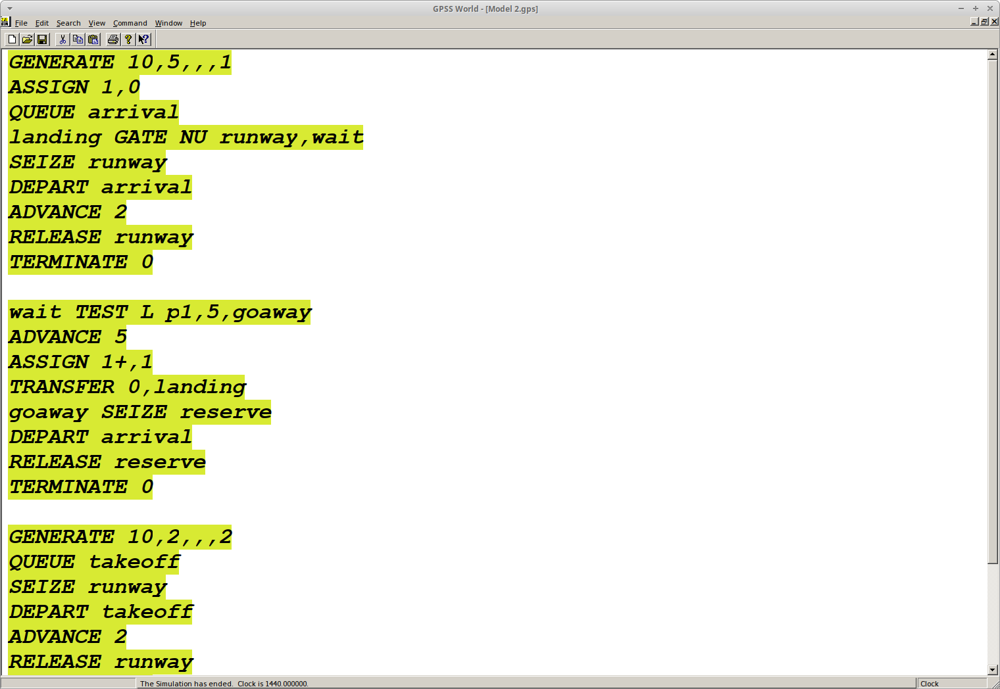
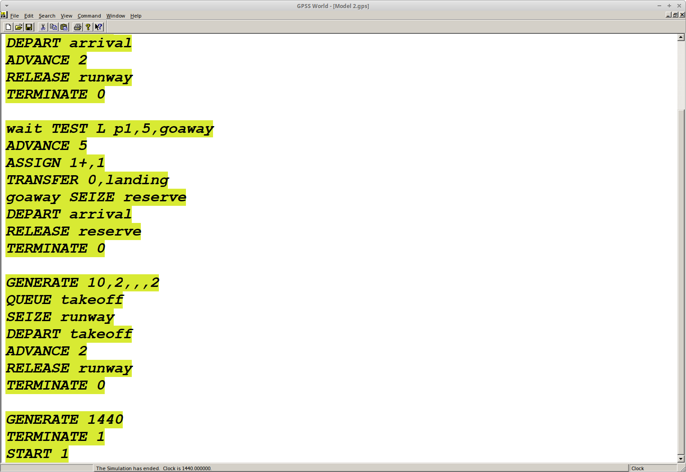
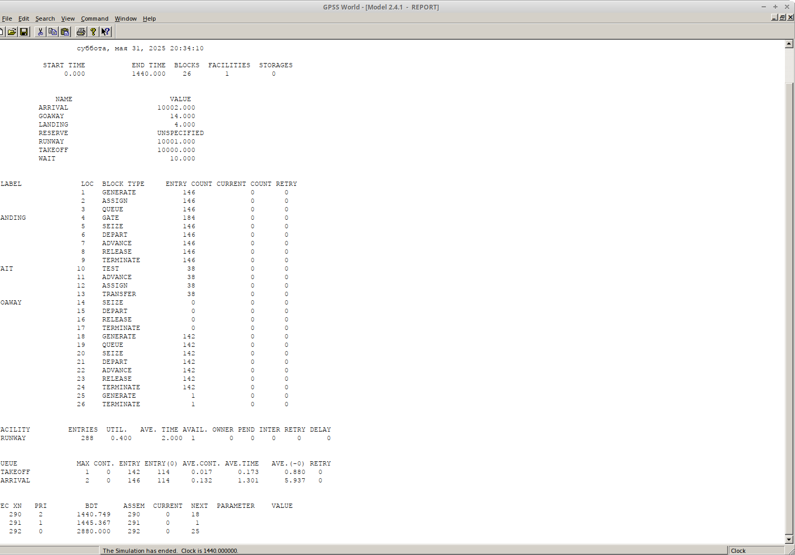
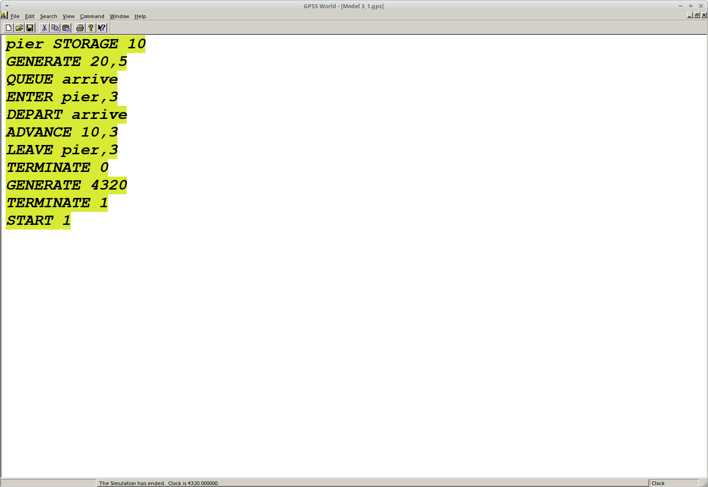
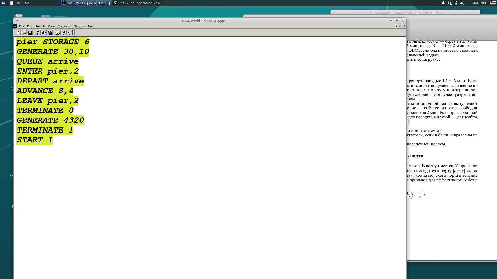

---
## Front matter
lang: ru-RU
title: Лабораторная работа №17
subtitle: Задания для самостоятельной работы.
author:
  - Акопян Сатеник
institute:
  - Российский университет дружбы народов, Москва, Россия
  - Объединённый институт ядерных исследований, Дубна, Россия
date: 01 января 1970

## i18n babel
babel-lang: russian
babel-otherlangs: english

## Formatting pdf
toc: false
toc-title: Содержание
slide_level: 2
aspectratio: 169
section-titles: true
theme: metropolis
header-includes:
 - \metroset{progressbar=frametitle,sectionpage=progressbar,numbering=fraction}
---

## Цель работы

Выполнить задания для самостоятельной работы.

## Выполнение лабораторной работы

1. Моделирование работы вычислительного центра

На вычислительном центре в обработку принимаются три класса заданий А, В и С.
Исходя из наличия оперативной памяти ЭВМ задания классов А и В могут решаться
одновременно, а задания класса С монополизируют ЭВМ. Задания класса А посту-
пают через 20 ± 5 мин, класса В — через 20 ± 10 мин, класса С — через 28 ± 5 мин
и требуют для выполнения: класс А — 20 ± 5 мин, класс В — 21 ± 3 мин, класс
С — 28 ± 5 мин. Задачи класса С загружаются в ЭВМ, если она полностью свободна.

## Выполнение лабораторной работы

Задачи классов А и В могут дозагружаться к решающей задаче.
Смоделировать работу ЭВМ за 80 ч. Определить её загрузку. (рис. [-@fig:001]).

Модель использует хранилище (RAM) для управления памятью, где задания классов A/B делят ресурс (ENTER/LEAVE 1), а класс C монополизирует его (ENTER/LEAVE 2). Это отражает приоритет задач C и конкуренцию A/B за память. Анализ загрузки ЭВМ за 80 часов покажет влияние класса C на общую пропускную способность (рис. [-@fig:001], [-@fig:002]).

## Выполнение лабораторной работы

{#fig:001 width=40%}

## Выполнение лабораторной работы

{#fig:002 width=40%}

## Выполнение лабораторной работы

{#fig:003 width=40%}

Как можно увидеть по отчету, загрузка высокая, т.к. заявки принимаются достаточно часто.

## Выполнение лабораторной работы

2. Модель работы аэропорта

Самолёты прибывают для посадки в район аэропорта каждые 10 ± 5 мин. Если
взлетно- посадочная полоса свободна, прибывший самолёт получает разрешение на
посадку. Если полоса занята, самолет выполняет полет по кругу и возвращается
в аэропорт каждые 5 мин. Если после пятого круга самолет не получает разрешения
на посадку, он отправляется на запасной аэродром.

## Выполнение лабораторной работы

В аэропорту через каждые 10 ± 2 мин к взлетно -посадочной полосе выруливают
готовые к взлёту самолёты и получают разрешение на взлёт, если полоса свободна.

Для взлета и посадки самолёты занимают полосу ровно на 2 мин. Если при свободной
полосе одновременно один самолёт прибывает для посадки, а другой — для взлёта,
то полоса предоставляется взлетающей машине.

## Выполнение лабораторной работы

Требуется:
– выполнить моделирование работы аэропорта в течение суток;

– подсчитать количество самолётов, которые взлетели, сели и были направлены на
запасной аэродром;

– определить коэффициент загрузки взлетно-посадочной полосы.

## Выполнение лабораторной работы

Динамика реализована через приоритеты: взлет (приоритет 2) прерывает посадку. Самолёты в очереди на посадку (GATE/TEST) могут уйти после 5 кругов. Модель учитывает конфликты за полосу (SEIZE/RELEASE) и подсчитывает успешные/перенаправленные рейсы за сутки, оценивая загрузку ВПП. (рис. [-@fig:004], [-@fig:005])

## Выполнение лабораторной работы

{#fig:004 width=40%}

## Выполнение лабораторной работы

{#fig:005 width=40%}

## Выполнение лабораторной работы

из отчета видно, что взлетели 146 самолетов, приземлились 142, были направлены
в запасной аэродром 0 (рис. [-@fig:006])

коэффициент загрузки небольшой, т.к. полоса используется с ограничением в 2 минуты по условию задачи

{#fig:006 width=40%}

## Выполнение лабораторной работы

3. Моделирование работы морского порта

Морские суда прибывают в порт каждые [a ± δ] часов. В порту имеется N причалов.
Каждый корабль по длине занимает M причалов и находится в порту [b ± ε] часов.
Требуется построить GPSS-модель для анализа работы морского порта в течение
полугода, определить оптимальное количество причалов для эффективной работы
порта.
## Выполнение лабораторной работы

Исходные данные:

1) a = 20 ч, δ = 5 ч, b = 10 ч, ε = 3 ч, N = 10, M = 3;

Хранилище (pier) моделирует причалы, где суда занимают несколько слотов (M) одновременно. Разные сценарии (N=10/M=3 и N=6/M=2) проверяют пропускную способность порта. Полугодовое моделирование (4320 часов) выявит оптимальное N для минимизации очередей (QUEUE/DEPART).

## Выполнение лабораторной работы

{#fig:007 width=40%}

## Выполнение лабораторной работы

2) a = 30 ч, δ = 10 ч, b = 8 ч, ε = 4 ч, N = 6, M = 2.

{#fig:008 width=40%}

## Выводы

В результате былы выполнены задания для самостоятельного выполнения, а также закреплены знания о моделировании