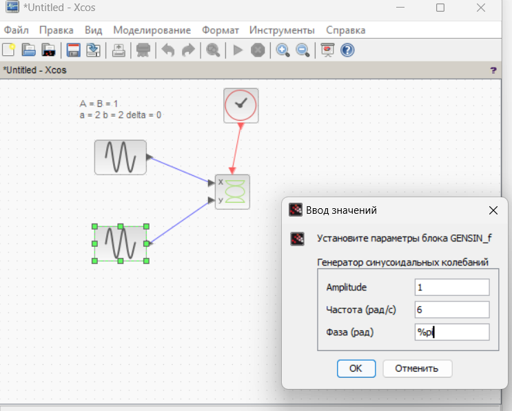

---
## Front matter
title: "Упражнение №1"
subtitle: "Построение фигур Лиссажу с помощью xcos"
author: "Акопян Сатеник"

## Generic otions
lang: ru-RU
toc-title: "Содержание"

## Bibliography
bibliography: bib/cite.bib
csl: pandoc/csl/gost-r-7-0-5-2008-numeric.csl

## Pdf output format
toc: true # Table of contents
toc-depth: 2
lof: true # List of figures
lot: true # List of tables
fontsize: 12pt
linestretch: 1.5
papersize: a4
documentclass: scrreprt
## I18n polyglossia
polyglossia-lang:
  name: russian
  options:
	- spelling=modern
	- babelshorthands=true
polyglossia-otherlangs:
  name: english
## I18n babel
babel-lang: russian
babel-otherlangs: english
## Fonts
mainfont: IBM Plex Serif
romanfont: IBM Plex Serif
sansfont: IBM Plex Sans
monofont: IBM Plex Mono
mathfont: STIX Two Math
mainfontoptions: Ligatures=Common,Ligatures=TeX,Scale=0.94
romanfontoptions: Ligatures=Common,Ligatures=TeX,Scale=0.94
sansfontoptions: Ligatures=Common,Ligatures=TeX,Scale=MatchLowercase,Scale=0.94
monofontoptions: Scale=MatchLowercase,Scale=0.94,FakeStretch=0.9
mathfontoptions:
## Biblatex
biblatex: true
biblio-style: "gost-numeric"
biblatexoptions:
  - parentracker=true
  - backend=biber
  - hyperref=auto
  - language=auto
  - autolang=other*
  - citestyle=gost-numeric
## Pandoc-crossref LaTeX customization
figureTitle: "Рис."
tableTitle: "Таблица"
listingTitle: "Листинг"
lofTitle: "Список иллюстраций"
lotTitle: "Список таблиц"
lolTitle: "Листинги"
## Misc options
indent: true
header-includes:
  - \usepackage{indentfirst}
  - \usepackage{float} # keep figures where there are in the text
  - \floatplacement{figure}{H} # keep figures where there are in the text
---

# Цель работы

Построить с помощью xcos фигуры Лиссажу с различными значениями параметров.

# Теоретическое введение

Scilab — система компьютерной математики, предназначенная для решения вычис
лительных задач.

Основное окно Scilab содержит обозреватель файлов, командное окно, обозрева
тель переменных и журнал команд

Программа xcos является приложением к пакету Scilab [5]. Для вызова окна xcos необходимо в меню основного окна Scilab выбрать Инструменты, Визуальное моделирование xcos.

При моделировании с использованием xcos реализуется принцип визуального
программирования, в соответствии с которым пользователь на экране из палитры блоков создаёт модель и осуществляет расчёты

# Выполнение лабораторной работы

1. Строим модель функционирования двух
источников синусоидального сигнала, позволяющая в зависимости от задаваемых
параметров построить различные фигуры Лиссажу

{#fig:001 width=70%}

2. Строим с помощью xcos фигуры Лиссажу со следующими параметрами:

$ A = B = 1, a = 2, b = 2, δ = 0; π/4; π/2; 3π/4; π$

2.1 δ = 0:

{#fig:002 width=70%}

2.2 δ = π/4:

{#fig:003 width=70%}

2.3 δ = π/2:

{#fig:004 width=70%}

2.4 δ = 3π/4:

{#fig:005 width=70%}

{#fig:006 width=70%}

2.5 δ = π:

{#fig:007 width=70%}

{#fig:008 width=70%}

3. Строим с помощью xcos фигуры Лиссажу со следующими параметрами:

$ A = B = 1, a = 2, b = 4, δ = 0; π/4; π/2; 3π/4; π$

3.1 δ = 0:

{#fig:009 width=70%}

{#fig:010 width=70%}

3.2 δ = π/4:
{#fig:011 width=70%}

{#fig:012 width=70%}

3.3 δ = π/2:

{#fig:013 width=70%}

{#fig:014 width=70%}

3.4 δ = 3π/4:

{#fig:015 width=70%}

{#fig:016 width=70%}

3.5 δ = π:

{#fig:017 width=70%}

{#fig:018 width=70%}

4. Строим с помощью xcos фигуры Лиссажу со следующими параметрами:

$ A = B = 1, a = 2, b = 6, δ = 0; π/4; π/2; 3π/4; π$

4.1 δ = 0:

{#fig:019 width=70%}

{#fig:020 width=70%}

{#fig:021 width=70%}

4.2 δ = π/4:

{#fig:022 width=70%}

{#fig:023 width=70%}

4.3 δ = π/2:

{#fig:024 width=70%}

{#fig:025 width=70%}

4.4 δ = 3π/4:

{#fig:026 width=70%}

{#fig:027 width=70%}

4.5 δ = π:

{#fig:028 width=70%}

{#fig:029 width=70%}

5. Строим с помощью xcos фигуры Лиссажу со следующими параметрами:

$ A = B = 1, a = 2, b = 3, δ = 0; π/4; π/2; 3π/4; π$

5.1 δ = 0:

{#fig:030 width=70%}

{#fig:031 width=70%}

{#fig:032 width=70%}

5.2 δ = π/4:

{#fig:033 width=70%}

{#fig:034 width=70%}

5.3 δ = π/2:

{#fig:035 width=70%}

{#fig:036 width=70%}

5.4 δ = 3π/4:

{#fig:037 width=70%}

{#fig:038 width=70%}

5.5 δ = π:

{#fig:039 width=70%}

{#fig:040 width=70%}

# Выводы

В результате данной лабораторной работы было выполнено упражнение с помощью xcos фигуры Лиссажу с различными значениями параметров.

# Список литературы{.unnumbered}

::: {#refs}
:::
